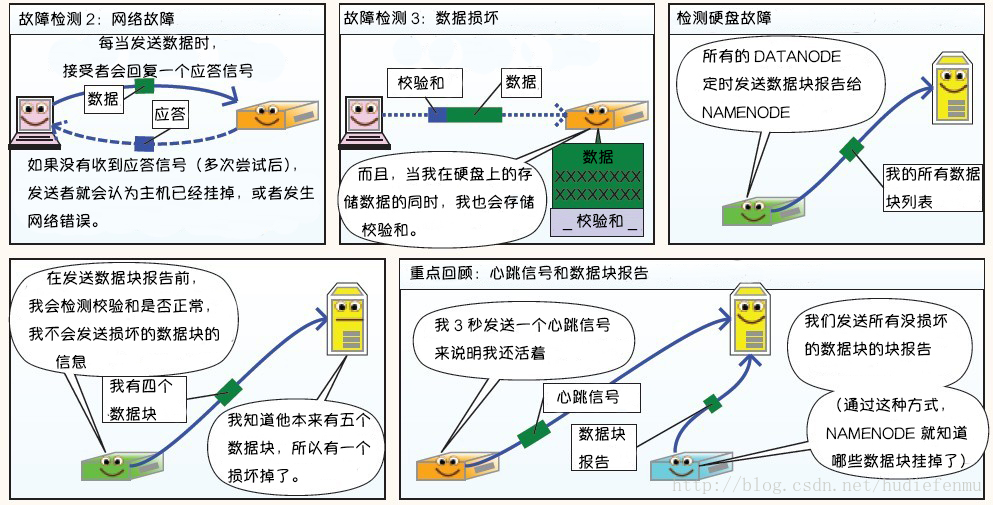
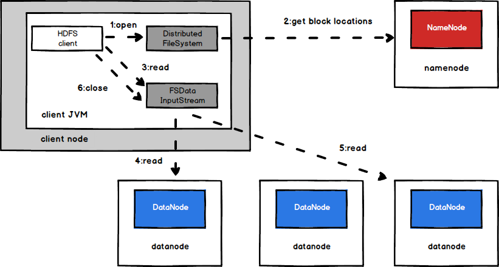
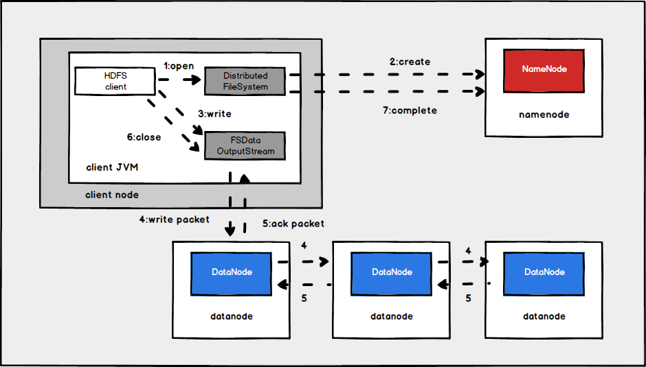
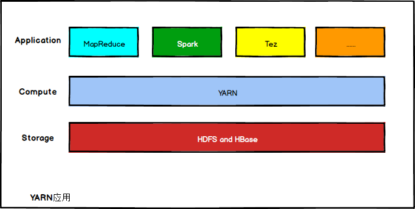
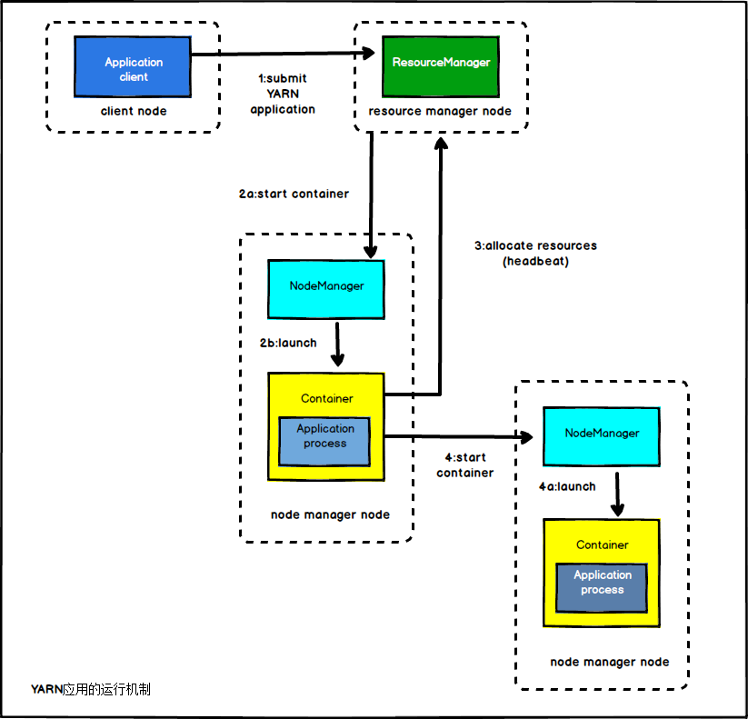
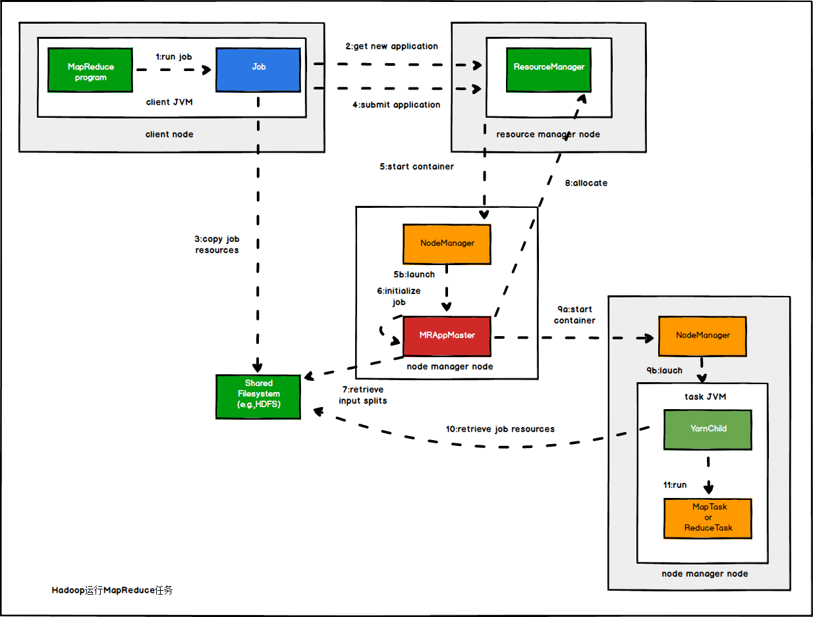
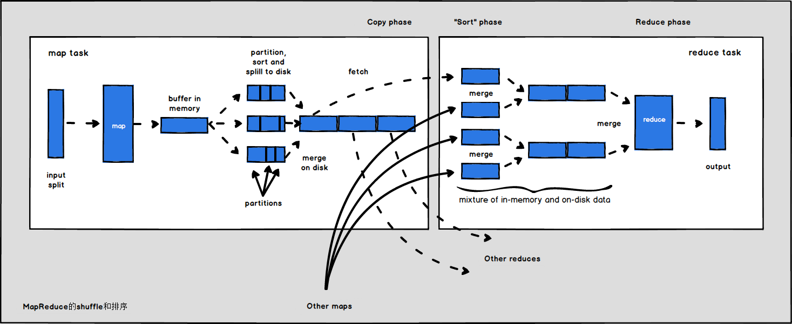

## 1 初始Hadoop

**1.1  相较于其它系统的优势**

- **为什么不能用配有大量硬盘的数据库来进行大规模数据分析？为什么需要Hadoop？**

计算机硬盘的寻址时间的提升远远不如传输速度的提升。寻址是将磁头移动到特定硬盘位置进行读/写操作的过程。他是导致硬盘操作延迟的主要原因，而传输速率取决于硬盘的带宽。

如果数据访问模式中包含大量的硬盘寻址，那么读取大量数据集就必然会花更长的时间。另一方面，如果数据库系统只更新一小部分记录，那么传统的B树就更有优势，但是数据库系统如果有大量数据更新时，B树的效率就明显落后于MapReduce，因为需要使用“排序/合并”来重建数据库。

在许多情况下，可以将MapReduce看作关系型数据库管理系统的补充，MapReduce适合解决需要以批处理方式分析整个数据集的问题。RDBMS适用于索引后数据集的点查询和更新，建立索引的数据库系统能够提供对小规模数据的低延迟数据检索和快速更新。**MapReduce适合一次写入，多次读取数据的应用，关系型数据库则更适合持续更新的数据集。**

|          | 传统关系型数据库 | MapReduce          |
| -------- | ---------------- | ------------------ |
| 数据大小 | GB               | PB                 |
| 数据存取 | 交互式和批处理   | 批处理             |
| 更新     | 多次读/写        | 一次写入，多次读取 |
| 事务     | ACID             | 无                 |
| 结构     | 写时模式         | 读时模式           |
| 完整性   | 高               | 低                 |
| 横向扩展 | 非线性           | 线性               |


## 2 关于MapReduce

**MapReduce是一种可用于数据处理的编程模型。**

**2.4.1 数据流**

MapReduce作业是客户端需要执行的一个工作单元：它包括输入数据、MapReduce程序和配置信息。Hadoop将作业分成若干个任务(task)来执行，其中包括辆类任务：map任务和reduce任务。这些任务运行在集群的节点上，并通过YARN进行调度。如果一个任务失败，它将在另一个不同的节点上自动重新调度运行。

- **为什么最佳分片的大小应该和块大小相同**？

因为他是确保可以存储在单个节点上的最大输入块的大小，如果分片跨越两个数据块，那么对于任何一个HDFS节点，基本都不可能同时存储这两个数据块，因此分片中的部分数据需要通过网络传输到map任务运行的节点。与使用本地数据运行整个map任务相比，这种方法效率更低。

- **map任务将其输出写入本地硬盘，而非HDFS？**

map的输出是中间结果：该中间结果由reduce任务处理后才产生最终输出结果，而且一旦作业完成，map的输出结果就可以删除。如果运行map任务的节点在将map中间结果传送给reduce任务之前是失败，hadoop将在另一个节点上重新运行这个map任务以再次构建map中间结果。

## 3 Hadoop分布式文件系统

### 基本知识

#### **定义**

HDFS是一个文件系统，用于存储文件，通过目录树来定位文件，其次它是分布式的，由许多服务器联合起来实现其功能，集群中的服务器有各自的角色。

**优点：**

1. 高容错性，数据自动保存多个副本，通过增加副本的形式，提高容错性。某个副本丢失以后，可以自动恢复。
2. 适合处理大数据
   - 数据规模：能够处理数据规模达到GB、TB、甚至PB级别的数据
   - 文件规模：能够处理百万规模以上的文件数量
3. 可构建在脸颊机器上，通过多副本机制，提高可靠性

**缺点**：

1. 不适合低延时数据访问，比如毫秒级的存储数据
2. 无法高效地对大量小文件进行存储
   - 存储大量小文件的话，它会占用NameNode大量的内存来存储文件目录和块信息
   - 小文件存储的寻址时间会超过读取时间，违反了HDFS的设计目标
3. <mark>不支持并发写入、文件随机修改</mark>
   - 一个文件只能有一个写，不允许多个线程同时写
   - 仅支持数据append，不支持文件的随机修改

#### **HDFS组成架构**

1. NameNode(nn):就是Master，它是一个主管、管理者。
   - 管理HDFS的名称空间
   - 配置副本策略
   - 管理数据块(Block)映射信息
   - 处理客户端读写请求
2. DataNode:就是Slave，NameNode下达命令，DataNode执行实际的操作
   - 存储实际的数据块
   - 执行数据块的读/写
3. Client:客户端
   - 文件切分。文件上传HDFS的时候，Client将文件切分成一个一个的Block，然后进行上传
   - 与NameNode交互，获取文件的位置信息
   - 与DataNode交互，读取或者写入数据
   - Client提供一些命令来管理HDFS，比如NameNode格式化
   - Client可以通过一些命令来访问HDFS，比如对HDFS增删改查操作
4. Secondary NameNode：并非NameNode的热备份。当NameNode挂掉的的时候，它并不能马上替换NameNode并提供服务。
   - 辅助NameNode，分担其工作量，比如定期合并Fsimage和Edits，并推送给NameNode
   - 在紧急情况下，可辅助恢复NameNode

#### HDFS文件块大小

HDFS重的文件在物理上是分块存储(Block)，块的大小可以通过配置参数(disk.blocksize)来规定，<mark>默认大小在Hadoop2.x/3.x版本中是128M，1.x版本中是64M。</mark>

#### 问题

**1.为什么块的大小不能设置太小，也不能设置太大？**

1. HDFS块设置太小，会增加寻址时间，程序一直在找块的开始位置
2. 如果块设置的太大，从磁盘传输数据的时间会明显大于定位这个块开始位置所需的时间。导致程序处理这个块数据时，会非常慢


**系统构成和写数据过程**

**HDFS写数据原理**


**读数据原理**


**HDFS故障类型和其检测方法**




**读写故障的处理**


**DataNode故障处理**


**副本布局策略**


### 3.2 HDFS的概念


- **HDFS中的块为什么这么大？**

HDFS的块比磁盘的块大，其目的是为了最小化寻址开销。如果块足够大，从磁盘传输数据的时间会明显大于定位这个块开始位置所需的时间。因而，传输一个由多个块组成的大文件的时间却决于磁盘传输速率。MapReduce中的map任务通常一次只处理一个块中的数据，因此如果任务数太少，作业的运行速度就会比较慢。

- **分布式文件系统中块抽象的好处？**

1. 一个文件的大小可以大于网络中任意一个磁盘的容量。文件的所有块并不需要存储在同一个磁盘上，因此他们可以利用集群上的任意一个磁盘进行存储。
2. 使用抽象块而非整个文件作为存储单元，大大简化了存储子系统的设计。将存储子系统的处理对象设置为块，可简化存储管理。同时也消除了对元数据的顾虑。
3. 块非常适合用于数据备份进而提供数据容错能力和提高可用性。

#### 3.2.2 namenode和datanode

HDFS集群有两类节点以管理节点-工作节点模式运行，即一个namenode(管理节点)和多个datanode(工作节点)。

**namenode**

1. 管理文件系统的命名空间，它维护者文件系统树及整棵树内所有的文件和目录。这些信息以两个文件形式永久保存在本地磁盘上：命名空间镜像文件和编辑日志文件。
2. 记录每个文件中各个块所在的数据节点信息(但它并不永久保存块的位置信息，因为这些信息会在系统启动时根据数据节点信息重建)。

**datanode**

文件系统的工作节点。它们根据需要存储并建锁数据块，并定期向namenode发送它们所存储的块的列表。

- **namenode容错机制**

1. 备份哪些组成文件系统元数据持久状态的文件。Hadoop可以通过配置使namenode在多个文件系统上保存元数据的持久状态。这些写操作是实时同步的，且是原子操作。
2. 运行一个辅助namenode，但它不能被用作namenode。这个辅助namenode的重要作用是定期合并编辑日志与命名空间镜像，以防止编辑日志过大。**它会保存合并后的命名空间镜像的副本，并在namenode发生故障时启用。**但是辅助namenode保存的状态总是滞后于主节点，所以在主节点全部失效时，难免会丢失部分数据。

- **HDFS高可用的实现需要在架构上做如下修改：**

1. namenode之间需要通过高可用共享存储实现编辑日志的共享。当备用namenode接管工作之后，它将通读共享编辑日志直至末尾，以实现与活动namenode的状态同步，并继续读取由活动namenode写入的新条目。
2. datanode需要同时向两个namenode发送数据块报告，因为数据块的映射信息存储在namenode的内存中，而非磁盘。
3. 客户端需要使用特定的机制来处理namenode的失效问题，这一机制对用户是透明的。
4. 辅助namenode的角色被备用namenode所包含，备用namenode为活动的namenode命名空间设置周期性检查点。

### 3.6 数据流

#### 3.6.1剖析文件读取

- 读取文件时事件的发生顺序？

客户端通过调用FileSystem对象的open()方法来打开希望读取的文件，对于HDFS来说，这个对象是DistributedFileSystem的一个实例。DistributedFileSystem通过使用远程过程调用(RPC)来调用namenode，以确定文件起始块的位置。对于每一个块，namenode返回存有该块副本的datanode地址。此外，这些打他弄得根据它们与客户端的距离来排序，如果该客户端本身就是一个datanode，那么该客户端将会从保存有相应数据块副本的本地datanode读取数据。



>在读取数据的时候，如果DFSInputStream在与datanode通信时遇到错误，会尝试从这个块的另外一个最邻近datanode读取数据。他也会记住那个datanode，以保证以后不会反复读取该节点上后续的块。
>
>DFSInputStream也会通过校验和确认从datanode发来的数据是否完整。如果发现有损坏的块，DFSInputStream也会试图从其它datanode读取其副本，也会将被损坏的块通知给namenode。


- 网络拓扑与Hadoop，”彼此邻近“什么意思？

Hadoop把网络看作一棵树，两个节点间的距离是它们到**最近共同祖先**的距离总和。该树中的层次是没有预先设定的，但是相对于数据中心、机架和正在运行的节点，通常可以设定等级。具体想法是针对以下每个场景，可用带宽以此递减：

1. 同一节点上的进程
2. 同一机架上的不同节点
3. 同一数据中心中不同机架上的节点
4. 不同数据中心中的节点

>数据中心d1、机架r1中的节点n1，可表示为/d1/r1/n1
>
>distance(/d1/r1/n1,/d1/r1/n1)=0	同一节点上的进程
>
>distance(/d1/r1/n1,/d1/r1/n2)=2	同一机架上的不同节点
>
>distance(/d1/r1/n1,/d1/r2/n3)=4	同一数据中心不同机架上的接待你
>
>distance(/d1/r1/n1,/d2/r3/n4)=6	不同数据中心中的节点

#### 3.6.2剖析文件写入

客户端通过对DistributedFileSystem对象调用create()来新建文件，DistributedFileSystem对namenode创建一个RPC调用，在文件系统的命名空间中新建一个文件，此时该文件中还没有相应的数据块。namenode执行各种不同的检查以确保这个文件不存在以及客户端有新建该文件的权限。如果这些检查均通过，那么namenode就会位创建新文件记录一条记录；否则，文件创建失败并向客户端抛出一个IOException异常。DistributedFileSystem向客户端返回一个FSDataOutPutStream对象，由此客户端可以开始写入数据。就向读取事件一样，FSDataOutStream封装一个DFSoutPutstream对象，该对象负责处理datanode和namenode之间的通信。




在客户端写入数据时，DFSOutputStream将它分成一个个的数据包，并写入内部队列，称为“数据队列”。DataStreamer处理数据队列，它的责任是挑选出适合存储数据副本的一组datanode，并据此来要求namenode分配新的数据块。这一组datanode构成一个管线（假设副本数为3），所有管线有3个节点。DataStreamer将数据包流式传输到管线中第一个datanode，该datanode存储数据包并将它发送到管线中的第2个datanode。同样，第2个datanode存储该数据包并且发送给管线中的第3个datanode。

如果任何datanode在数据写入期间发生故障，则执行以下操作。首先关闭管线，确认把队列中的所有数据包都添加回数据队列的最前端，以确保故障节点下游的datanode不会漏掉任何一个数据包。为存储在另一正常datanode的当前数据块指定一个新的标识，并将该标识传送给namenode，以便故障datanode在恢复后可以删除存储的部分数据块。从管线中删除故障datanode，基于两个正常datanode构建一条新管线。余下的数据块写入管线中正常的datanode。namenode注意到块复本量不足时，会在另一个节点上创建一个新的复本，后续的数据块继续正常接受处理。

- **复本怎么放？**

Hadoop的默认布局策略是在运行客户端的节点上放第一个复本（如果客户端运行在集群之外，就随机选择一个节点，不过系统会避免挑选那么存储太满或太忙的节点）。第二个复本放在与第一个不同且随机另外选择的机架中节点上。第三个复本与第二个复本放在同一机架上，且随机选择另一个节点。其它复本放在集群中随机选择的节点上，不过系统会尽量避免在同一机架上放太多复本。

#### 3.6.3 一致模型

**文件系统的一致模型描述了文件读/写的数据可见性。**

新建一个文件后，它能在文件系统的命名空间中立即可见，但是，写入文件的内容并不保证能立即可见，即使数据流已经刷新并存储。所以文件长度显示为0。**当写入的数据超过一个块后，第一个数据块对新的reader就是可见的，总之，当前正在写入的块对其它reader不可见。**

```java
Path p = new Path("p");
OutputStream out = fs.create(p);
out.write("content".getBytes("UTF-8"));
out.flush();
assertThat(fs.getFileStatus(p).getLen(),is(0L));
```

HDFS提供了一种强行将所有缓刷新到datanode中的手段，即对FSDataOutputStream调用**hflush()**方法。当hflush()方法返回成功后，对所有新的reader而言，HDFS能保证文件中到目前为止写入的数据均到达所有datanode的写入管道并且对所有新的reader均可见。

```java
Path p = new Path("p");
FSDataOutStream out = fs.create(p);
out.write("content".getBytes("UTF-8"));
out.hflush();
assertThat(fs.getFileStatus(p).getLen(),is(((long)"content".length())));
```

>hflush()不保证datanode已经将数据写到磁盘上，仅确保数据在datanode的内存中。为确保数据写到磁盘上，可以用**hsync()**替代。


## 4 关于YARN

**Apache YARN(Yet Another Resource Negotiator)是Hadoop的集群资源管理系统。**

YARN提供请求和使用集群资源的API，但这些API很少直接用于用户代码。



基础架构：

YARN主要由ResourceManager、NodeManager、ApplicatioinMaster和Container等组件构成。

ResourceManager主要作用如下：

1. 处理客户端请求
2. 监控NodeManager
3. 启动或监控ApplicationMaster
4. 资源的分配和调度

NodeManager主要作用如下：

1. 管理单个节点上的资源
2. 处理来自ResourceManager的命令
3. 处理来自ApplicationMaster的命令

ApplicationMaster作用如下：

1. 为应用程序申请资源并分配给内部任务
2. 人物的监控和容错

Container：

Container是YARN中的资源抽象，它封装了某个节点上的多维度资源，如内存、CPU、磁盘、网络等。

### 4.1 剖析YARN应用运行机制

YARN通过两类长期运行的守护进程提成自己的核心服务：**管理集群上资源使用的资源管理器(resource manager)**、**运行在集群中所有节点上且能够启动和监控容器(container)的节点管理器(node manager)**。容器用于执行特定应用程序的进程，每个容器都有资源限制。一个容器可以是一个Unix进程，也可以是一个linux cgroup，取决于YARN的配置。



为了能在YARN上运行一个应用，首先，客户端联系资源管理器，要求它运行一个application master进程，然后，资源管理器找到一个能够在容器中启动application master的节点管理器。

>YARN本身不会为应用的各部分彼此间通信提供任何手段，大多数重要的YARN应用使用某种形式的远程通信机制来向客户端传递状态更新和返回结果。

#### 4.1.1 资源申请

**YARN应用可以在运行中的任意时刻提出资源申请**。例如可以在最开始提出所有的请求，或者为了满足不断变化的应用需要，采取更为动态的方式在需要更多资源时提出请求。

①Spark采用上述第一种方式，在集群上启动固定数量的执行器

②MapReduce分两步，在最开始时申请map任务容器，reduce任务容器的启用则放在后期。同样，如果任何任务出现失败，将会另外申请容器以重新运行失败的任务。

### 4.2 YARN与MapReduce 1相比

**MapReduce 1中**，有辆类守护进程控制着作业执行过程：一个`jobtracker`以及一个或多个`tasktracker`。`jobtracker`通过调度`tasktracker`上运行的任务来协调所有运行在系统上的作业。`tasktracker`在运行任务的同时将运行进度报告发送给`jobtracker`，`jobtracker`由此记录每项作业任务的整体进度情况。如果其中一个任务失败，`jobtracker`可以在另一个`tasktracker`节点上重新调度该任务。

**MapReduce 1中**，`jobtracker`同时负责**作业调度**和**任务进度监控**。相比之下，YARN中，这些职责是由不同的实体担负的：它们分别是资源管理器和application master(每个MapReduce作业一个)。`jobtracker`也负责存储已完成作业的作业历史，但是也可以运行一个作业历史服务器作为一个独立的守护进程来取代`jobtracker`。在YARN中，与之等价的角色是时间轴服务器(timeline server)，它主要用于存储应用历史。

| MapReduce 1 | YARN                                         |
| ----------- | -------------------------------------------- |
| Jobtracker  | 资源管理器、application master、时间轴服务器 |
| Tasktracker | 节点管理器                                   |
| Slot        | 容器                                         |

- **YARN的优点？**

①可扩展性(Scalability)

与MapReduce 1相比，YARN可以在更大规模的集群上运行。当节点数达到4000，任务数达到40000时，MapReduce 1会遇到可扩展性瓶颈，**瓶颈源自于jobtracker必须同时管理作业和任务**。YARN利用**资源管理器和application master分离的架构有带你克服了局限性**，可以扩展到接近`10000`个节点和`100000`个任务。

②可用性(Availability)

**当服务守护进程失败时，通过为另一个守护进程复制接管工作所需的状态以便其继续提供服务，从而可以获得高可用(HA,High availability)**。然而，`jobtracker`内存中大量快速变化的复杂状态使得改进`jobtracker`服务获得高可用性非常困难。

③利用率(Utilization)

MapReduce 1中，每个`tasktracker`都配置有若干固定长度的slot，这些slot时静态分配的，在配置的时候被划分为`map slot`和`reduce slot`。一个`map slot`仅能用于运行一个map任务，一个`reduce slot`仅能由于运行一个reduce任务。

YARN中，一个节点管理器管理一个资源池，而不是指定的固定数目的slot。YARN上运行的MapReduce不会出现由于集群中仅有`map slot`可用导致reduce任务必须等待的情况。并且，YARN中的资源时精细化管理的，这样一个应用能够按需请求资源，而不是请求一个不可分割的、对于特定的任务而言可能会太大或太小的slot。

④多租户

YARN的最大优点在于向MapReduce以外的其它类型的分布式应用开放了Hadoop。MapReduce仅仅时许多YARN应用中的一个。

用户甚至可以在同一个YARN集群上运行不同版本的MapReduce，这使得升级MapReduce的过程更好管理。

### 4.3 YARN中的调度

#### 4.3.1 调度选项

| 策略       | 描述                                                         | 优点                       | 缺点             |
| ---------- | ------------------------------------------------------------ | -------------------------- | ---------------- |
| FIFO调度器 | 将应用放置在一个队列中，然后按照提交的顺序运行应用。首先为队列中第一个应用的请求分配资源，<br />第一个应用的请求被满足后再依次为队列中下一个应用服务。 | 简单易懂，不需要任何配置。 | 不适合共享集群。 |
| 容量调度器 | 一个独立的专门队列保证小作业一提交就可以启动                 |                            | 大作业执行时间长 |
| 公平调度器 | 不需要预留一定量的资源，调度器会在所有运行的作业之间动态平衡资源。第一个(大)作业启动时，<br />它也是唯一运行的作业，因而获得集群中所有的资源。当第二个(小)作业启动时，它被分配到集群的<br />一半资源，这样每个作业都能公平共享资源。 | 所有应用公平分配资源       |                  |

#### 4.3.5 主导资源公平性

- **如果一个用户的应用对CPU的需求很大，但对内存的需求量很少，而另一个用户需要很少的CPU，但对内存需求量很大，那么如何比较这两个应用？**

YARN中调度器解决这个问题的思路是，观察每个用户的主导资源，并将其作为对集群资源使用的度量，次方法称为**主导资源公平性**(Dominant Resource Fairness,DRF)


#### 4.4 作业提交全过程

作业提交全过程详解：

1. 作业提交
   - Client调用`job.waitForCompletion`方法，向整个集群提交MapReduce作业。
   - Client向RM申请一个作业id
   - RM给Client返回该job资源的提交路径和作业id
   - Client提交jar包、切片信息和配置文件到指定的资源提交路径
   - Client提交完资源后，向RM申请运行MrAppMaster。
2. 作业初始化
   - 当RM收到Client的请求后，将该job添加到容量调度器中
   - 某个空闲的NM领取到该Job
   - 该NM创建Container，并产生MRAppmaster
   - 下载Client提交的资源到本地
3. 任务分配
   - MrAppMaster向RM申请运行多个MapTask任务资源
   - RM将运行MapTask任务分配给另外两个NodeManager，另两个NodeManager分别领取任务并创建容器
4. 任务运行
   - MR向两个接收到任务的NodeManager发送程序启动脚本，这两个NodeManager分别启动MapTask，MapTask对数据分区排序
   - MrAppMaster等待所有MapTask运行完毕后，向RM申请容器，运行ReduceTask
   - ReduceTask向MapTask获取相应分区的数据
   - 程序运行完毕后，MR会向RM申请注销自己
5. 进度和状态更新
   - YARN中的任务将其进度和状态返回给应用管理器，客户端每秒向应用管理器请求更新进度，展示给用户
6. 作业完成
   - 除了向应用管理器请求作业进度外，客户端每5秒都会通过调用waitForCompletion()来检查作业是否完成。时间间隔可以通过`mapreduce.client.completion.pollinterval`来设置。作业完成之后，应用管理器和Container会清理工作状态。作业的信息会被历史服务器存储以备之后用户检查。


## 5 Hadoop的I/O操作

- **检测数据是否损坏的常见措施？**

在数据第一次引入系统时计算校验和并在数据通过一个不可靠的通道进行传输时再次进行计算校验和。如果计算所得的新校验和与原来的校验和不匹配，就可以认为数据已损坏。HDFS用于校验和计算的错误检测码是CRC-32C。

>校验和也是可能损坏的，但由于校验和比数据小得多，所以损坏的可能性非常小。

### 5.1 数据完整性

#### 5.1.1 HDFS的数据完整性

`datanode`负责在收到数据后存储该数据及其校验和之前对数据进行验证。它在收到客户端的数据或复制其它`datanode`的数据时执行这个操作。正在写数据的客户端将数据以及校验和发送到由一系列`datanode`组成的管线，管线中最后一个`datanode`负责验证校验和。如果`datanode`检测到错误，客户端便会收到一个`IOException`异常的一个子类。

客户端从`datanode`读取数据时，也会验证校验和，将它们与`datanode`中存储的校验和进行比较。每个`datanode`均持久保存一个用于验证的校验和日志，所以它知道每个数据块的最后一次验证时间。客户端成功验证一个数据块后，会告诉这个`datanode`，`datanode`由此更新日志。

不只是客户端在读取数据块时会验证校验和，每个`datanode`也会在一个后台线程中运行一个`DataBlockScanner`，从而定期验证存储在这个`datanode`上的所有数据块。

- **数据修复**

由于HDFS存储着每个数据块的复本，因此它可以通过数据复本来修复损坏的数据块，进而得到一个新的，完好无损的复本。

基本思路是：

①客户端在读取数据块时，如果检测到错误，首先向`namenode`报告已损坏的数据块及其正在尝试读操作的这个`datanode`，再抛出`ChecksumException`异常。

②`namenode`将这个数据块复本标记为已损坏，这样它就不再将客户端处理请求直接发送到这个节点。

③之后，它安排这个数据块的一个复本复制到另一个`datanode`，如此一来，数据块的复制因子又回到期望水平。此后，已损坏的数据块复本被删除。

> 在使用`open()`方法读取文件之前，将`false`传递给`FileSystem`对象的`setVerifyChecksum()`方法，可以禁用校验和验证。
>
> 如果在命令解释器中使用带`-get`选项的`-ignoreCrc`命令或者使用等价的`-copyToLocal`命令，也可以达到相同的效果。

- **禁用校验和计算**

使用`RawLocalFileSystem`替代`LocalFileSystem`。

### 5.2 压缩

压缩格式：

| 压缩格式 | 工具  | 算法    | 文件扩展名 | 是否可切分 |
| -------- | ----- | ------- | ---------- | ---------- |
| DEFLATE  | 无    | DEFLATE | .deflate   | 否         |
| gzip     | gzip  | DEFLATE | .gz        | 否         |
| bzip2    | bzip2 | bzip2   | .bz2       | 是         |
| LZO      | lzop  | LZO     | .lzo       | 否         |
| LZ4      | 无    | LZ4     | .lz4       | 否         |
| Snappy   | 无    | Snappy  | .snappy    | 否         |

> `DEFLATE`为标准压缩算法，标准实现是`zlib`。

#### 5.2.2 压缩和输入分片

> 在考虑如何压缩将由`MapReduce`处理的数据时，压缩格式是否支持切分非常重要。

一个存储在HDFS文件系统中压缩前为`1GB`的文件，如果HDFS的块大小为`128MB`，那么文件将被存储在8个块中，把这个文件作为输入数据的MapReduce作业，将创建8个输入分片，其中每个分片作为一个单独的map任务的输入被独立处理。

若文件经过`gzip`压缩的，压缩后文件大小为`1GB`。与以前一样，HDFS将这个文件保存为8个数据块。但是，无法将每个数据块单独作为一个输入分片，因为无法**实现从`gzip`压缩数据流的任意位置读取数据**，读取时无法从数据流的任意当前位置前进到下一块的骑士位置读取下一个数据块，从而实现与整个数据流的同步。在这种情况下，MapReduce会采用正确的做法，它不会尝试切分`gzip`压缩文件，但牺牲了数据的本地性：一个map任务处理8个HDFS块，而其中大多数块并没有存储在执行该map任务的节点上。并且，map任务数越少，作业的粒度就越大，因而运行的时间可能会更长。

- **应该使用哪种压缩格式？**

建议，大致按照效率从高到底排列：

①使用容器文件格式，例如顺序文件、Avro数据文件、ORCFiles或者Parquet文件，这些文件格式同时支持压缩和切分。通常与一个快速压缩工具联合使用，如，`LZO`，`LZ4`或者`Snappy`。

②使用支持切分的压缩格式，如`bzip2`，或者使用通过索引实现切分的压缩格式如`LZO`。

③在应用中将文件切分成块，并使用任意一种压缩格式为每个数据块建立压缩文件。

④ 存储未经压缩的文件。

> 对于大文件，不要使用不支持切分整个文件的压缩格式，因为会失去数据的本地特性，造成MapReduce应用效率低下。

### 5.3 序列化

==序列化指将结构化对象转化为字节流以便在网络上传输或写到磁盘进行永久存储的过程。反序列化指将字节流转回结构化对象的逆过程。==

序列化用于分布式数据处理两大领域：==进程通信和永久存储==

在Hadoop中，系统中多个节点上进程间的通信时通过“远程过程调用”实现的。RPC协议将消息序列化成二进制流后发送到远程节点，远程节点紧接着将二进制流反序列化为原始消息。通常情况下，RPC序列化格式如下：

①紧凑

紧凑格式能充分利用网络带宽

②快速

进程间通信形成分布式系统的骨架，需要尽量减少序列化和反序列化的性能开销

③可扩展

满足新的需求，所以需要在控制客户端和服务器的过程中需要直接引进相应的协议

④支持互操作

对于某些系统来说，系统能支持已不用语言写的客户端与服务器交互

#### 5.3.2 Writable类

| JAVA基本类型 | Writable实现    | 序列化大小(字节) |
| ------------ | --------------- | ---------------- |
| boolean      | BooleanWritable | 1                |
| byte         | ByteWritable    | 1                |
| short        | ShortWritable   | 2                |
| int          | IntWritable     | 4                |
|              | VIntWritable    | 1~5              |
| float        | FloatWritable   | 4                |
| long         | LongWritable    | 8                |
|              | VLongWritable   | 1~9              |
| double       | DoubleWritable  | 8                |

> `Writable`类对所有Java基本类型提供封装，`char`类型除外(可以存储在`IntWritable`中)。所有的封装包好`get()`和`set()`两个方法用于读取或存储封装的值。

> 对整数进行编码时，有两种选择，即**定长格式(`IntWritable`和`LongWritable`)和变长格式(`VIntWritable`和`VLongWritable`)**，需要编码的数值如果相当小`[-127,127]`，变长格式只用一个字节进行编码，否则，使用第一个字节来表示数值的正负和后跟多少字节。

## 6 MapReduce应用开发

- 作业、任务和任务尝试ID

`Hadoop 2`中，MapReduce作业ID由YARN资源管理器创建的YARN应用ID生成。一个应用ID的格式包含两部分：`资源管理器开始时间`和`唯一标识此应用的由资源管理器维护的增量计数器`。例如ID为`application_1410450250506_0001`的应用是资源管理器运行的第一个应用，时间戳`1410450250506`表示资源管理器开始时间。计数器的数字前面由0开始，以便于ID在目录列表中进行排序。

任务属于作业，任务ID是这样形成的，将作业ID的job'前缀替换为task前缀，然后加上一个后缀表示是作业里的哪个任务。例如`task_1410450250506_0001_m_000003`表示ID为`job_1410450250506_0001`的作业的第4个map任务。作业的任务ID在作业初始化时产生，因此任务ID的顺序不必是任务的执行顺序。

### 定义

MapReduce是一个<mark>分布式运算程序的编程框架</mark>mark>，是用户开发“基于Hadoop的数据分析应用”的核心框架

MapReduce核心功能是将用户编写的`业务逻辑代码`和`自带默认组件`整合成一个完整的分布式运算程序，并发运行在一个Hadoop集群上。

**优点**

1. MapReduce易于编程，它简单的实现一些接口，就可以完成一分布式程序，这个分布式程序可以分布到大量廉价的PC机器上运行。
2. 良好的扩展性，当你的计算资源不能得到满足的时候，你可以通过简单的增加机器来扩展它的计算能力
3. 高容错性，MapReduce设计的初衷就是程序能够将部署在廉价的PC机器上，具有很高的容错性。
4. 适合在PB级别以上海量数据的离线处理，可以实现上前台服务器集群并发工作，提供数据处理能力

**缺点**

1. 不适合实时计算，MapReduce无法像MySql一样，在毫秒或者秒级返回结果
2. 不擅长流失计算，流式计算的输入数据是动态的，而MapReduce的输入数据集是动态的，不能动态变化
3. 不擅长DAG计算，每个MapReduce作业的输出结果都会写入到磁盘，会造成大量的磁盘IO，导致性能非常低下。


## 7 MapReduce的工作机制

### 7.1 MapReduce作业运行机制

一个完整的MapReduce程序在分布式运行时有三类实例进程：

1. **MrAppMaster**：负责整个程序的过程调度及状态协调
2. **MapTask**：负责Map阶段的整个数据处理流程
3. **ReduceTask**：负责Reduce阶段的整个数据处理流程


在最高层，有以下5个实体：

①客户端，提交MapReduce作业

②YARN资源管理器，负责协调集群上计算机资源的分配

③YARN节点管理器，负责启动和监视集群中机器上的计算容器

④MapReduce的application master，负责协调运行MapReduce作业的任务，他和MapReduce任务在容器中运行，这些容器由资源管理器分配并由节点管理器进行管理。

⑤分布式文件系统，用来与其它实体间共享作业文件

#### 7.1.1 提交作业



- **JobSummiter实现的作业提交过程？**

①向资源管理器申请一个新应用ID，用于MapReduce作业ID。

②检查作业的输出说明，如，没有指定输出目录或输出目录已经存在，作业就不能提交，错误抛回给MapReduce程序。

③计算作业的输入分片。

④将运行作业所需要的资源(包括作业JAR文件，配置文件和计算所得的输入分片)复制到已作业ID命名的目录下的共享文件系统中。

⑤通过调用资源管理器的`submitApplication()`方法提交作业。

#### 7.1.2 作业的初始化

资源管理器收到调用它的`submitApplication()`消息后，将请求传递给YARN调度器`scheduler`。调度器分配一个容器，然后资源管理器在节点管理器的管理下在容器中启动`application master`的进程。

MapReduce作业的`application master`是一个Java应用程序，它的主类是`MRAppMaster`。由于将接受来自任务的进度和完成报告（步骤6），因此`application master`对作业的初始化时通过创建多个对象以保持对作业进度的跟踪来完成的。接下来，它接受来自共享文件系统的、在客户端计算的输入分片（步骤7）。然后对每一个分片创建一个map任务对象以及由`mapreduce.job.reduces`属性确定的多个reduce任务。==任务ID在此时分配。==

`application master`必须决定如何运行构成MapReduce作业的各个任务。如果作业很小，就选择和自己在同一个JVM上运行任务。与在一个节点上顺序循行这些任务相比，当`application master`判断在新的容器中分配和运行任务的开销大于并行运行他们的开销时，就会发生这一情况。==这样的作业称为uberized，或者作为uber任务运行。==

> 哪些是小作业？默认情况下，小作业就是少于10个mapper且只有1个reducer且输入大小小于一个HDFS块的作业

#### 7.1.3 任务的分配

如果作业不合适作为uber任务运行，那么`application master`就会为该作业中的所有map任务和reduce任务向资源管理器请求容器（步骤8）。首先为Map任务发出请求，该请求优先级高于reduce任务的请求，这是因为所有的map任务必须在reduce的排序阶段能够启动前完成。==直到有5%的map任务已经完成时，为reduce任务的请求才会发出。==

reduce任务能够在集群中任意位置运行，但是==map任务的请求有着数据本地化局限==。在理想的情况下，任务是数据本地化的，意味着任务在分片驻留的同一节点上运行。可选的情况是，任务可能是机架本地化的，即和分片在同一机架而非同一节点上运行。有些任务既不是数据本地化，也不是机架本地化，它们会从别的机架，而不是运行所在的机架上获取自己的数据。

#### 7.1.4 任务的执行

一旦资源管理器的调度器为任务分配了一个特定节点上的容器，`application master`就通过与节点管理器通信来启动容器（步骤9a和9b）。该任务由主类为`YarnChild`的一个Java应用程序执行。在它运行之前，首先将任务需要的资源本地化，包括作业的配置、JAR文件和所有来自分布式缓存的文件。

#### 7.1.5 进度和状态的更新

- **状态信息在作业期间不断改变，如何与客户端通信的？**

任务在运行时，对其进度保持跟踪：

①对map任务，任务进度是已处理输入所占的比例

②对reduce任务，系统会估计已处理reduce输入的比例，整个过程分成三部分，与shuffle的三个阶段相对应。

### 7.3 shuffle和排序

#### 7.3.1 map端

==MapReduce确保每个reducer的输入都是按键排序的。系统执行排序、将map输出作为输入传给reducer的过程称为shuffle。==

map函数开始产生输出时，并不是简单地将他写到磁盘，它利用缓冲的方式写到内存并处于效率的考虑进行预排序。每个map任务都有一个唤醒内存缓冲区用于存储输出。在默认情况下，缓冲区的大小为`100MB`，可以通过改变`mapreduce.task.io.sort.mb`属性来调整。一旦缓冲内容达到阙值`mapreduce.map.sort.spill.percent`默认`0.80`，一个后台线程便开始把内容溢出到磁盘。在溢出写到磁盘过程中，map输出继续写到缓冲区，但如果在此区间缓冲区被填满，map会被阻塞直到写磁盘过程完成。溢出写过程按轮询方式将缓冲区中的内容写到`mapreduce.cluster.local.dir`属性在作业特定子目录下的目录中。



在写磁盘之前，线程首先根据数据最终要传的reducer把数据划分成相应的分区(partition)。在每个分区中，后台线程按键进行内存中排序，如果由一个combiner函数，它就在排序后的输出上运行。运行combiner 函数使得map输出结果更紧凑，因此减少写到磁盘的数据和传递给reducer的数据。

每次内存缓冲区达到溢出阈值，就会新建一个溢出文件(spill file)，因此在map任务写完其最后一个输出记录之后，就会有几个溢出文件。在任务完成之前，溢出文件被合并成一个已分区且已排序的输出文件。配置属性`mapreduce.task.io.sort.factor`控制着一次最多能合并多少流，默认值为`10`。

如果至少存在3个溢出文件`mapreduce.map.combine.minspills`时，则combiner会在输出文件写到磁盘之前再次运行。combiner可以在输入上反复运行，但并不影响最终结果。如果只有1或2个溢出文件，那么由于map输出规模减小，因而不值得带哦用combiner带来的开销，因此不会为该map输出再次运行combiner。

> 在将压缩map输出写到磁盘的过程中对它进行压缩往往是个很好的主意，因为这样会写磁盘的熟读更快，节约磁盘空间，并且减少传给reducer的数据量。在默认情况下，输出是不压缩的，可将`mapreduce.map.output.compress`设置为`true`，使用的压缩哭由`mapreduce.map.output.compress.codec`指定。

#### 7.3.2 reduce端

- **reducer如何知道要从哪台集器取得map输出？**

map任务成功完成后，它们会使用心跳机制通知它们的`application master`。因此，对于指定作业，`application master`知道map输出和主机位置之间的映射关系。reducer中的一个线程定期询问master以便获取map输出主机的位置，知道获得所有输出位置。由于第一个reducer可能失败，因此主机没有在第一个reducer检索到map输出时就立即从磁盘上删除它们。相反，主机会等待，知道`application master`告知它删除map输出，这是作业完成后执行的。


如果map输出相当小，会被复制到reduce任务JVM的内存(缓冲区大小由`mapreduce.reduce.shuffle.input.buffer.percent`属性控制，指定用于此用途的对空间的百分比)，否则，map输出被复制到磁盘。一旦内存缓冲区达到阈值大小(由`mapreduce.reduce.merge.inmem.threshold`控制)，则合并后溢写到磁盘中。如果指定combiner，则在合并期间运行它以降低写入磁盘的数据量。

随着磁盘上副本增多，后台线程会将它们合并为更大的，排好序的文件。这会为后面的合并节省一些时间。复制完所有map输出后，reduce任务进入排序阶段(更恰当的说法是合并阶段，因为排序是在map端进行)，这个阶段将合并map输出，维持其顺序排序。这是循环进行的。如，如果50个map输出，而合并因子是10(10为默认设置，由`mapreduce.task.io.sort.factor`属性设置)，合并将进行5次。每次将10个文件合并成一个文件，因此最后有5个中间文件。

在最后阶段，即reduce阶段，直接把数据输入reduce函数，从而省略了一次磁盘往返行程，并没有将这5个文件合并成一个已排序的文件作为最后一趟。最后的合并可以来自内存和磁盘片段。

#### 7.3.3 配置调优

**map端调优属性**

| 属性名称                              | 类型       | 默认值                                                       | 说明                                                         |
| ------------------------------------- | ---------- | ------------------------------------------------------------ | ------------------------------------------------------------ |
| `mapreduce.task.io.sort.mb`           | int        | 100                                                          | 排序map输出时所使用的<br />内存缓冲区的大小，以MB为单位      |
| `mapreduce.map.sort.spill.psercent`   | float      | 0.80                                                         | map输出内存缓冲和用来开始磁盘<br />溢出写过程的记录边界索引，这两<br />者使用比例的阈值 |
| `mapreduce.task.io.sort.factor`       | int        | 10                                                           | 排序文件时，一次最多合并的流数。<br />这个属性也在reduce中使用。将此值<br />增加100很常见 |
| `mapreduce.map.combine.minspills`     | int        | 3                                                            | 运行combiner所需的最少溢出文件数                             |
| `mapreduce.map.output.compress`       | Boolean    | false                                                        | 是否压缩map输出                                              |
| `mapreduce.map.output.compress.codec` | Class name | `org.apache.`<br />`hadoop.io.`<br />`compress.`<br />`DefaultCodec` | 用于map输出的压缩编解码器                                    |
| `mapreduce.shuffle.max.threads`       | int        | 0                                                            | 每个节点管理器的工作线程数，用于将<br />map输出到reducer。   |

>总的原则是给shuffle过程尽量多提供内存空间。然而，有一个平衡问题，也就是要确保map函数和reduce函数能得到足够的内存来运行。

在map端，可以通过避免多次溢出写磁盘来获得最佳性能；一次是最佳的情况。如果能估算map输出大小，就可以合理设置`mapreduce.task.io.sort.*`属性来尽可能减少溢出写的次数。

在reduce端，中间数据全部驻留在内存时，就能获得最佳性能。在默认情况下，这是不可能发生的，因为所有内存一般都预留给reduce函数。但如果reduce函数的内存需求不大，把`mapreduce.reduce.merge.inmem.threshold`设置为0，把`mapreduce.reduce.input.buffer.percent`设置为`1.0`就可以提升性能。

**reduce端的调优属性**

| 属性名称                                                     | 类型  | 默认值 | 描述                                                         |
| ------------------------------------------------------------ | ----- | ------ | ------------------------------------------------------------ |
| `mapreduce.reduce.`<br />`shuffle.parallelcopies`            | int   | 5      | 用于把map输出复制到reducer的线程数                           |
| `mapreduce.reduce.`<br />`shuflle.maxfetchfailures`          | int   | 10     | 在声明失败之前，reducer获取一个map<br />输出所花的最大时间   |
| `mapreduce.task.io.`<br />`sort.factor`                      | int   | 10     | 排序文件时一次最多合并的流的数量                             |
| `mapreduce.reduce.`<br />`shuffle.input.bufer.`<br />`percent` | float | 0.70   | 在shuffle的复制阶段，分配给map<br />输出的缓冲区占堆空间的百分比 |
| `mapreduce.reduce.`<br />`shuffle.merge.`<br />`percent`     | float | 0.66   | map输出缓冲区的阈值使用比例，<br />用于启动合并输出和磁盘溢出写的过程 |
| `mapreduce.reduce.`<br />`merge.inmem.threshold`             | int   | 1000   | 启动合并输出和磁盘溢出写过程的map<br />输出的阈值数。        |
| `mapreduce.reduce.input.`<br />`buffer.percent`              | float | 0.0    | 在reduce过程中，在内存中保存map输出的空间占<br />整个堆空间的比例。reduce阶段开始时，内存中map<br />输出大小不能大于这个值。默认情况下，在reduce任务<br />开始之前，所有map输出都合并到磁盘上，以便为reducer<br />提供尽可能多的内存。然而，如果reducer需要的内存较少，<br />可以增加此值来最小化访问磁盘次数。 |

### 7.4 任务的执行


## 8 MapReduce的类型与格式

MapReduce数据处理模型非常简单:Map和Reduce函数的输入和输出时键-值对。

### 8.1 MapReduce的类型

Hadoop的MapReduce中，map函数和reduce函数遵循如下常规格式：

```
map:(K1,V1) -> list(K2,V2)
reduce:(K2,list(V2))->list(K3,V3)
```

## 9 MapReduce的特性

### 9.1 计数器

计数器是收集作业统计信息的有效手段之一，用于质量控制或应用级统计。计数器还可辅助诊断系统故障。如果需要将日志信息传输到map或reduce任务，更好的方法通常是看能否用一个计数器值来记录某一特定事件的发生。

### 9.3 排序

排序是mapreduce的核心技术。尽管应用本身可能并不需要对数据排序，但仍可能使用mapreduce的排序功能来组织数据。

### 9.4 边数据分布

边数据是作业所需的额外的只读数据，以辅助处理主数据集。所面临的挑战在于如何使所有map或reduce任务都能够方便而高效地使用边数据。

#### 9.4.2 分布式缓存

与在作业配置中序列化边数据的技术相比，Hadoop的分布式缓存机制更受青睐，它能够在任务运行过程中及时地将文件和存档复制到任务节点以供使用。为了节约网络带宽，在每个作业中，各个文件通常只需要复制到一个节点一次。

## 10 构建Hadoop集群

### 10.1 集群规范

- 为什么不使用RAID?

尽管建议采用RAID(`Redundant Array of Independent Disk`，即磁盘阵列)作为namenode地存储器以保护元数据，但是若将RAID作为datanode的存储设备则不会给HDFS带来溢出。HDFS所提供的节点间数据复制技术已可满足数据备份需求，无需使用RAID的冗余机制。

此外，尽管RAID条带化技术(`RAID 0`)被广泛用于提升性能，但是其速度仍然比用在HDFS里的JBOD(Just a Bunch of Disks)配置慢。JBOD在所有磁盘之间循环调度HDFS块。`RAID 0`的读/写操作受限于磁盘阵列中响应最慢的盘片的速度，而JBOD的磁盘操作均独立，因而平均读/写速度高于最慢盘片的读/写速度。需要强调的是，各个磁盘的性能在实际使用中总存在相当大的差异，即使对相同型号的磁盘。在一些针对某一雅虎集群的基准评测中，在一项测试中，JBOD比RAID 0快10%；在另一测试(HDFS写吞吐量)中，JBOD比RAID 0快30%。

最后，若JBOD配置的某一磁盘出现故障，HDFS可以忽略该磁盘，继续工作。而RAID的某一盘片故障会导致整个磁盘阵列不可用，进而使相应节点失效。

#### 10 .1.1 网络拓扑

>为了达到Hadoop的最佳性能，配置Hadoop系统以让其了解网络拓扑状况就极为关键。如果一个集群只包含一个机架，就无需做什么，因为这是默认配置。但是对于多机架的集群来说，描述清楚节点-机架的映射关系就很有必要。这使得将MapReduce任务分配到各个节点时，会倾向于执行机架内的数据传输，而非跨机架数据传输。HDFS还能够更加智能地放置复本，以取得性能和弹性地平衡。

大多数安装并不需要自己实现接口，只需要使用默认地`ScriptBasedMapping`实现即可，它运行用户定义地脚本描述映射关系。脚本地存放路径由属性`net.topology.script.file.name`控制。脚本接受一系列输入参数，描述带映射地主机名称或IP地址，再将相应的网络位置以空格分开，输出到标准输出。

**Topology Script**

```shell
HADOOP_CONF=/etc/hadoop/conf 

while [ $# -gt 0 ] ; do
  nodeArg=$1
  exec< ${HADOOP_CONF}/topology.data 
  result="" 
  while read line ; do
    ar=( $line ) 
    if [ "${ar[0]}" = "$nodeArg" ] ; then
      result="${ar[1]}"
    fi
  done 
  shift 
  if [ -z "$result" ] ; then
    echo -n "/default/rack "
  else
    echo -n "$result "
  fi
done 
```

**Topology data**

```
hadoopdata1.ec.com     /dc1/rack1
hadoopdata1            /dc1/rack1
10.1.1.1               /dc1/rack2
```

### 10.3 Hadoop配置

#### 10.3.2 环境配置

**一个守护进程需要多少内存？**

由于namenode会在内存中维护所有文件的每个数据块的引用，因此namenode很可能会吃光分配给他的所有内存。很难用一个公式来精确计算内存需求量，因为内存需求量取决于多个因素，包括每个文件包含的数据块数、文件名称的长度、文件系统中的目录数等。因此，在不同和Hadoop版本下namenode的内存需求也不相同。

1000MB内存通常足够管理数百万个文件，但是根据经验来看，保守估计需要为每1百万个数据块分配1000MB内存空间。

#### 10.3.4 Hadoop守护进程的地址和端口

Hadoop守护进程一般同时运行RPC和HTTP两个服务器，RPC服务器支持守护进程间的通信，HTTP服务器则提供与用户交互的Web页面。需要分别为两个服务器配置网络地址和监听端口号。端口号0表示服务器会选择一个空闲的端口号(这种做法与集群范围的防火墙策略不兼容，不推荐)。

通常，用于设置服务器RPC和HTTP地址的属性担负着双重责任：一方面它们决定了服务器将绑定的网络接口，另一方面，客户端或集群中的其它集器使用它们连接的服务器。

用户经常希望服务器同时可以绑定多个网络接口，将网络地址设为0.0.0.0 可以达到这个目的，但是却破坏了上述第二种情况，因为这个地址无法被客户端或集群中的其它机器解析。一种解决方案是将客户端和服务器的配置分开，但是更好的一种方案是为服务器绑定主机。通过将`yarn.resourcemanager.hostname`设定为主机名或IP地址,`yarn.resourcemanager.bind-host`设定为0.0.0.0，可以确保资源管理器能够与主机上的所有地址绑定，且同时能为节点管理器和客户端提供可解析的地址。

除了RPC服务器之外，各个datanode还运行TCP/IP服务器以支持块传输。服务器地址和端口号由属性`dfs.datanode.address`设定，默认值是0.0.0.0:50010。

有多个网络接口时，还可以为各个datanode选择某一个网络接口作为IP地址。相关属性是`dfs.datanode.dns.interface`，默认值是default,表示使用默认的网络接口。

#### 10.3.5 Hadoop的其它属性

1 集群成员

为了便于在将来添加或移除节点，可以通过文件来指定一些允许作为datanode或节点管理器加入集群的经过认证的集器。

属性`dfs.hosts`记录允许作为datanode加入集群集器列表；属性`yarn.resourcemanager.nodes.include-path`记录允许作为节点管理器加入集群的机器列表。与之相对应的，属性`dfs.hosts.exclude`和`yarn.resourcemanager.nodes.exclude-path`所指定的文件分别包含待解除的集器列表。

2 缓冲区大小

Hadoop使用一个4KB的缓冲区辅助I/O操作。增大缓冲区容量会显著提高性能，可以通过core-site.xml文件中的`io.file.buffer.size`属性来设置缓冲区大小。

3 HDFS块大小

在默认情况下，HDFS块大小是128MB，但是许多集器把块大小设的更大以降低namenode的内存压力，并向mapper传输更多数据。可以通过hdfs-site.xml文件中的`dfs.blocksize`属性设置块的大小。

4 保留的存储空间

默认情况下，datanode能够使用存储目录上的所有闲置空间。如果计划将部分空间留给其它应用程序，则需要设置`dfs.datanode.du.reserved`属性来指定保留的空间大小。

5 回收站

Hadoop文件系统也有回收站设施，被删除的文件并未被真正删除，进只转移到回收站中。回收站中的文件在被永久删除之前仍会至少保留一段时间。该信息由core-site.xml文件中的`fs.trash.interval`属性设置。默认情况下，属性的值是0，表示回收站特性无效。

## 11 管理Hadoop

### 11.1 HDFS

**1 namenode的目录结构**

`dfs.namenode.name.dir`属性描述一组目录，各个目录存储着镜像内容。

`VERSION`文件是一个Java属性文件，其中包含正在运行的HDFS的版本信息：

```
#Sat Dec 04 19:08:42 CST 2021
namespaceID=1178194806
clusterID=CID-b51dd45c-2cd2-4153-a536-392087eaf029
cTime=1626174934160
storageType=NAME_NODE
blockpoolID=BP-1028710730-192.168.10.102-1626174934160
layoutVersion=-65
```

`layoutVersion`是一个负整数，描述HDFS持久性数据结构的版本。只要布局变更，版本号便会递减，此时，HDFS也需要升级，否则，磁盘仍然使用旧版本的布局，新版本的namenode就无法正常工作。

`namespaceID`是文件系统命名空间的唯一标识符，是在namenode首次格式化创建的。

`clusterID`是将HDFS集群作为一个整体赋予的唯一标识符，对于联邦HDFS非常重要，这里一个集群由多个命名空间组成，且每个命名空间由一个namenode管理。

`blockpoolID`是数据块池的唯一标识符，数据块池中包含了由一个namenode管理的命名空间中的所有文件。

`cTime`属性标记了namenode存储系统的创建时间。对于刚刚初始化的存储系统，这个属性值为0；但在文件系统升级之后，该值会更新到新的时间戳。

`storageType`属性说明该存储目录包含的是namenode的数据结构。

**2 文件系统映像和编辑日志**

文件系统客户端执行写操作时，这些事务首先被记录到编辑日志中，namenode在内存中维护文件系统的元数据，当编辑日志被修改时，相关元数据信息也同步更新。内存中的元数据可支持客户端的读请求。

编辑日志在概念上时单个实体，但是它体现为磁盘上的多个文件。每个文件称为一个段(`segment`)，名称由前缀edits及后缀组成，后缀指示出该文件所包含的事务ID。任一时刻只有一个文件处于打开可写状态，在每个事务完成之后，且在向客户端发送成功代码之前，文件都需要更新并同步到每个复本之后方可返回成功代码，以确保任何事务都不会因为机器故障而丢失。

每个fsimage文件都是文件系统元数据的一个完整的永久性检查点。并非每一个写操作都会更新该文件，因为fsimage是一个大型文件，如果频繁地执行写操作，会使系统运行极为缓慢。但这个特性根本不会降低系统的恢复能力，因为如果namenode发生故障，最近的fsimage文件将被载入到内存以重构元数据的最近状态，再从相关点开始向前执行编辑日志中记录的每个事务。

> 每个fsimage文件包含文件系统中的所有目录和文件inode的序列化信息。每个inode是一个文件或目录的元数据的内部描述。对于文件来说，包含的信息有“复制级别”、修改时间和访问时间、访问许可、块大小、组成一个文件的块等。对于目录文件来说，包含的信息有修改时间、访问许可和配额元数据等信息。
>
> 数据块存储在datanode中，但fsimage文件并不描述datanode。取而代之的是，namenode将这种块映射关系放在内存中。当datanode加入集群时，namenode向datanode索取块列表以建立块映射关系；namenode还将定期征询datanode以确保它拥有最新的块映射。

编辑日志会无限增长，尽管这种情况对于namenode的运行没有影响，但由于需要恢复编辑日志中的各项事务，namenode的重启操作会比较慢。解决方案是运行辅助namenode，为主namenode内存中的文件系统元数据创建检查点。创建检查点的步骤如下：

1. 辅助namenode请求主namenode停止使用正在进行中的edits文件，这样新的编辑操作记录到一个新文件中。主namenode还会更新所有存储目录中的seen_txid文件。
2. 辅助namenode从主namenode获取最近的fsimage和edits文件(采用HTTP GET)。
3. 辅助namenode将fsimage文件载入内存，逐一执行edits文件中的事务，创建新的合并后后的fsimage文件。
4. 辅助namenode将新的fsimage文件发送回主namenode(使用HTTP PUT)，主namenode将其保存为临时的`.ckpt`文件。
5. 主namenode重新命名临时的fsimage文件。

最终，主namenode拥有最新的fsimage文件和一个更小的正在进行中的edits文件。当namenode处在安全模式时，管理员也可调用`hdfs dfsadmin -saveNamespace`命令来创建检查点。

**检查点触发的条件？**

通常情况下，辅助namenode每隔一个小时(由`dfs.namenode.checkpoint.period`属性设置，以每秒为单位)创建检查点；此外，如果从上一个检查点开始编辑日志的大小已经达到100万个事务(由`dfs.namenode.checkpoint.txns`属性设置)时，那么即使不到一小时，也会创建检查点，检查频率为每分钟一次(由`dfs.namenode.checkpoint.check.period`属性设置，以秒为单位)。

**3 辅助namenode的目录结构**

辅助namenode的检查点目录(`dfs.namenode.checkpoint.dir`)的布局和主`namenode`的检查点目录的布局相同。这种设计方案的好处是，在主namenode发生故障时，可以从辅助namenode恢复数据。有两种实现方法。方法一是将相关存储目录复制到新namenode中；方法二是使用`-importCheckPoint`选项启动namenode守护进程，从而将辅助namenode用作新的主namenode。借助该选项，仅当`dfs.namenode.name.dir`属性定义的目录中没有元数据时，辅助namenode会从`dfs.namenode.checkpoint.dir`属性定义的目录载入最新的检查点namenode元数据。

**4 datanode的目录结构**

datanode的存储目录时初始阶段自动创建的，不需要额外格式化。

HDFS数据块存储在以`blk_`为前缀的文件中，文件名包含了该文件存储的块原始字节数。每个块有一个相关联的带有`.meta`后缀的元数据文件。元数据文件包括头部和该块各区段的一系列的校验和。

每个块属于一个数据块池，每个数据块池都有自己的存储目录，目录根据数据块ID形成，当目录中数据块的数量增加到一定规模时，datanode会创建一个子目录来存放新的数据块及其元数据信息。如果当前目录已经存储了64个(通过`dfs.datanode.numblocks`属性设置)数据块时，就会创建一个子目录。

**11.1.2 安全模式**

namenode启动时，首先将映像文件载入内存，并执行编辑日志中的各项操作。一旦在内存中成功建立文件系统元数据的映像，则创建一个新的fsimage文件和一个空的编辑日志，在这个过程中，namenode运行在安全模式，意味着namenode的文件系统对于客户端来说是只读的。

系统中数据块的位置并不是由namenode维护的，而是以块裂变的形式存储在datanode中。在系统的正常操作期间，namenode会在内存中保留所有块位置的映射信息。在安全模式下，各个datanode会向namenode发送最新的块列表信息，namenode了解到足够的块位置信息后，即可高效运行文件系统。如果namenode认为向其发送更新信息的datanode节点过少，则它会启动块复制进程，以将数据块复制到新的datanode节点。然而，在大多数情况下上述操作都是不必要的，并浪费了集群的资源，实际上，在安全模式下namenode并不向datanode发出任何块复制或块删除命令。

如果满足“最小复本条件”，namenode会在30秒之后就退出安全模式，所谓的`最小复本条件指的是在整个文件系统中有99.9%的块满足最小复本级别(默认1，dfs.namenode.replication.min属性设置)`

### 11.2 监控

#### 11.2.2 度量和JMX

Hadoop守护进程收集事件和度量相关的信息，这些信息统称为“度量”，例如各个datanode会收集以下度量：写入的字节数，块的副本数和客户端发起的读操作请求时。

**度量和计数器的差别在哪里？**

主要区别是应用范围不同：度量由Hadoop守护进程收集，而计数器先针对MapReduce任务进行采集，再针对整个作业进行汇总。此外，用户群也不同，从广义上讲，度量为管理员服务，而计数器主要为MapReduce用户服务。

二者的数据采集和聚合过程也不同。计数器是MapRedu的特性，MapReduce系统确保计数器值由任务JVM产生，再传回application master，最终传回运行MapReduce作业的客户端。再整个过程中，任务进程和application master都会执行汇总操作。

度量的收集机制独立于接受更新的组件，有多种输出度量的方式，包括本地文件Ganglia和JMX。守护进程收集度量，并在输出之前执行汇总操作。

### 11.3 维护

#### 11.3.2 委任和解除节点

**1 委任新节点**

委任一个新节点非常简单。首先，配置hdfs-site.xml文件，指向namenode；其次，配置yarn-site.xml文件，指向资源管理器；最后，启动datanode和资源管理器守护进程。

向集群添加新节点的步骤如下：

1. 将新节点的网络地址添加到include文件中
2. 运行以下指令，将审核过的一系列datanode集合更新至namenode信息：`% hdfs dfsadmin -refreshNodes`
3. 运行以下命令，将审核过的一系列节点管理器信息更新至资源管理器：`% yarn rmadmin -refreshNodes`
4. 以新节点更新slaves文件。Hadoop控制脚本会将新节点包括在未来操作之中。
5. 启动新的datanode和节点管理器。
6. 检查新的datanode和节点管理器是否都出现在网页界面中。

HDFS不会自动将块从旧的datanode移到新的datanode以平衡集群。用户需要自行运行均衡器。

**2 解除旧节点**

HDFS能够容忍datanode故障，但这并不意味着允许随意终止datanode。以三副本策略为例，如果同时关闭不同机架上的三个datanode，则数据丢失的概率会非常高。正确的方法是，用户将拟退出的若干datanode告知namenode，Hadoop系统就可在这些datanode停机之前将块复制到其它datanode。

从集群中移除节点的步骤为：

1. 将待解除节点的网络地址添加到exclude文件中，不更新include文件
2. 执行以下命令，使用一组新的审核过的datanode来更新namenode设置：`%hdfs dfsadmin -refreshNodes`
3. 使用一组新的审核过的节点管理器来更新资源管理器设置：`% yarn rmadmin -refreshNodes`
4. 转到网页界面，查看待解除datanode的管理状态是否已经变成“正在解除”(`Decommission In Progress`)，因为此时相关的datanode正在被解除过程之中。这些datanode会把它们的块复制到其它datanode中。
5. 当所有datanode的状态变为“解除完毕”(`Decommissioned`)时，表明所有块都已经复制完毕关闭已经解除的节点。
6. 从include文件中移除这些节点，并允许以下命令：`% hdfs dfsadmin -refreshNodes`  `% yarn rmadmin -refreshNodes`
7. 从slaves文件中移除节点。


