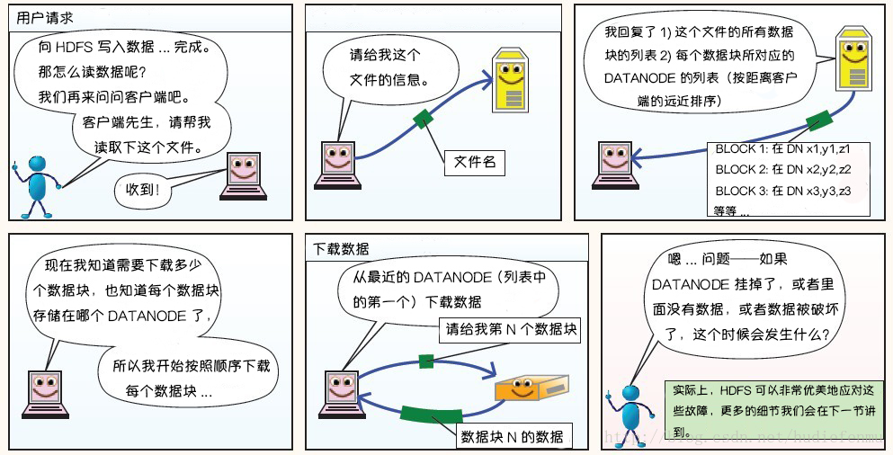
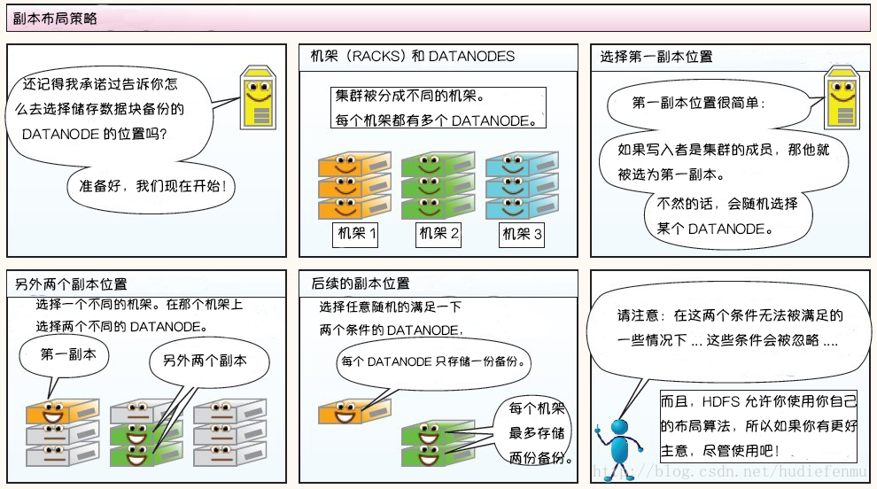

## 1 初始Hadoop

**1.1  相较于其它系统的优势**

- **为什么不能用配有大量硬盘的数据库来进行大规模数据分析？为什么需要Hadoop？**

计算机硬盘的寻址时间的提升远远不如传输速度的提升。寻址是将磁头移动到特定硬盘位置进行读/写操作的过程。他是导致硬盘操作延迟的主要原因，而传输速率取决于硬盘的带宽。

如果数据访问模式中包含大量的硬盘寻址，那么读取大量数据集就必然会花更长的时间。另一方面，如果数据库系统只更新一小部分记录，那么传统的B树就更有优势，但是数据库系统如果有大量数据更新时，B树的效率就明显落后于MapReduce，因为需要使用“排序/合并”来重建数据库。

在许多情况下，可以将MapReduce看作关系型数据库管理系统的补充，MapReduce适合解决需要以批处理方式分析整个数据集的问题。RDBMS适用于索引后数据集的点查询和更新，建立索引的数据库系统能够提供对小规模数据的低延迟数据检索和快速更新。**MapReduce适合一次写入，多次读取数据的应用，关系型数据库则更适合持续更新的数据集。**

|          | 传统关系型数据库 | MapReduce          |
| -------- | ---------------- | ------------------ |
| 数据大小 | GB               | PB                 |
| 数据存取 | 交互式和批处理   | 批处理             |
| 更新     | 多次读/写        | 一次写入，多次读取 |
| 事务     | ACID             | 无                 |
| 结构     | 写时模式         | 读时模式           |
| 完整性   | 高               | 低                 |
| 横向扩展 | 非线性           | 线性               |

## 2 关于MapReduce

**MapReduce是一种可用于数据处理的编程模型。**

**2.4.1 数据流**

MapReduce作业是客户端需要执行的一个工作单元：它包括输入数据、MapReduce程序和配置信息。Hadoop将作业分成若干个任务(task)来执行，其中包括辆类任务：map任务和reduce任务。这些任务运行在集群的节点上，并通过YARN进行调度。如果一个任务失败，它将在另一个不同的节点上自动重新调度运行。

- **为什么最佳分片的大小应该和块大小相同**？

因为他是确保可以存储在单个节点上的最大输入块的大小，如果分片跨越两个数据块，那么对于任何一个HDFS节点，基本都不可能同时存储这两个数据块，因此分片中的部分数据需要通过网络传输到map任务运行的节点。与使用本地数据运行整个map任务相比，这种方法效率更低。

- **map任务将其输出写入本地硬盘，而非HDFS？**

map的输出是中间结果：该中间结果由reduce任务处理后才产生最终输出结果，而且一旦作业完成，map的输出结果就可以删除。如果运行map任务的节点在将map中间结果传送给reduce任务之前是失败，hadoop将在另一个节点上重新运行这个map任务以再次构建map中间结果。

## 3 Hadoop分布式文件系统

**系统构成和写数据过程**

**HDFS写数据原理**

**读数据原理**

**HDFS故障类型和其检测方法**

**读写故障的处理**

**DataNode故障处理**

**副本布局策略**

### 3.2 HDFS的概念

- **HDFS中的块为什么这么大？**

HDFS的块比磁盘的块大，其目的是为了最小化寻址开销。如果块足够大，从磁盘传输数据的时间会明显大于定位这个块开始位置所需的时间。因而，传输一个由多个块组成的大文件的时间却决于磁盘传输速率。MapReduce中的map任务通常一次只处理一个块中的数据，因此如果任务数太少，作业的运行速度就会比较慢。

- **分布式文件系统中块抽象的好处？**

1. 一个文件的大小可以大于网络中任意一个磁盘的容量。文件的所有块并不需要存储在同一个磁盘上，因此他们可以利用集群上的任意一个磁盘进行存储。
2. 使用抽象块而非整个文件作为存储单元，大大简化了存储子系统的设计。将存储子系统的处理对象设置为块，可简化存储管理。同时也消除了对元数据的顾虑。
3. 块非常适合用于数据备份进而提供数据容错能力和提高可用性。

#### 3.2.2 namenode和datanode

HDFS集群有两类节点以管理节点-工作节点模式运行，即一个namenode(管理节点)和多个datanode(工作节点)。

**namenode**

1. 管理文件系统的命名空间，它维护者文件系统树及整棵树内所有的文件和目录。这些信息以两个文件形式永久保存在本地磁盘上：命名空间镜像文件和编辑日志文件。
2. 记录每个文件中各个块所在的数据节点信息(但它并不永久保存块的位置信息，因为这些信息会在系统启动时根据数据节点信息重建)。

**datanode**

文件系统的工作节点。它们根据需要存储并建锁数据块，并定期向namenode发送它们所存储的块的列表。

- **namenode容错机制**

1. 备份哪些组成文件系统元数据持久状态的文件。Hadoop可以通过配置使namenode在多个文件系统上保存元数据的持久状态。这些写操作是实时同步的，且是原子操作。
2. 运行一个辅助namenode，但它不能被用作namenode。这个辅助namenode的重要作用是定期合并编辑日志与命名空间镜像，以防止编辑日志过大。**它会保存合并后的命名空间镜像的副本，并在namenode发生故障时启用。**但是辅助namenode保存的状态总是滞后于主节点，所以在主节点全部失效时，难免会丢失部分数据。

- **HDFS高可用的实现需要在架构上做如下修改：**

1. namenode之间需要通过高可用共享存储实现编辑日志的共享。当备用namenode接管工作之后，它将通读共享编辑日志直至末尾，以实现与活动namenode的状态同步，并继续读取由活动namenode写入的新条目。
2. datanode需要同时向两个namenode发送数据块报告，因为数据块的映射信息存储在namenode的内存中，而非磁盘。
3. 客户端需要使用特定的机制来处理namenode的失效问题，这一机制对用户是透明的。
4. 辅助namenode的角色被备用namenode所包含，备用namenode为活动的namenode命名空间设置周期性检查点。

### 3.6 数据流

#### 3.6.1剖析文件读取

- 读取文件时事件的发生顺序？

客户端通过调用FileSystem对象的open()方法来打开希望读取的文件，对于HDFS来说，这个对象是DistributedFileSystem的一个实例。DistributedFileSystem通过使用远程过程调用(RPC)来调用namenode，以确定文件起始块的位置。对于每一个块，namenode返回存有该块副本的datanode地址。此外，这些打他弄得根据它们与客户端的距离来排序，如果该客户端本身就是一个datanode，那么该客户端将会从保存有相应数据块副本的本地datanode读取数据。

>在读取数据的时候，如果DFSInputStream在与datanode通信时遇到错误，会尝试从这个块的另外一个最邻近datanode读取数据。他也会记住那个datanode，以保证以后不会反复读取该节点上后续的块。
>
>DFSInputStream也会通过校验和确认从datanode发来的数据是否完整。如果发现有损坏的块，DFSInputStream也会试图从其它datanode读取其副本，也会将被损坏的块通知给namenode。

- 网络拓扑与Hadoop，”彼此邻近“什么意思？

Hadoop把网络看作一棵树，两个节点间的距离是它们到**最近共同祖先**的距离总和。该树中的层次是没有预先设定的，但是相对于数据中心、机架和正在运行的节点，通常可以设定等级。具体想法是针对以下每个场景，可用带宽以此递减：

1. 同一节点上的进程
2. 同一机架上的不同节点
3. 同一数据中心中不同机架上的节点
4. 不同数据中心中的节点

>数据中心d1、机架r1中的节点n1，可表示为/d1/r1/n1
>
>distance(/d1/r1/n1,/d1/r1/n1)=0	同一节点上的进程
>
>distance(/d1/r1/n1,/d1/r1/n2)=2	同一机架上的不同节点
>
>distance(/d1/r1/n1,/d1/r2/n3)=4	同一数据中心不同机架上的接待你
>
>distance(/d1/r1/n1,/d2/r3/n4)=6	不同数据中心中的节点

