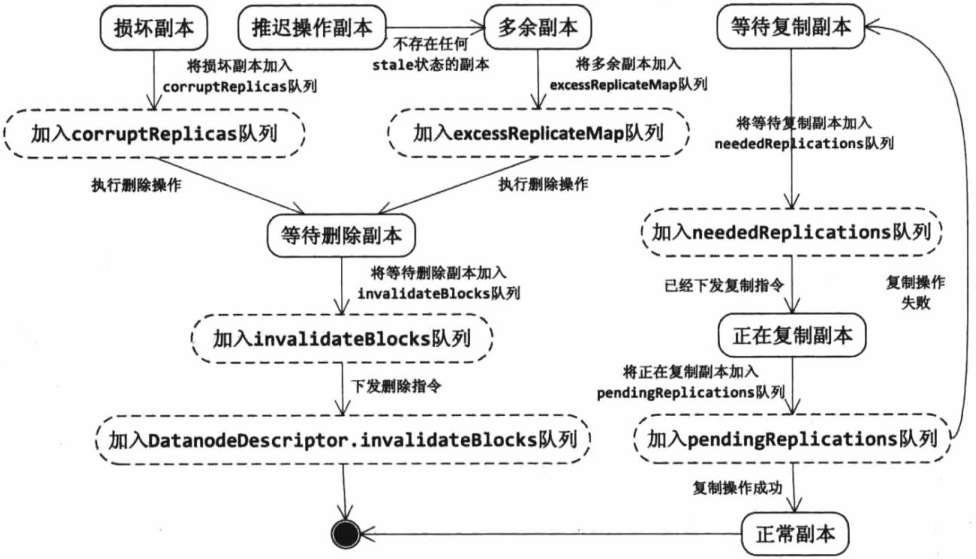
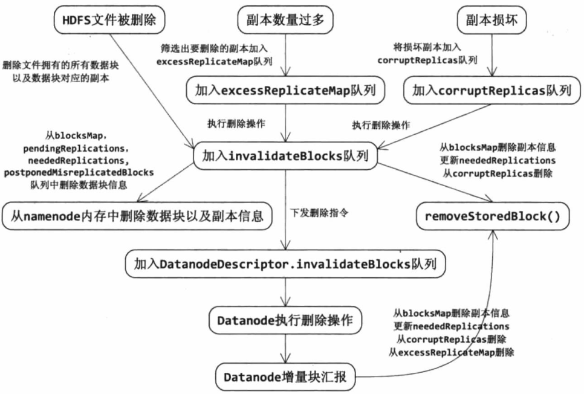
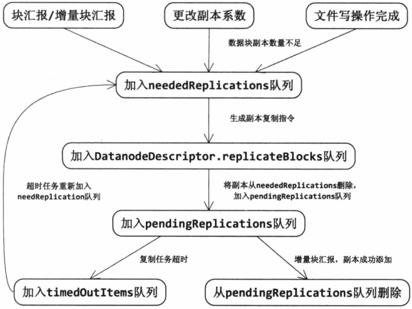
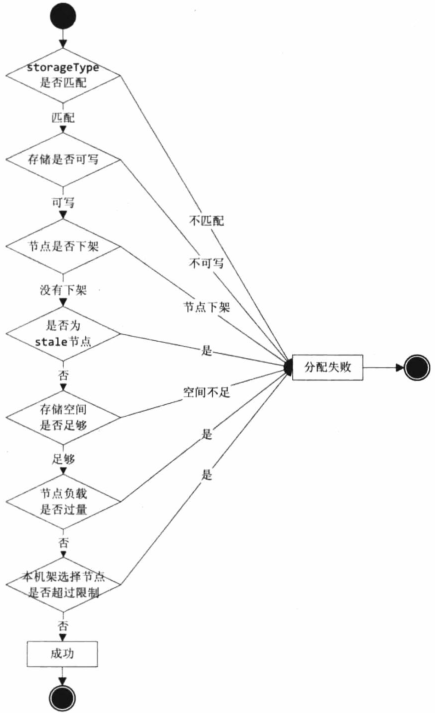
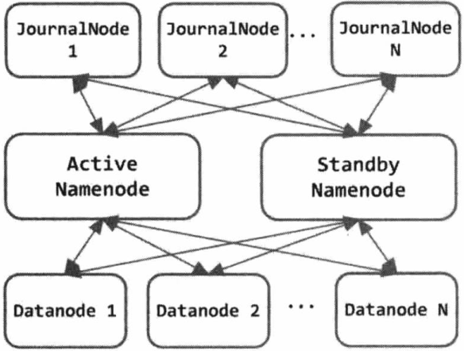
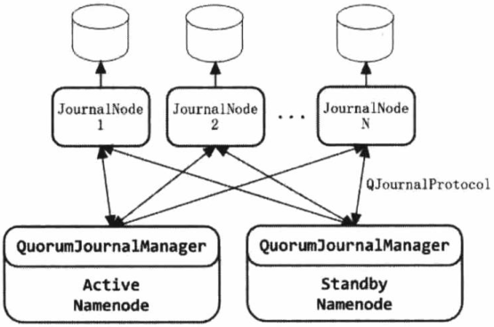

## 第二章 Hadoop RPC

RPC服务器端代码的处理流程与所有网络程序服务器端的处理流程类似，都分为5个步骤：

1. 读取请求
2. 反序列化请求
3. 处理请求
4. 序列化响应
5. 发回响应

对于网络服务器端程序来说，如果对每个请求都构建一个线程响应，那么在负载增加时性能会下降得很快；而如果只用少量线程响应，又会在`IO`阻塞时造成响应流程停止、吞吐率降低。

### Reactor模式

是一种广泛应用在服务器端的设计模式，也是一种基于事件驱动的设计模式。`Reactor`模式的处理流程是：应用程序向一个中间人注册`IO`事件，当中间人监听到这个`IO`事件发生后，会通知并唤醒应用程序处理这个事件。这里的中间人其实是一个不断等待和循环的线程，它接受所有应用程序的注册，并检查应用程序注册的`IO`事件是否就绪，如果就绪了则通知应用程序进行处理。

一个简单的基于`Reactor`模式的网络服务器设计，包括`reactor`、`acceptor`、`handler`等模块。`reactor`负责监听所有的`IO`事件，当检测到一个新的`IO`事件发生时,`reactor`会唤醒这个事件对应的模块处理。`acceptor`则负责响应`Socket`连接请求事件，`acceptor`会接受请求建立连接，之后构建`handler`对象。`handler`对象则负责向`reactor`注册`IO`读事件，然后从网络上读取请求并执行对应的业务逻辑，最后发回响应。


### 客户端和NameNode、DataNode通信过程

1. client和NameNode之间是通过RPC通信
2. DataNode和NameNode之间是通过RPC通信
3. client和DataNode之间是通过简单的Socket通信
4. DataNode与DataNode之间通过RPC通信

**以HDFS读写文件为例：**
  NameNode主要负责管理文件系统的==命名空间、集群配置信息和存储块的复制==等。NameNode会将文件系统的Meta-data存储在内存中，这些信息主要包括了文件信息、每一个文件对应的文件块的信息和每一个文件块在DataNode的信息等。==NameNode本身就是一个RPC的服务端，主要实现的接口有：ClientProtocol、DatanodeProtocol、NamenodeProtocol==。
  DataNode是文件存储的基本单元，它将Block存储在本地文件系统中，保存了Block的Meta-data，同时周期性地将所有存在的Block信息发送给NameNode。

ClientProtocol接口
ClientProtocol协议用于客户端和NameNode之间的交流。客户端通过此协议可以操纵HDFS的目录命名空间、打开与关闭文件流等。该接口协议中定义的与文件内容相关的操作主要有

（1）文件管理，文件的增、删、改，权限控制、文件块管理等；

（2）文件系统管理，查看文件系统状态和设置元数据信息，例如容量、块大小、副本因子数等；

（3）持久会话类，如放弃对指定块的操作、客户端同步等。

DataNodeProtocol接口
该协议用于DataNode和NameNode之间进行通信，例如发送心跳报告和块状态报告。一般来说，NameNode不直接对DataNode进行RPC（后面的文章会介绍）调用，如果一个NameNode需要与DataNode进行通信，唯一的方式，就是通过调用该协议接口定义的方法。

NameNodeProtocol接口
该协议接口定义了备用NameNode（Secondary NameNode）（注意，他不是NameNode的备份） 他是一个用来辅助NameNode的服务器端进程，主要是对映像文件执行特定的操作，另外，还包括获取指定DataNode块上的操作。

## 第三章 Namenode

### 3.1文件系统目录树

#### 3.1.4 FSImage

##### 1 fsimage和edits文件

fsimage和edits文件都是经过`序列化(protocol)`的，在NameNode启动的时候，它会将fsimage文件中的所有内容加载到内存中，之后再执行edits文件中的各项操作。使得内存中的元数据和实际的数据同步，存在内存中的元数据支持客户端的读操作。 

在NameNode启动之后，hdfs中的更新操作会重新写到edits文件中，因为fsimage文件一般情况下都是非常大的，可以达到GB级别甚至更高，如果所有的更新操作都向fsimage中添加的话，势必会导致系统运行的越来越慢。但是如果向edits文件中写的话就不会导致这样的情况出现，每次执行写操作后，且在向客户端发送成功代码之前，edits文件都需要同步更新的。 如果一个文件比较大，会使得写操作需要向多台机器进行操作，只有当所有的写操作都执行完成之后，写操作才可以称之为成功。这样的优势就是在任何的操作下都不会因为机器的故障而导致元数据不同步的情况出现。

fsimage包含hadoop文件系统中的所有的目录和文件IDnode的序列化信息。**对于文件来说，包含的信息有修改时间、访问时间、块大小和组成一个文件块信息等**；**对于目录来说，包含的信息主要有修改时间、访问控制权等信息**。**fsimage并不包含DataNode的信息，而是包含DataNode上块的映射信息，并存在内存中**。当一个新的DataNode加入集群时，DataNode都会向NameNode提供块的信息，并且NameNode也会定期的获取块的信息，以便NameNode拥有最新的块映射信息。又因为fsimage包含hadoop文件系统中的所有目录和文件IDnode的序列化信息，所有一旦fsimage出现丢失或者损坏的情况，那么即使DataNode上有块的数据，但是我们没有文件到块的映射关系，所以我们也是没有办法使用DataNode上的数据。所以定期且及时的备份fsimage和edits文件非常重要.


##### 2 **Namenode维护着HDFS中最重要的关系**

1. HDFS文件系统的目录数以及文件的数据块索引，文件系统目录数在3.1节中已经介绍，文件的数据块索引即每个文件对应的数据块列表，这个信息保存在`INodeFile.blocks`字段中。
2. 数据块和数据节点的对应关系，即指定数据块的副本保存在哪些数据节点上的信息。这个信息是在`Datanode`启动时，由`Datanode`上报给`Namenode`的，也就是说这个信息是`Namenode`动态构建起来的，而不是从`fsimage`文件中加载的。

在3.1节中已经介绍了HDFS文件系统目录树的实现，我们知道`Namenode`会定期将文件系统目录树以及文件与数据块的对应关系保存至fsimage文件中，然后在`Namenode`启动时读取fsimage文件以重建HDFS第一关系。**要注意的是第二关系并不会保存至fsimage文件中，也就是说，fsimage并不记录数据块和数据节点的对应关系。**这部分数据是由`Datanode`主动将当前`Datanode`上保存的数据块信息汇报给`Namenode`，然后`Namenode`更新内存中的数据，以维护数据块和数据节点的对应关系。

### 3.2 数据块管理

#### 3.2.1 Block、Replica、BlocksMap

`BlocksMap`是`Namenode`上与数据块相关的最重要的类，它管理着`Namenode`上数据块的元数据，包括当前数据块属于哪个HDFS文件，以及当前数据块保存在哪些`Datanode`上，当`Datanode`启动时，会对`Datanode`的本地磁盘进行扫描，并将当前`Datanode`上保存的数据块信息汇报给`Namenode`。`Namenode`收到`Datanode`的汇报信息后，会建立数据块与保存这个数据块的数据节点的对应关系，并将这个信息保存在`BlocksMap`中，所以无论是获取某个数据块对应的`HDFS`文件，还是获取数据块保存在哪些数据节点上，都需要通过`BlocksMap`对象。

`BlocksMap`通过一个`GSet`对象维护了`Block->BlockInfo`的映射关系，`GSet`是`Hadoop`自己实现的一个比较特殊的集合类型，其特数的地方在于它是一个集合，但却提供类似映射的功能：

```java
private final int capacity;
private volatile GSet<Block,BlockInfo> blocks;
```

**为什么BlocksMap维护的是Block->BlockInfo的对应关系呢？**

这是因为`BlockInfo`保存数据节点的信息都是在`Datanode`启动时上报的，**也就是动态构建的**。而`Namenode`启动时内存中保存的关于数据块的信息只有`Block`类中维护的这么多，所以`Namenode`维护了`Block->BlockInfo`的对应关系，随着`Datanode`不断地上报数据块信息，`BlockInfo`地信息会不断地更新。

#### 3.2.2 数据块状态管理

###### （5）`postponedMisreplicatedBlocks`队列

当`Namenode`发生错误并进行`Actice`与`Standby`切换时，`Namenode`中保存的多余副本不能直接删除，需要先放入`postponedMisreplicatedBlocks`队列中，直到这个数据块地所有副本所在的`Datanode`都进行了块汇报。

为什么这样设计？

1. `blockA`有两个副本，副本1在`datanode1`上，副本2在`datanode2`上
2. 这时，`namenode1`发出删除指令，删除`datanode1`上的副本1
3. 发出删除指令后，`namenode1`发生错误，切换至`namenoe2`
4. 这时`datanode1`并没有进行块汇报，`namenode2`并不知道`datanode1`上已经删除了副本1，所以`namenode2`向`datanode2`发出删除操作
5. `datanode2`删除副本2，数据块地所有副本都被删除了，数据块也就丢失了


###### 数据块副本状态转换图



###### 数据块副本删除流程图




###### 数据块地复制

`Namenode`会在以下三种情况下将一个数据块副本加入`needReplications`队列中以执行数据块副本复制流程：

1. 客户端完成了一个文件地写操作，`Namenode`会检查这个文件包含地所有数据块是否有足够地副本数量，如果不足则加入`neededReplications`队列中
2. 当`Namenode`执行一个`Datanode`地撤销操作时，会将这个`Datanode`上保存的所有副本进行复制，也就是将这些副本加入`neededReplicsations`队列中。
3. `pendingReplications`队列中保存的数据块复制任务超时，会将这些任务重新加入`neededReplications`队列中。

当待复制数据块加入`neededReplications`队列后，会由`RedundancyMonitor`线程处理，调用`computeDatanodeWork()`方法定期从`needReplications`队列中筛选出数据块，然后为这些数据块选择复制的源`Datanode`和目标`Datanode`，再将数据块加入源`Datanode`对应的`DatanodeDescriptor`的`replicateBlocks`队列，生成复制数据块的指令通过心跳响应将指令带到源`Datanode`。完成名字节点指令的生成后，`computeDatnodeWork()`方法会将待复制数据块从`neededReplicatioins`队列中删除，然后加入`pendingReplications`队列。



##### 3 块汇报

为了提高`HDFS`的启动速度，`Namenode`会将`Datanode`的全量块汇报分为两种：启动时发送的第一次全量块汇报和周期性的全量块汇报。对于启动时发送的第一次全量汇报，为了提高响应速度，`Namenode`不会计算哪些元数据需要删除，不会计算无效副本，将这些处理都推迟到下一次块汇报时处理。


### 3.3 数据节点管理

#### 3.3.3 DatanodeManager

##### 4 Datanode的心跳

`Datanode`的`BPServiceActor`对象会以`dnConf.heartBeatInterval(默认3s)`间隔向`Namenode`发送心跳，`Datanode`向`Namenode`发送的心跳信息包括：`Datanode`的注册信息、`Datanode`的存储信息、缓存信息、当前`Datanode`写文件的连接数、读写数据使用的线程数的等描述当前`Datanode`负载信息。

`Namenode`收到`Datanode`的心跳之后，会调用`BlockManager.hadnleHeartBeat()`方法返回一个心跳响应`HeartbeatResponse`。这个心跳响应中包含一个`DatanodeCommand`的数组，用来携带`Namenode`对`Datanode`的指令，例如数据块副本的复制、删除、缓存等指令。

`NameNode`还会启动一个线程，负责周期性检测所有`Datanode`上报心跳的情况，对于长时间没有上报心跳的`Datanode`，则认为该`Datanode`出现故障不能正常工作，这时会调用`DatanodeManager.removeDatanode()`删除该数据节点。

### 3.4 租约管理

`HDFS`文件是`write-once-read-many`，并且不支持客户端的并行写操作，那么就**需要一种机制保证对HDFS文件的互斥操作**。`HDFS`提供了租约==Lease==机制来实现这个功能，租约是`HDFS`种一个重要的概念，是`Namenode`给予租约持有者`LeaseHolder`在规定时间内有文件权限==写文件==的合同。

在`HDFS`中，客户端写文件时需要先从租约管理器`LeaseManager`申请一个租约，成功申请租约后客户端就成为了租约持有者，也就拥有了对该`HDFS`文件的独占权限，其它客户换在该租约有效时无法打开这个`HDFS`文件进行操作。`Namenode`的租约管理器保存了`HDFS`文件与租约、租约和租约持有者的对应关系，租约管理者还会定期检查它维护的所有租约是否过期。租约管理器会强制收回过期的租约，所有租约持有者需要定期更新租约，维护对该文件的独占锁定。当客户端完成了对文件的写操作，关闭文件时，必须在租约管理器中释放租约。

### 3.5 缓存管理

`Hadoop2.3.0`版本新增了集中式缓存管理`Centralized Cache Management`功能，允许用户将一些文件和目录保存到`HDFS`缓存中，`HDFS`集中式缓存是由分布在`Datanode`上的堆外内存组成的，并且由`Namenode`同一管理。

添加集中式缓存功能的`HDFS`集群具有以下显著优势：

1. 阻止了频繁使用的数据从内存中清除
2. 因为集中式缓存是由`Namenode`统一管理的，所以`HDFS`客户端可以根据数据块的缓存情况调度任务，从而提高了数据块的读性能。
3. 数据块被`Datanode`缓存后，客户端就可以使用一个新的更高效的零拷贝机制读取数据块。因为数据块被缓存时已经执行了校验操作，所以使用零拷贝读取数据块的客户端不会有读取开销。
4. 可以提高集群的内存利用率。当`Datanode`使用操作系统的`buffer`缓存数据块时，对一个块的重复读会导致该块的`N`个副本全部被送入操作系统的`buffer`中，而使用集中式缓存时，用户可以锁定这`N`个副本中的`M`个，从而节约了`N-M`的内存。

#### 3.5.1 缓存概念

`HDFS`集中式缓存有两个主要概念：

1. 缓存指令`Cache Directive`：一条缓存指令定义了一个要被缓存的路径(`PATH`)，这些路径可以是文件夹或文件。需要注意的是，文件的缓存是非递归的，只有在文件夹第一层列出的文件才会被缓存，文件夹也可以指定额外的参数，比如缓存副本因子(`replication`)、有效期等。缓存副本因子设置了路径的缓存副本数，如果多个缓存指令指向同一个文件，那么就用最大缓存副本因子。
2. 缓存池`Cache Pool`：缓存池是一个管理单元，是管理缓存指令的组。缓存池拥有类似`UNIX`的权限，可以限制哪个用户和组可以访问该缓存池。缓存池也可以用于资源管理。可以设置一个最大限制值，限制写入缓存池中指令的字节数。

#### 3.5.3 HDFS集中式缓存架构

用户通过`hdfs cacheadmin`命令或者`HDFS API`向`Namenode`发送缓存指令，`Namenode`的`CacheManager`类会将缓存指令保存到内存的指定数据结构中，同时在`fsimage`和`editlog`文件中记录该缓存指令。之后`Namenode`的`CacheReplicationMonitor`类会周期性扫描命名空间和活跃的缓存指令，以确定需要缓存或删除缓存的数据块，并向`Datanode`分配缓存任务。`Namenode`还负责管理集群中所有`Datanode`的堆外缓存，`Datanode`会周期性向`Namenode`发送缓存报告，而`Namenode`会通过心跳响应向`Datanode`下发缓存指令。`DFSClient`读取数据块时回向`Namenode`发送`ClientProtocol.getBlockLocations`请求获取数据块的位置信息，`Namenode`除了返回数据块的位置信息外，还会返回该数据块的缓存信息，这样`DFSClient`就可以执行本地零拷贝读取缓存数据块。


### 3.6 ClientProtocol实现

#### 3.6.3 创建新的数据块

##### 1 分析状态--`analyzeFileState()`

1. 如果`previousBlock==null`，也就是`addBlock()`方法并未携带文件最后一个数据块的信息。这种情况可能是`Client`调用`ClientProtocol.append()`方法申请追加写文件，而文件的最后一个数据块正好写满，`Client`就会调用`addBlock()`方法申请新的数据块，这时`analyzeFileState()`方法无须执行任何操作，`getAdditionalBlock()`方法正常执行数据块分配操作即可。
2. 如果`previousBlock`信息与`penultimateBlock`信息匹配，`penultimateBlock`是`Namenode`记录的文件倒数第二个数据块的信息。这种情况是`Namenode`已经成功地为`Client`分配了数据块，但是响应信息并未送回`Client`,所以`Client`重发了请求。对于这种情况，由于`Namenode`已经成功地分配了数据块，并且`Client`没有向新分配的数据块写入任何数据，所以`analyzeFileState()`方法会将分配的数据块保存至`onRetryBlock`参数中，`getAdditionalBlock()`方法可以直接将`onRetryBlock`中保存的数据块再次返回给`Client`,而无须构造新的数据块。
3. `previousBlock`信息与`lastBlockInFile`信息不匹配，这是异常的情况，不应该出现，`getAdditionalBlock()`方法会直接抛出异常。`
4. Namenode`正在执行分配数据块操作，例如正在调用`chooseTarget()`方法，这时Client由于请求超时而重新发送了请求。对于重发的请求，`analyzeFileState()`无须进行任何操作，因为之前的请求并未改变命名空间的状态。


##### 2 分配数据节点--`chooseTarget4NewBlock()`

1. 如果`Client`不是一个`DataNode`,则在集群范围内随机选择一个节点作为第一个节点。

2. 如果`Client`是一个`DataNode`,则判断`Client`所在的本地数据节点是否符合存储数据块的要求，如果符合，则第一个节点分配完毕；如果该数据节点不符目标节点要求，则在`Client`同一个机架范围内寻找，如果找到目标节点，则第一个节点分配完毕；
3. 如果在同一个机架内未找到符合要求的目标节点，则在集群内随机分配一个节点，找到则第一个节点分配完毕；否则分配失败。
4. 如果已经成功分配第一个数据节点，则在与第一个分配节点不同机架的远程机架内寻找第二个目标节点。如果符合要求，则第二个节点分配完毕：如果在远程机架内未找到符合要求的目标节点，则在第一个分配节点的机架内寻找，如果找到则第二个节点分配完毕，否则第二个节点分配失败。
5. 如果前两个节点分配成功，则准备分配第三个副本的目标节点。首先判断前两个节点是否在同一个机架内，如果是，则在远程机架内寻找目标节点，找到则第三个节点分配完毕：如果前两个节点在不同的机架内，且当前数据块为新分配的数据块，则在与`Client`相同的机架内寻找。如果当前数据块为已有的数据块，则在第二个节点的机架内分配。如果找到则第三个节点分配完毕，未找到则在集群中随机分配一个节点；否则第三个节点分配失败。
6. 如果需要分配的节点数目大于三个，则在集群范围内随机寻找节点。


在`chooseTarget4NewBlock()`逻辑中，如何判断一个数据节点满足保存数据块副本的要求？这里是通过`BlockPlacementPolicy.isGoodTrarget()`方法判断，如果返回`true`，则当前数据节点可以作为数据块副本的保存节点。



### 3.7 `Namenode`的启动和停止

安全模式是`Namenode`的一种状态，处于安全模式中的`Namenode`不接受任何对于命名空间的修改操作，同时也不触发任何复制和删除数据块的操作。

`Namenode`启动时会首先加载命名空间镜像(`fsimage`)并且合并编辑日志(`editslog`),完成这些操作后`Namenode`的==第一关系（文件系统目录树）也就建立起来了==。之后`Namenode`就需要接受`Datanode`的块汇报(`blockReport`)以获得数据块的存储信息，==也就是建立第二关系==（数据块与存储这个数据块副本的Datanode的对应关系）。这些操作都是`Namenode`在安全模式中进行的，只有当`Namenode`==收集到的阈值比例满足最低副本系数的数据块时才可以离开安全模式==。最低副本系数指的是一个数据块应该拥有的最少的副本数量，它是由配置项`dfs.namenode..replication.min`配置的，`默认值是1`。这里的阈值比例指的是已经收集到的满足最低副本系数的数据块数量与`HDFS`文件系统中所有数据块的比例，文件系统中所有数据块的数量在第一关系建立时就可以获得，阈值比例则是由配置项`dfs.safemode.threshold.pct`配置的，默认是`0.999`。当`Namenode`发现已经满足了阈值比例后，会延迟一段时间退出安全模式，目的是等待那些还没有进行块汇报的数据节点进行块汇报，这个时间是由配置项`dfs.safemode.extension`配置的，默认是`30`秒。之后`Namenode`就可以顺利地退出安全模式了。

| 配置名                         | 类型  | 默认值 | 描述                                                         |
| ------------------------------ | ----- | ------ | ------------------------------------------------------------ |
| `dfs.namenode.replication.min` | int   | 1      | 数据块最低副本系数，也用于写操作时判断是否可以`complete`一个数据块 |
| `dfs.safemode.threshold.pct`   | float | 0.999  | 离开安全模式时，系统需要满足的阈值比例。也就是满足最低副本系数的数据块与系统内所有数据块的比例 |
| `dfs.safeode.extension`        | int   | 30000  | 安全模式等待时间，也就是满足了最低副本系数之后，离开安全模式的时间，用于等待剩余的数据节点上报数据块 |

> 如果`threshold`设置为`0`,则`Namenode`启动时并不会进入安全模式。如果`threshold`设置为`1`，则`Namenode`需要等待所有数据块上报之后才能退出安全模式。如果`threshold`设置大于`1`,则`Namenode`无法自动退出安全模式。同时需要注意的是，任何时候都可以通过手动方式退出安全模式。

#### 3.7.2 HDFS HA

在一个`HA`集群中，会配置两个独立的`Namenode`。在任意时刻，只有一个节点会作为活动的节点，另一个节点则处于备份状态。活动的`Namenode`负责执行所有修改命名空间以及删除备份数据块的操作，而备份的`Namenode`则执行同步操作以保持与活动节点命名空间的致性。

为了使备份节点与活动节点的状态能够同步一致，两个节点都需要与组独立运行的节点`(JournalNodes,JNS)`通信。当`Active Namenode`执行了修改命名空间的操作时，它会定期将执行的操作记录在`editlog`中，并写入`JNS`的多数节点中。而`Standby Namenode`会一直监听`JNS`上`editlog`的变化，如果发现`editlog`有改动，`Standby Namenode`就会读取`editlog`并与当前的命名空间合并。当发生了错误切换时，`Standby`节点会先保证已经从`JNS`上读取了所有的`editlog`并与命名空间合并，然后才会从`Standby`状态切换为`Active`状态。通过这种机制，保证了`Active Namenode`与`Standby Namenode`之间命名空间状态的一致性，也就是第一关系链的一致性。

为了使错误切换能够很快地执行完毕，就需要保证`Standby`节点也保存了实时的数据块存储信息，也就是第二关系链。这样发生错误切换时，`Standby`节点就不需要等待所有的数据节点进行全量块汇报，而可以直接切换为`Active`状态。为了实现这个机制，`Datanode`会同时向这两个`Namenode`发送心跳以及块汇报信息。这样`Active Namenode`和`Standby Namenode`的元数据就完全同步了，一旦发生故障，就可以马上切换，也就是热备。这里需要注意的是，`Standby Namenode`只会更新数据块的存储信息，并不会向`Namenode`发送复制或者删除数据块的指令，这些指令只能由`Active Namenode`发送。



在`HA`架构中有一个非常重要的问题，就是需要保证同一时刻只有一个处于`Active`状态的`Namenode`,否则就会出现两个`Namenode`同时修改命名空间的问题，也就是脑裂`(split-brain)`。脑裂的`HDFS`集群很有可能造成数据块的丢失，以及向`Datanode`下发错误指令等异常情况。为了预防脑裂的情况，`HDFS`提供了三个级别的隔离`(fencing)`机制。

1. 共享存储隔离：同一时间只允许一个`Namenode`向`JournalNodes`写入`editlog`数据。
2. 客户端隔离：同一时间只允许一个`Namenode`响应客户端请求。
3. `Datanode`隔离：同一时间只允许一个`Namenode`向`Datanode`下发名字节点指令，例如删除、复制数据块指令等。

##### Quorum Journal

所有的`HA`实现方案都依赖于一个保存`editlog`的共享存储。这个共享存储必须是高可用的，并且能够被集群中的所有`Namenode`同时访问。

在`Quorum Journal`模式之前，HDFS中使用最多的共享存储方案是`NAS+NFS`。但是这种方案有个缺点，就是为了预防脑裂的情况，它要求有一个互斥脚本在`Namenode`发生故障切换时关闭上一个活动节点，或者阻止上一个活动节点访问共享存储。为了解决这个问题，`cloudera`提供了`Quorum Journal`设计方案，这是一个基于`Paxos`算法实现的HA`方案`:



`Quorum Journal`方案中有两个重要的组件:

1. `JournalNode(JN)`:运行在`N`台独立的物理机器上，它将`editlog`文件保存在`JournalNode`的本地磁盘上，同时`JournalNode`还对外提供RPC接口`QJournalProtocol`以执行远程读写`editlog`文件的功能。
2. `QuorumJournalManager(QJM)`:运行在`Namenode`上（目前HA集群中只有两个`Namenode`,`Active&Standby`),通过调用`RPC`接口`QJournalProtocol`中的方法向`JournalNode`发送写入、互斥、同步`editlog`。

`Quorum Journal`方案依赖于这样一个概念：`HDFS`集群中有`2N+1`个`JN`存储`editlog`文件，这些`editlog`文件是保存在`N`的本地磁盘上的。每个`N`对`QM`暴露`RPC`接口`QJournalProtocol`,允许`Namenode`读写`editlog`文件。当`Namenode`向共享存储写入`editlog`文件时，它会通过`QJM`向集群中的所有N发送写`editlog`文件请求，当有一半以上的（`≥N+1`)`JN`返回写操作成功时即认为该次写成功。这个原理是基于`Paxos`算法的，集群能容忍最多有`N`台机器挂掉，如果多于`N`台挂掉，这个算法就失效了。

1. 使用`Quorum Journal`实现的`HA`方案有如下好处。
2. `JN`进程可以运行在普通的`PC`上，而无须配置专业的共享存储硬件。
3. 不需要实现单独的`fencing`机制，`Quorum Journal`模式中内置了`fencing`功能。
4. `Quorum Journal`不存在单点故障，集群中有`2N+1`个`JournalNode`,可以允许有`N`个`JournalNode`死亡。
5. `JN`不会因为其中一台机器的延迟而影响整体的延迟，而且也不会因为N数量的增多而影响性能（因为`Namenode`向`JournalNode`发送日志是并行的）。


##### 互斥机制

当`HA`集群发生`Namenode`异常切换时，需要在共享存储上`fencing`上一个活动节点以保证该节点不能再向共享存储写入`editlog`。基于`Quorum Journal`模式的`HA`提供了`epoch number`来解决互斥(`fencing`)问题，这个概念在很多分布式文献中都能找到（例如Paxos、ZAB等）。`epoch number`具有如下一些性质。

1. 当一个`Namenode`变为活动状态时，会分配给它一个`epoch number`。
2. 每个`epoch number`都是唯一的，没有任意两个`Namenode`有相同的`epoch number`。
3. `epoch number`定义了`Namenode`写`editlog`文件的顺序。对于任意两个`Namenode`,拥有更大`epoch number`的`Namenode`被认为是活动节点

当一个`Namenode`切换为活动状态时，它的`QJM`会向所有`JN`发送`QJournalProtocol.getJournalState()`请求以获取该`JN`的`lastPromisedEpoch`变量值，`lastPromisedEpoch`变量保存了该N认为的集群中活动的`Namenode`对应的`epoch number`值。当`QM`接收到集群中多于半的`N`回复后，它会将接收到的最大值加`1`并保存到`myEpoch`变量中，之后`QM`会调用`QJournalProtocol.newEpoch(myEpoch)`方法向所有`JN`发起更新`epoch number`请求。每个`JN`都会比较`QM`提交的`myEpoch`变量，以及当前`JN`保存的`lastPromisedEpoch`变量，如果新的`myEpoch`较大，则更新`N`的`lastPromisedEpoch`为新值，并且返回更新成功；如果小，则返回更新失败，如果`QJM`接收到超过一半的`JN`返回成功，则设置它的`epoch number`为`myEpoch`;否则，它中止尝试成为一个活动的`Namenode`,并抛出`IOException`异常。

当活动的`Namenode`成功获取并更新了`epoch number`后，调用任何修改`editlog`的`RPC`请求都必须携带`epoch number`。当`RPC`请求到达`JN`后（除了`newEpoch()`请求），`JN`会将请求者的`epoch number`与自己保存的`lastPromisedEpoch`变量做比较，如果请求者的`epoch number`更大，`JN`就会更新自己的`lastPromisedEpoch`变量，并执行对应的操作：如果请求者的`epoch number`更小，`JN`就会拒绝这次请求。当集群中的大多数`JN`拒绝了请求时，这次操作就失败了。考虑如下情况，当HDFS集群发生Namenode错误切换后，原来`Standby Namenode`会将集群的`epoch number`加`1`之后更新。这样原来的`Active Namenode`的`epoch number`肯定小于这个值，当这个节点执行写`editlog`操作时，由于`JN`节点不接收`epoch number`小于`lastPromisedEpoch`的写请求，所以这次写请求会失败，也就达到了`fencing`的目的。


