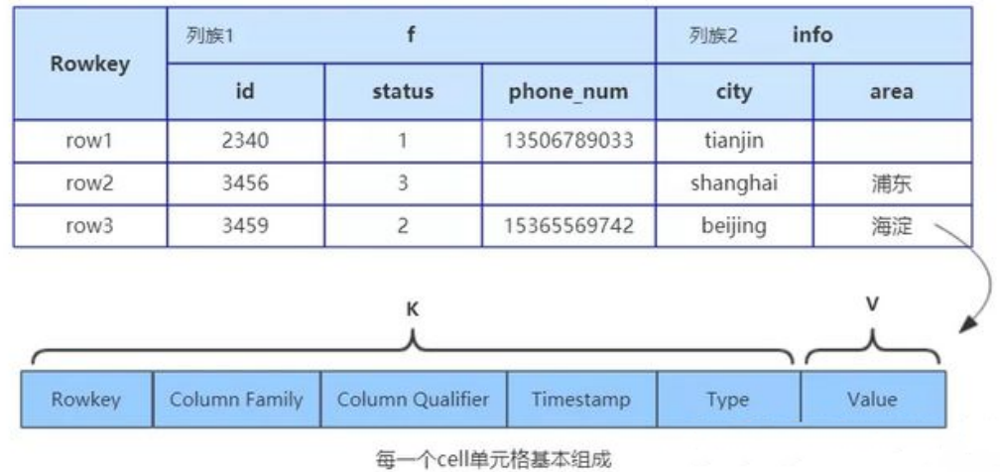
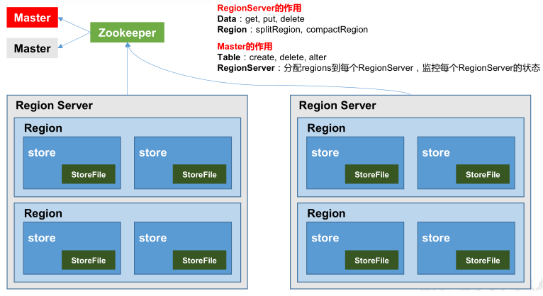
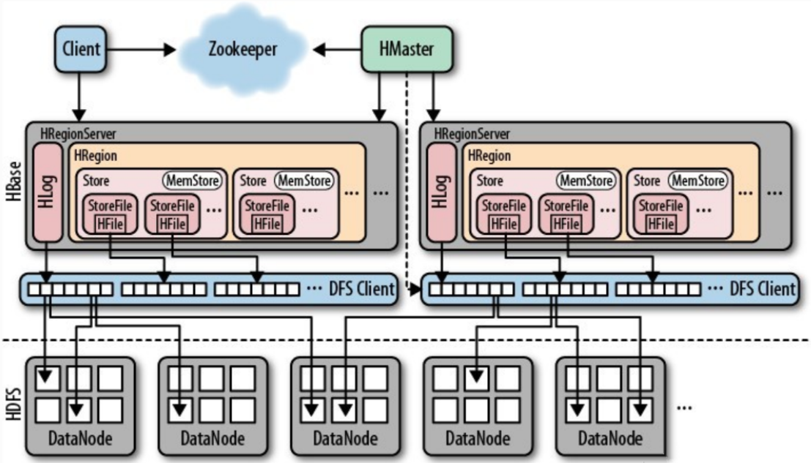
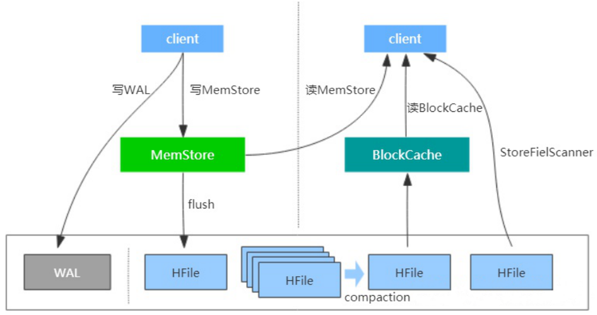

### 1 数据模型

#### 1.1 概念

1. NameSpace 命名空间，类似于关系型数据库的 DatabBase 概念，每个命名空间下有多个表。HBase有两个自带的命名空间，分别是 hbase 和 default，hbase 中存放的是 HBase 内置的表，default 表是用户默认使用的命名空间。
2. Region 类似于关系型数据库的表概念。不同的是，HBase定义表时只需要声明列族即可，不需要声明具体的列。这意味着，往HBase写入数据时，字段可以动态、按需指定。因此，和关系型数据库相比，HBase 能够轻松应对字段变更的场景。
3. Row HBase 表中的每行数据都由一个 RowKey 和多个 Column（列）组成，数据是按照RowKey的字典顺序存储的，并且查询数据时只能根据 RowKey 进行检索，所以 RowKey 的设计十分重要。
4. Column HBase 中的每个列都由 Column Family(列族)和 Column Qualifier（列限定符）进行限定，例如info：name，info：age。建表时，只需指明列族，而列限定符无需预先定义。
5. Time Stamp 用于标识数据的不同版本（version），每条数据写入时，如果不指定时间戳，系统会自动为其加上该字段，其值为写入 HBase 的时间。
6. Cell 由{rowkey, column Family：column Qualifier, time Stamp} 唯一确定的单元。cell 中的数据是没有类型的，全部是字节码形式存贮

#### 1.2 数据模型

HBase在实际存储数据的时候是以有序KV的形式组织的。

这里重点从`KV`这个角度切入，`Value`是实际写入的数据，比较好理解。其中`Key`则是由`Rowkey`、`Column Family `: `Column Qualifier`、`Timestamp`、`Type`等几个维度组成，其中`rowkey`是`HBase`的行键；`column family`（列族）与`qualifier`（列限定符即列名）共同组成了`HBase`的列；`timestamp`表示的就是数据写入时的时间戳，主要用于标识`HBase`数据的版本号；`type`代表`Put/Delete`的操作类型，说明一点，`HBase`删除是给数据打上`delete marker`，在数据合并时才会真正物理删除。此外，`HBase`的表具有稀疏特性，一行中空值的列并不占用任何存储空间。

#### 1.3 索引

默认情况下`HBase`只对`rowkey`做了单列索引，所以`HBase`能通过`rowkey`进行高效的单点查询及小范围扫描。`HBase`索引还是比较单一的，通过非`rowkey`列查询性能比较低，除非对非`Rowkey`列做二级索引，否则不建议根据非`rowkey`列做查询。`HBase`的二级索引一般是基于HBase协处理器实现，目前比较成熟的方案可以使用`Phoenix`，`Phoenix`不仅能够为`HBase`提供二级索引能力，还扮演着`HBase`的`SQL`层，增强了`HBase`即席查询的能力。

### 2 基本架构

1. **Region Server** 为 Region 的管理者，其实现类为 HRegionServer，主要作用如下:

   - 对于数据的操作：get, put, delete；

   - 对于 Region 的操作：splitRegion、compactRegion。

2. **Master**是所有 Region Server 的管理者，其实现类为 HMaster，主要作用如下：

   - 对于表的操作：create, delete, alter
   - 对于 RegionServer 的操作：分配 regions 到每个 RegionServer，监控每个 RegionServer的状态，负载均衡和故障转移。

3. **Zookeeper** HBase 通过 Zookeeper 来做 Master 的高可用、RegionServer 的监控、元数据的入口以及集群配置的维护等工作。

4. **HDFS** 为 HBase 提供最终的底层数据存储服务，同时为 HBase 提供高可用的支持

1. **StoreFile** 保存实际数据的物理文件，StoreFile 以 HFile 的形式存储在 HDFS 上。每个 Store 会有一个或多个 StoreFile（HFile），数据在每个 StoreFile 中都是有序的。
2. **MemStore**写缓存，由于 HFile 中的数据要求是有序的，所以数据是先存储在 MemStore 中，排好序后，等到达刷写时机才会刷写到 HFile，每次刷写都会形成一个新的 HFile。
3. **WAL**由于数据要经 MemStore 排序后才能刷写到 HFile，但把数据保存在内存中会有很高的概率导致数据丢失，为了解决这个问题，数据会先写在一个叫做 Write-Ahead logfile 的文件中，然后再写入 MemStore 中。所以在系统出现故障的时候，数据可以通过这个日志文件重建。

### 3 写流程

1. Client 先访问 zookeeper，获取 hbase:meta 表位于哪个 Region Server。
2. 访问对应的 Region Server，获取 hbase:meta 表，根据读请求的 namespace:table/rowkey，查询出目标数据位于哪个 Region Server 中的哪个 Region 中。并将该 table 的 region 信息以及 meta 表的位置信息缓存在客户端的 meta cache，方便下次访问。
3. 与目标 Region Server 进行通讯；
4. 将数据顺序写入（追加）到 WAL；
5. 将数据写入对应的 MemStore，数据会在 MemStore 进行排序；
6. 向客户端发送 ack；
7. 等达到 MemStore 的刷写时机后，将数据刷写到 HFile。

### 4 读流程

1. Client 先访问 zookeeper，获取 hbase:meta 表位于哪个 Region Server。
2. 访问对应的 Region Server，获取 hbase:meta 表，根据读请求的 namespace:table/rowkey，查询出目标数据位于哪个 Region Server 中的哪个 Region 中。并将该 table 的 region 信息以及 meta 表的位置信息缓存在客户端的 meta cache，方便下次访问。
3. 与目标 Region Server 进行通讯；
4. 分别在 Block Cache（读缓存），MemStore 和 Store File（HFile）中查询目标数据，并将查到的所有数据进行合并。此处所有数据是指同一条数据的不同版本（time stamp）或者不同的类型（Put/Delete）。
5. 将从文件中查询到的数据块（Block，HFile 数据存储单元，默认大小为 64KB）缓存到Block Cache。
6. 将合并后的最终结果返回给客户端

### 5 HBase 与 Hive 的对比

1．Hive

1. **数据仓库** Hive 的本质其实就相当于将 HDFS 中已经存储的文件在 Mysql 中做了一个双射关系，以方便使用 HQL 去管理查询。
2. **用于数据分析、清洗**Hive 适用于离线的数据分析和清洗，延迟较高。
3. **基于 HDFS、MapReduce** Hive 存储的数据依旧在 DataNode 上，编写的 HQL 语句终将是转换为 MapReduce 代码执行。

2．HBase

1. **数据库** 是一种面向列族存储的非关系型数据库。
2. **用于存储结构化和非结构化的数据** 适用于单表非关系型数据的存储，不适合做关联查询，类似 JOIN 等操作。
3. **基于 HDFS** 数据持久化存储的体现形式是 HFile，存放于 DataNode 中，被 ResionServer 以 region 的形式进行管理。
4. **延迟较低，接入在线业务使用** 面对大量的企业数据，HBase 可以直线单表大量数据的存储，同时提供了高效的数据访问速度。

### 6 HBase核心原理

`HBase`是`Google`的`BigTable`的开源实现，底层存储引擎是基于`LSM-Tree`数据结构设计的。写入数据时会先写WAL日志，再将数据写到写缓存`MemStore`中，等写缓存达到一定规模后或满足其他触发条件才会`flush`刷写到磁盘，这样就将磁盘随机写变成了顺序写，提高了写性能。每一次刷写磁盘都会生成新的`HFile`文件。可以参考如下的原理图：

随着时间推移，写入的`HFile`会越来越多，查询数据时就会因为要进行多次`io`导致性能降低，为了提升读性能，`HBase`会定期执行`compaction`操作以合并`HFile`。此外，`HBase`在读路径上也有诸多设计，其中一个重要的点是设计了`BlockCache`读缓存。这样以后，读取数据时会依次从`BlockCache`、`MemStore`以及`HFile`中`seek`数据，再加上一些其他设计比如布隆过滤器、索引等，保证了`HBase`的高性能。

#### B+Tree VS LSM-Tree

传统关系型数据采用的底层数据结构是B+树，那么同样是面向磁盘存储的数据结构LSM-Tree相比B+树有什么异同之处呢？

`LSM-Tree`的设计思路是，将数据拆分为几百M大小的`Segments`，并是顺序写入。

`B+Tree`则是将数据拆分为固定大小的`Block`或`Page`, 一般是`4KB`大小，和磁盘一个扇区的大小对应，`Page`是读写的最小单位。

在数据的更新和删除方面，`B+Tree`可以做到原地更新和删除，这种方式对数据库事务支持更加友好，因为一个`key`只会出现一个`Page`页里面，但由于`LSM-Tree`只能追加写，并且在`L0`层`key`的`rang`会重叠，所以对事务支持较弱，只能在`Segment Compaction`的时候进行真正地更新和删除。

因此`LSM-Tree`的优点是支持高吞吐的写（可认为是O（1）），这个特点在分布式系统上更为看重，当然针对读取普通的`LSM-Tree`结构，读取是`O（N）`的复杂度，在使用索引或者缓存优化后的也可以达到`O（logN）`的复杂度。

而`B+tree`的优点是支持高效的读（稳定的`OlogN`），但是在大规模的写请求下（复杂度O(LogN)），效率会变得比较低，因为随着`insert`的操作，为了维护B+树结构，节点会不断的分裂和合并。操作磁盘的随机读写概率会变大，故导致性能降低。

还有一点需要提到的是基于`LSM-Tree`分层存储能够做到写的高吞吐，带来的副作用是整个系统必须频繁的进行`compaction`，写入量越大，`Compaction`的过程越频繁。而`compaction`是一个`compare & merge`的过程，非常消耗`CPU`和存储`IO`，在高吞吐的写入情形下，大量的`compaction`操作占用大量系统资源，必然带来整个系统性能断崖式下跌，对应用系统产生巨大影响，当然我们可以禁用自动`Major Compaction`，在每天系统低峰期定期触发合并，来避免这个问题。

阿里为了优化这个问题，在`X-DB`引入了异构硬件设备`FPGA`来代替`CPU`完成`compaction`操作，使系统整体性能维持在高水位并避免抖动，是存储引擎得以服务业务苛刻要求的关键。