# Spark

## 1 Spark运行架构

### 1.1运行架构

Spark框架的核心是一个计算引擎，整体来说，它采用了标准`master-slave`的结构。如下图所示，它展示了一个Spark执行时的基本结构。图中的Driver表示master，负责管理整个集群中的作业任务调度。图形中的Executor则是slave，负责实际执行任务

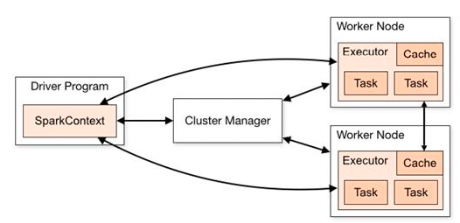

### 1.2核心组件

Spark框架有两个核心组件：

#### 1.2.1Driver

Spark驱动器节点，用于执行Spark任务中的main方法，负责实际代码的执行工作。Driver在Spark作业执行时主要负责：

1. 将用户程序转化为作业(job)
2. 在Executor之间调度任务(task)
3. 跟踪Executor的执行情况
4. 通过UI展示查询运行情况

> 简单理解，所谓的Driver就是驱使整个应用运行起来的程序，称之为Driver类。

#### 1.2.2Executor

Spark Executor是集群中工作节点(Worker)中的一个JVM进程，负责在Spark作业中运行具体任务(Task)，任务彼此之间相互独立，Spark应用启动时，Executor节点被同时启动，并且始终伴随着整个Spark应用的生命周期而存在，如果有Executor节点发生故障或崩溃，Spark应用也可以继续执行，会将出错节点上的任务调度到其他Executor节点上继续运行。

Executor有两个核心功能：

1. 负责运行组成Spark应用的任务，并将结果返回给驱动器进程
2. 通过自身的块管理器(Block Manager)为用户程序中要求缓存的RDD提供内存式存储。RDD是直接换存在Executor进城内的，因此任务可以在运行时充分利用缓存数据加速运算。

#### 1.2.3Master&Worker

Spark集群的独立部署环境中，不需要依赖其他的资源调度框架，自身就实现了资源调度的功能，所以环境中还有其他两个核心组件：Master和Worker，这里的Master是一个进程，主要负责资源的调度和分配，并进行集群的监控等职责，类似于YARN环境中的RM。一个Worker运行在集群中的一台服务器上，由Master分配资源对数据进行并行的处理和计算，类似于Yarn中的NM。

#### 1.2.4ApplicationMaster

Hadoop用户向YARN集群提交应用程序时，提交程序中应该包含ApplicationMaster，用于向资源调度器申请执行任务的资源容器Container，运行用户自己的程序任务job，监控整个任务的执行，跟踪整个任务的状态，处理任务失败等异常情况。

### 1.3提交流程

#### 1.3.1Yarn Client模式

Client模式将用于监控和调度的Driver模块在客户端执行，而不是在Yarn中，一般用于测试

1. Driver在任务提交的本地上运行
2. Driver启动后会和ResourceManager通讯申请启动ApplicationMaster
3. ResourceManager分配container，在合适的NodeManager上启动ApplicationMaster负责向ResourceManager申请Executor内存
4. ResourceManager接到Application的资源申请后会分配container，然后ApplicationMaster在资源分配指定的NodeManager上启动Executor进程
5. Executor进程启动后会向Driver反向注册，Executor全部注册完成后Driver开始执行main函数
6. 之后执行到Action算子时，出发一个Job，并根据宽依赖开始划分stage，每个stage生成对应的TaskSet，之后将task分发到各个Executor上执行

#### 1.3.2Yarn Cluster模式

Cluster模式将用于监控和调度的Driver模块启动在Yarn集群资源中执行，一般应用于实际生产环境。

1. 在Yarn Cluster模式下，任务提交后会和ResourceManager通讯申请启动ApplicationMaster
2. 随后ResourceManager分配container，在合适的NodeManager上启动ApplicationMaster，此时的ApplicationMaster就是Driver
3. Driver启动后向ResourceManager申请Executor内存，ResourceManager接到ApplicationMaster的申请后会分配container，然后在合适的NodeManager上启动Executor进程
4. Executor进程启动后会向Driver反向注册，Executor全部注册完成后Driver开始执行main函数
5. 之后执行到Action算子时，触发一个Job，并根据宽依赖开始划分stage，每个stage生成对应的TaskSet，之后将task分发到各个Executor上执行

## 2 Spark核心编程

spark计算框架为了能够进行高并发和高吞吐量的数据处理，封装了三大数据结构，用于处理不同的应用场景：

1. RDD：弹性分布式数据集
2. 累加器：分布式共享==只写==变量
3. 广播变量：分布式共享==只读==变量

### 2.1RDD

RDD(Resilient Distributed Dataset)弹性分布式数据集，是Spark中最基本的数据处理模型。代码中是一个抽象类，它代表一个弹性的、不可变、可分区、里面的元素可并行计算的集合。

1. 弹性
   - 存储的弹性：内存与磁盘的自动切换
   - 容错的弹性：数据丢失可以自动恢复
   - 计算的弹性：计算出错重试机制
   - 分片的弹性：可根据需要重新分片
2. 分布式：数据存储在大数据集群不同节点上
3. 数据集：RDD封装了计算逻辑，并不保存数据
4. 数据抽象：RDD是一个抽象类，需要子类具体实现
5. 不可变：RDD封装了计算逻辑，是不可以改变的，要想改变，只能产生新的RDD，在新的RDD里面封装计算逻辑
6. 可分区、并行计算


## 3 RDD编程

#### 3.5.1基本RDD

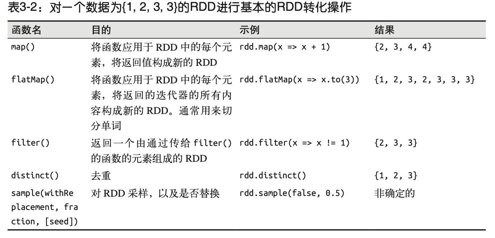

##### 伪集合操作

1. RDD中最常缺失的集合是元素的唯一性，因为常常有重复的元素。只要唯一的元素，可以使用`RDD.distince()`转化操作来生成一个只包含不同元素的新RDD。不过，`distinct()`操作开销很大，它需要将所有数据通过网络进行`shuffle`以确保每个元素都只有一份。
2. 最简单的集合操作是union，它会返回一个包含两个RDD中所有元素的RDD。
3. spark还提供了`intersection(other)`	方法，只返回两个RDD中都有的元素。在运行时也会去掉所有重复的元素。
4. 有时我们需要移除一些数据，subtract(other)函数接受另外一个RDD作为参数，返回一个由只存在于第一个RDD中而不存在于第二个RDD中的所有元素组成的RDD。和`intersection`一样，也需要`shuffle`
5. `cartesian(other)`转化操作会返回所有可能的(a,b)对，其中a是源RDD中的元素，而b则来自另一个RDD。

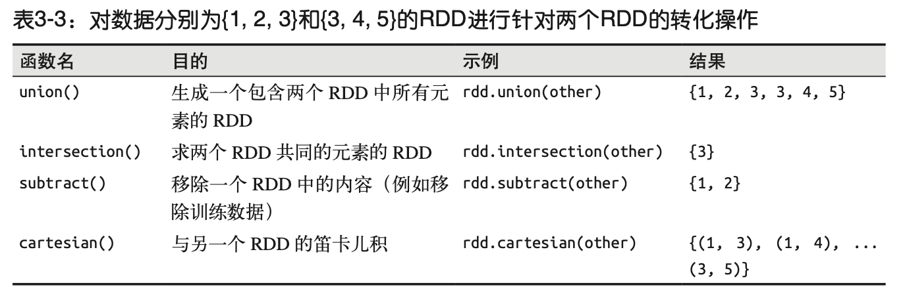

##### 行动操作

`fold()`和`reduce()`类似，接受一个与`reduce()`接收的函数签名形同的函数，再加上一个“初始值”来作为每个分区第一次调用时的结果。

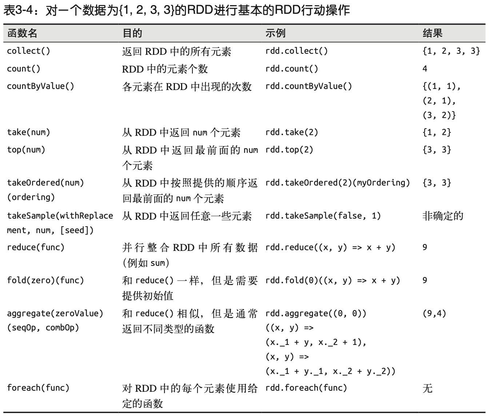


### 3.6 持久化(缓存)

为了避免多次计算同一个RDD，可以让Spark对数据进行持久化，当我们让Spark持久化存储一个RDD时，计算出RDD的节点会分别保存它们所求出的分区数据。如果一个持久化数据的节点发生故障，Spark会在序哟啊用到缓存数据的时候重算丢失的数据分区。如果希望节点故障的情况不会拖累我们的执行速度，也可以把数据备份到多个节点上。

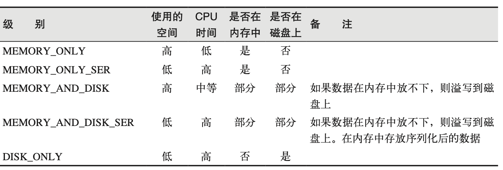

如果要缓存的数据太多，内存中放不下，Spark会自动利用最近最少使用(LRU)的缓存策略把最老的分区从内存中移除。对于仅把数据存放在内存中的缓存级别，下一次要用到已经被移除的分区时，这些分区就需要重新计算。但是对于使用内存与磁盘的缓存级别的分区来说，被移除的分区都会写入磁盘。不管哪种情况，都不必担心作业因为缓存太多数据而被打断。不过，缓存不必要的数据会导致有用的数据被移除内存，带来更多重算的时间开销。

RDD还有一个方法`unpersist()`，调用该方法可以手动把持久化的RDD从缓存中移除。


## 4 键值对操作

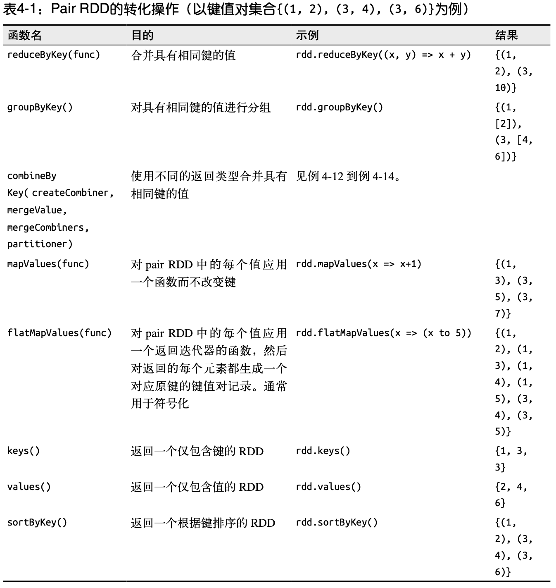


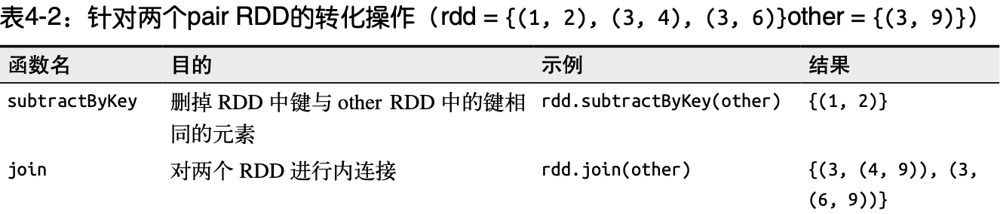

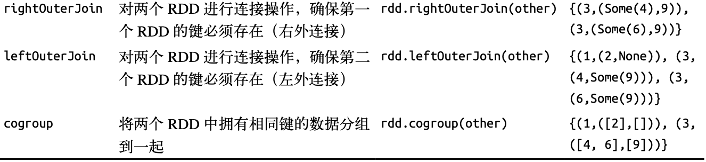


## 5 数据读取与保存

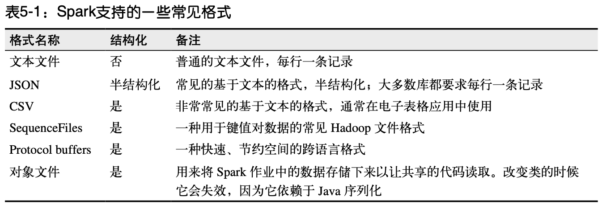

#### 5.2.1 文本文件

如果多个输入文件以一个包含数据所有部分的目录的形式出现，可以用两种方式来处理。可以仍使用`textFile	`函数，传递目录作为参数，这样它会把个部分都读取到RDD中。有时候有必要知道数据的个部分分别来自哪个文件，有时则希望同时处理整个文件，如果文件足够小，可以使用`sparkContext.wholeTextFiles()`方法，该方法会返回一个pair RDD，其中键是输入文件的文件名。

`wholeTextFiles()`在每个文件表示一个特定时间段内的数据时非常有用，如果有表示不同阶段销售数据的文件，则可以很容易求出每个阶段的平均值。

```scala
val input = sc.wholeTextFiles("file:/home/holden/salesFiles")
val result = input.mapValues{ y=> 
  val nums = y.split(" ").map(x => x.toDouble)
  nums.sum/nums.size.toDouble
}
```

#### 5.2.7 文件压缩

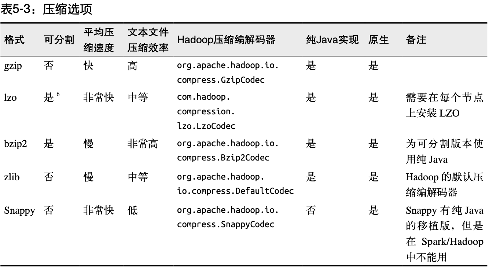

## 6 Spark编程进阶


## 7 在集群上运行Spark

#### 7.2.5 小结

1. 用户通过spark-submit脚本提交应用
2. spark-submit脚本启动驱动器程序，申请资源以启动执行器节点
3. 驱动器程序与集群管理器通信，申请资源以启动执行器节点
4. 集群管理器为驱动器程序启动执行器节点
5. 驱动器进程执行用户应用的操作，根据程序中所定义的对RDD的转化操作和行动操作，驱动器节点把工作以任务的形式发送到执行器进程
6. 任务在执行器程序中进行计算并保存结果
7. 如果驱动器程序的main()方法推出，或者调用了SparkContext.stop()，驱动器程序会终止执行器进程，并且通过集群管理器释放资源。

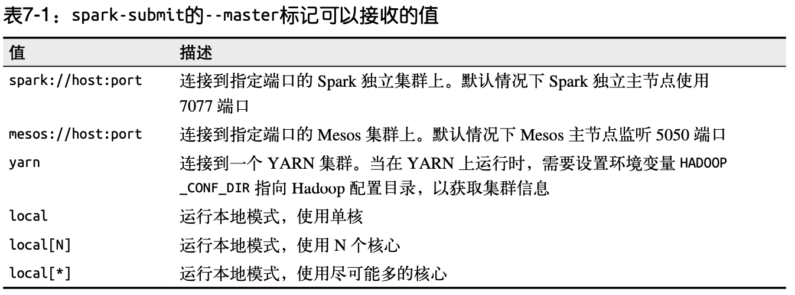

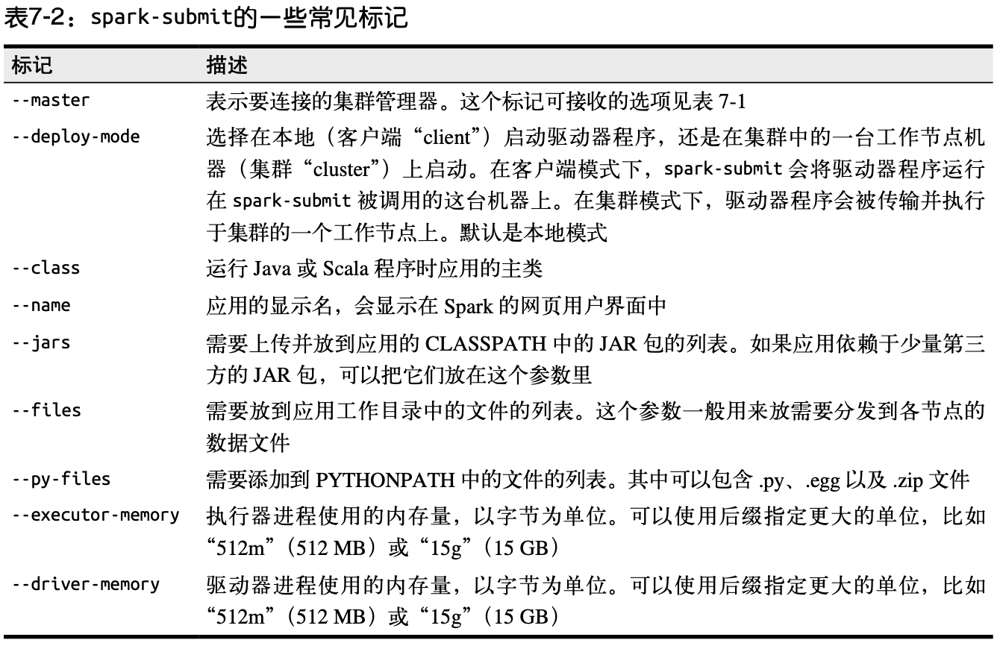


### 7.5 Spark应用内与应用间调度

在调度多用户集群时，Spark主要依赖集群管理器来在Spark应用间共享资源，当Spark应用向集群管理器申请执行器节点时，应用收到的执行器节点个数可能比它申请的更多或者更少，这取决于集群的可用性与争用。许多集群管理器支持队列，可以为队列定义不同优先级或容量限制，这样Spark就可以把作业提交到相应的队列中。


