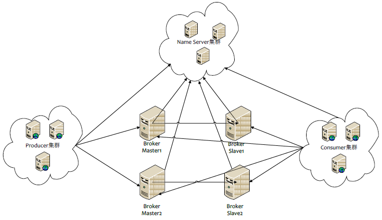

### 什么是消息队列


消息（Message）是指在应用间传送的数据。消息可以非常简单，比如只包含文本字符串，也可以更复杂，可能包含嵌入对象。

消息队列（Message Queue）是一种应用间的通信方式，消息发送后可以立即返回，由消息系统来确保消息的可靠传递。消息发布者只管把消息发布到 MQ 中而不用管谁来取，消息使用者只管从 MQ 中取消息而不管是谁发布的。

### 为何用消息队列

- **解耦**

**传统模式** ：系统间耦合性太强，系统A在代码中直接调用系统B和系统C的代码，如果将来D系统接入，系统A还需要修改代码，过于麻烦。

**中间件模式** ：需要消息的系统自己从消息队列中订阅。

- **异步**

**传统模式**：非必要的业务逻辑以同步的方式运行，太耗费时间。

**中间件模式**：将消息写入消息队列，非必要的业务逻辑以异步的方式运行，加快响应速度。

- **削峰**

**传统模式**：并发量大的时候，所有的请求直接怼到数据库，造成数据库连接异常。

**中间件模式**：系统A慢慢的按照数据库能处理的并发量，从消息队列中慢慢拉取消息。在生产中，这个短暂的高峰期积压是允许的。


### 使用消息队列应该满足的情况

- 生产者不需要从消费者处获得反馈

引用消息队列之前的直接调用，其接口的返回值应该为空，这让下层的动作还没做，上层当成动作做完了继续执行（异步）成为了可能。

- 容许短暂的不一致性
- 有效果

即会有解耦、提速、削峰这方面的收益。


### 使用了消息队列的缺点?

1. 系统可用性降低
2. 系统复杂性增加
3. 暂时的不一致性


### 技术选型

| 特性       | ActiveMQ                                                     | RabbitMQ                                                     | RocketMQ                 | kafka                                                        |
| ---------- | :----------------------------------------------------------- | :----------------------------------------------------------- | :----------------------- | ------------------------------------------------------------ |
| 开发语言   | java                                                         | erlang                                                       | java                     | scala                                                        |
| 单机吞吐量 | 万级                                                         | 万级                                                         | 10万级                   | 10万级                                                       |
| 时效性     | ms级                                                         | us级                                                         | ms级                     | ms级以内                                                     |
| 可用性     | 高(主从架构)                                                 | 高(主从架构)                                                 | 非常高(分布式架构)       | 非常高(分布式架构)                                           |
| 功能特性   | 成熟的产品，在很多公司得到应用；有较多的文档；各种协议支持较好 | 基于erlang开发，所以并发能力很强，性能极其好，延时很低;管理界面较丰富 | MQ功能比较完备，扩展性佳 | 只支持主要的MQ功能，像一些消息查询，消息回溯等功能没有提供，在大数据领域应用广。 |


### 面试问题

###  高可用

RabbitMQ可以使用镜像模式搭建高可用集群，可以配置数据同步到所有节点还是指定数量的节点以满足实际需求。

**RocketMQ、Kafka天然的是分布式设计让他们天然具有高可用的技能**，RocketMQ有多master多slave异步复制模式、多master多slave同步双写模式多种集群部署模式可以选择 多master多slave模式部署架构图:



Producer与NameServer集群中的其中一个节点（随机选择）建立长连接，定期从NameServer获取Topic路由信息，并向提供Topic服务的Broker Master建立长连接，且定时向Master发送心跳。Producer只能将消息发送到Broker master。Consumer则不一样，它同时与提供Topic服务的Master、Slave建立长连接，既可以从Master订阅消息，也可以从Slave订阅消息，订阅规则由Broker配置决定。


Zookeeper的的作用与NameServer的作用相似， 用于保存集群配置、选举Leader等。集群中有许多broker用于堆积消息，Kafka支持水平扩展，一般broker数量越多，集群吞吐率越高。Producer使用push模式将消息发布到broker。Consumer使用pull模式从broker订阅并消费消息。


### 重复消费

现在消息队列一般都能保证at least once的，也就是消息至少一次投递。 在这种情况为什么会出现重复消费的问题呢？ 通常都是由于网络原因造成的，原因如下： 通常消息被成功消费后消费者都会发送一个成功标志给MQ，MQ收到这个标志就表示消息已经成功消费了，就不会再发送给其他消费者了。 但是如果因为网络这个标志没有送到MQ就丢失了，MQ就认为这个消息没有被成功消费，就会再次发送给其他消费者消费，就造成了重复了。

```
幂等性 是指一个操作其执行任意多次所产生的影响均与一次执行的影响相同 大白话就是你同样的参数调用我这个接口，调用多少次结果都相同

在编程中一个幂等操作的特点是其任意多次执行所产生的影响均与一次执行的影响相同。幂等函数，或幂等方法，是指可以使用相同参数重复执行，并能获得相同结果的函数。这些函数不会影响系统状态，也不用担心重复执行会对系统造成改变。
```

**通俗了讲就是你同样的参数调用我这个接口，调用多少次结果都是一个**

幂等性需要根据业务需求来具体看，但是主要的原理就是**去重** 一般可分为强校验、弱校验

- **强校验** 一般与金融相关的操作都是强校验的比如消费者是一个打款服务，在付款成功后都加一条流水记录。且两个操作放入一个事务中。 再次消费的时候就去流水表查一下有没有这条纪录，如果有表示已经消费过了，直接返回。流水表也能起到对账的作用！ 一些简单的场景也可以依赖数据库唯一约束实现
- **弱校验** 这个就没那么严格，重复一下也没那么重要的情况。 可以将ID保存在redis set中，过期时间看情况设置。 如果ID不能保证唯一可以选择生产方生成一个token存入redis，消费方在消费后将其删除（redis的操作能够保证其原子性，删除失败会返回0）

### 消息丢失

一般来讲消息丢失的途径有三个：

- 生产者弄丢数据
  主流的MQ都有确认机制或者事务机制，可以保证生产者将消息送达到MQ。 比如RabbitMQ就有事务模式和confirm模式。
- 消息队列弄丢数据
  一般只要开启MQ的持久化磁盘配置就能解决这个问题，写入了磁盘就放心了。
- 消费者弄丢数据
  消费者丢数据一般是因为采用了自动确认消息模式。MQ收到确认消息后会删除消息，如果这时消费者异常了，那消息就没了。改用手动确认就能解决这个问题。


### 消息顺序消费

**同个业务场景下不同几个操作的消息同时过去**，本身顺序是对的，但是发出去的时候同时发出去，消费的时候却乱掉了


**解决方法**

**RocketMQ**

**一个topic下有多个队列**，为了保证发送有序，**RocketMQ**提供了**MessageQueueSelector**队列选择机制，他有三种实现:

- 可使用**Hash取模法**，让同一个订单发送到同一个队列中，再使用同步发送，只有同个订单的创建消息发送成功，再发送支付消息。

**RocketMQ**的topic内的队列机制,可以保证存储满足**FIFO**（First Input First Output 简单说就是指先进先出）,剩下的只需要消费者顺序消费即可。仅保证顺序发送，顺序消费由消费者业务保证。

### 分布式事务


