## HADOOP

### HDFS

#### 1.HDFS写数据流程

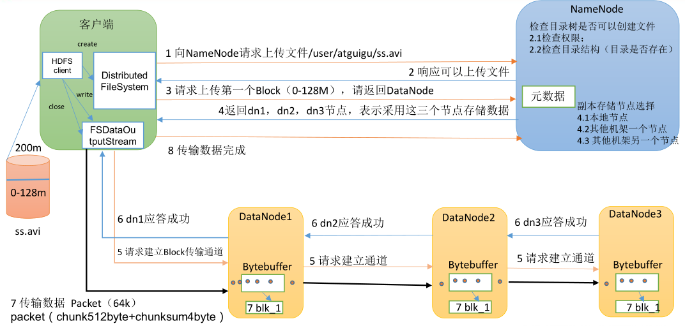

1. 客户端通过`DistributedFileSystem`模块向`NameNode`请求上传文件，`NameNode`检查目标文件是否已存在，父目录是否存在。
2. `NameNode`返回是否可以上传。
3. 客户端请求第一个`Block`上传到哪几个`DataNode`服务器上。
4. `NameNode`返回`3`个`DataNode`节点，分别为`dn1`、`dn2`、`dn3`。
5. 客户端通过`FSDataOutputStream`模块请求`dn1`上传数据，`dn1`收到请求会继续调用`dn2`，然后`dn2`调用`dn3`，将这个通信管道建立完成。
6. `dn1`、`dn2`、`dn3`逐级应答客户端。
7. 客户端开始往`dn1`上传第一个`Block`（先从磁盘读取数据放到一个本地内存缓存），以`Packet`为单位，`dn1`收到一个`Packet`就会传给`dn2`，`dn2`传给`dn3`；`dn1`每传一个`packet`会放入一个应答队列等待应答。
8. 当一个`Block`传输完成之后，客户端再次请求`NameNode`上传第二个Block的服务器。（重复执行3-7步）

#### 2.HDFS读数据流程

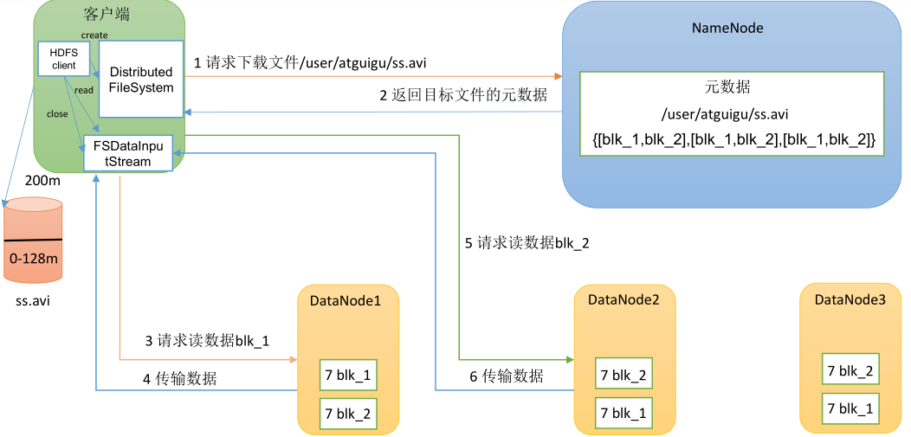

1. 客户端通过`DistributedFileSystem`向`NameNode`请求下载文件，`NameNode`通过查询元数据，找到文件块所在的`DataNode`地址。
2. 挑选一台`DataNode`（就近原则，然后随机）服务器，请求读取数据。
3. `DataNode`开始传输数据给客户端（从磁盘里面读取数据输入流，以`Packet`为单位来做校验）。
4. 客户端以`Packet`为单位接收，先在本地缓存，然后写入目标文件。

#### 3.NameNode工作机制

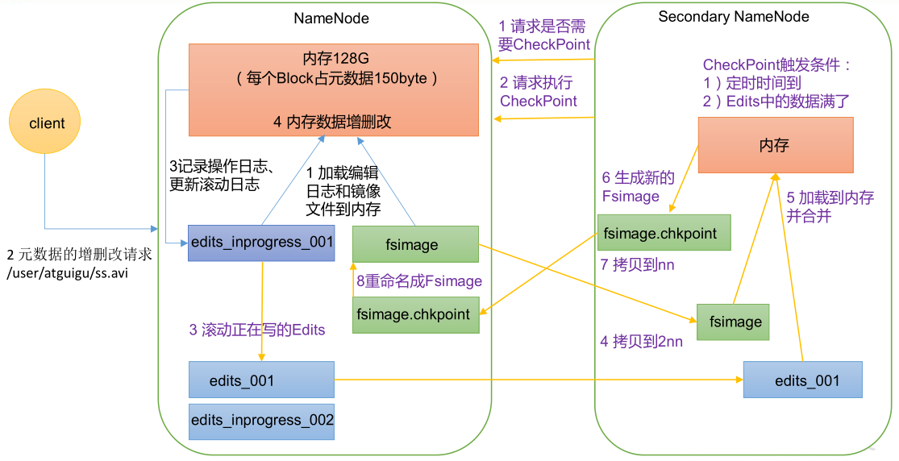

##### 第一阶段：NameNode 启动

1. 第一次启动`NameNode`格式化后，创建`Fsimage`和`Edits`文件。如果不是第一次启动，直接加载编辑日志和镜像文件到内存。
2. 客户端对元数据进行增删改的请求。
3. `NameNode`记录操作日志，更新滚动日志。
4. `NameNode`在内存中对元数据进行增删改。

##### 第二阶段：Secondary NameNode 工作

1. `Secondary NameNode`询问`NameNode`是否需要`CheckPoint`。直接带回`NameNode`是否检查结果。
2. `Secondary NameNode`请求执行`CheckPoint`。
3. `NameNode `滚动正在写的`Edits`日志。
4. 将滚动前的编辑日志和镜像文件拷贝到`Secondary NameNode`。
5. `Secondary NameNode`加载编辑日志和镜像文件到内存，并合并。
6. 生成新的镜像文件`fsimage.chkpoint`。
7. 拷贝`fsimage.chkpoint`到`NameNode`。
8. `NameNode`将`fsimage.chkpoint`重新命名成`fsimage`。

#### 4.DataNode 工作机制

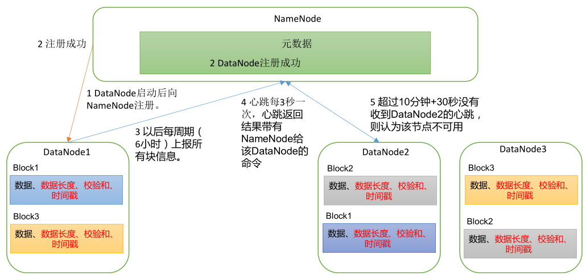

1. 一个数据块在`DataNode`上以文件形式存储在磁盘上，包括两个文件，一个是数据本身，一个是元数据包括数据块的长度，块数据的校验和，以及时间戳。
2. `DataNode`启动后向`NameNode`注册，通过后，周期性（`6小时`）的向`NameNode`上报所有的块信息。
3. 心跳是每`3`秒一次，心跳返回结果带有`NameNode`给该`DataNode`的命令如复制块数据到另一台机器，或删除某个数据块。如果超过10分钟没有收到某个`DataNode`的心跳，则认为该节点不可用。
4. 集群运行中可以安全加入和退出一些机器

### MapReduce 

#### 1.MapReduce 工作流程

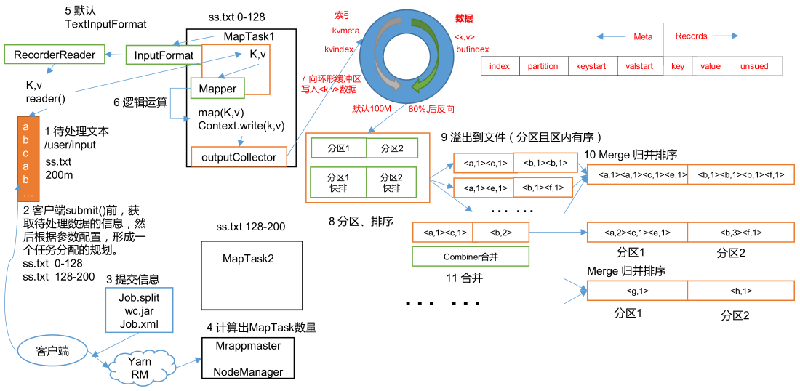

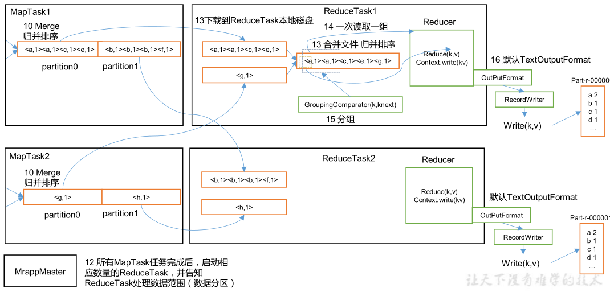

上面的流程是整个`MapReduce`最全工作流程，但是`Shuffle`过程只是从第`7`步开始到第`16`步结束，具体`Shuffle`过程详解，如下：

1. `MapTask`收集我们的`map()`方法输出的`kv`对，放到内存缓冲区中
2. 从内存缓冲区不断溢出本地磁盘文件，可能会溢出多个文件
3. 多个溢出文件会被合并成大的溢出文件
4. 在溢出过程及合并的过程中，都要调用`Partitioner`进行分区和针对key进行排序
5. `ReduceTask`根据自己的分区号，去各个`MapTask`机器上取相应的结果分区数据
6. `ReduceTask`会抓取到同一个分区的来自不同`MapTask`的结果文件，`ReduceTask`会将这些文件再进行合并（归并排序）
7. 合并成大文件后，`Shuffle`的过程也就结束了，后面进入`ReduceTask`的逻辑运算过程（从文件中取出一个一个的键值对`Group`，调用用户自定义的`reduce()`方法）

> `Shuffle`中的缓冲区大小会影响到`MapReduce`程序的执行效率，原则上说，缓冲区越大，磁盘io的次数越少，执行速度就越快。
>
> 缓冲区的大小可以通过参数调整，参数：`mapreduce.task.io.sort.mb`默认`100M`。

#### 2.Shuffle

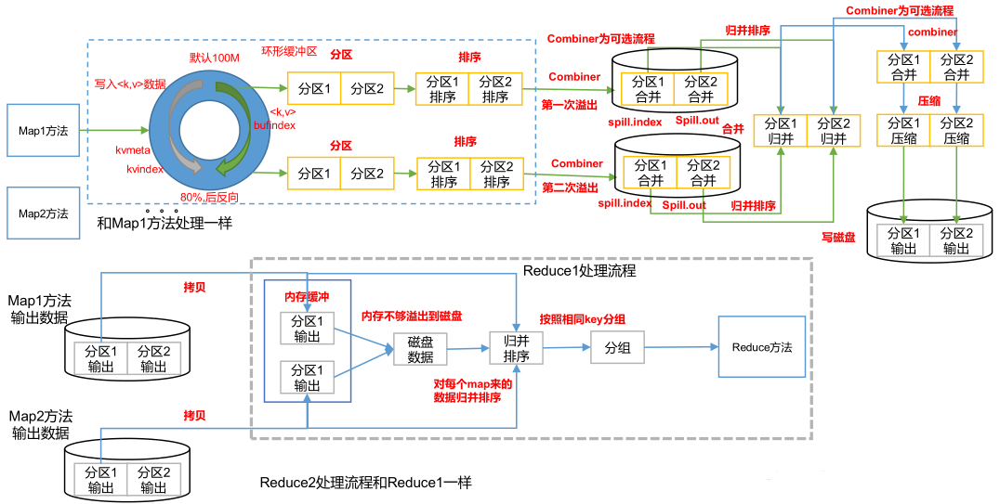

#### 3.MapTask 工作机制

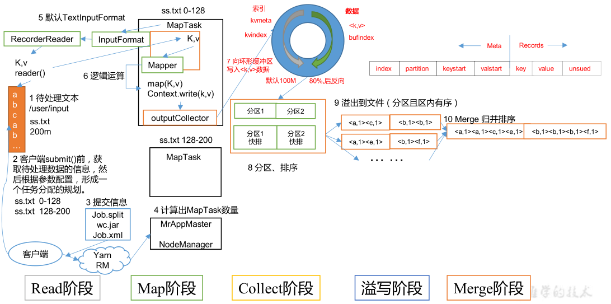

1. `Read`阶段：`MapTask`通过`InputFormat`获得的`RecordReader`，从输入`InputSplit`中解析出一个个`key/value`。
2. `Map`阶段：该节点主要是将解析出的`key/value`交给用户编写`map()`函数处理，并产生一系列新的`key/value`。
3. `Collect`收集阶段：在用户编写`map()`函数中，当数据处理完成后，一般会调用`OutputCollector.collect()`输出结果。在该函数内部，它会将生成的`key/value`分区（调用`Partitioner`），并写入一个环形内存缓冲区中。
4. `Spill`阶段：即“溢写”，当环形缓冲区满后，`MapReduce`会将数据写到本地磁盘上，生成一个临时文件。需要注意的是，将数据写入本地磁盘之前，先要对数据进行一次本地排序，并在必要时对数据进行合并、压缩等操作。
5. `Merge`阶段：当所有数据处理完成后，`MapTask`对所有临时文件进行一次合并，以确保最终只会生成一个数据文件。当所有数据处理完后，`MapTask`会将所有临时文件合并成一个大文件，并保存到文件`output/file.out`中，同时生成相应的索引文件`output/file.out.index`。在进行文件合并过程中，`MapTask`以分区为单位进行合并。对于某个分区，它将采用多轮递归合并的方式。每轮合并`mapreduce.task.io.sort.factor`（默认10）个文件，并将产生的文件重新加入待合并列表中，对文件排序后，重复以上过程，直到最终得到一个大文件。让每个`MapTask`最终只生成一个数据文件，可避免同时打开大量文件和同时读取大量小文件产生的随机读取带来的开销。

**溢写阶段详情:**

1. 利用快速排序算法对缓存区内的数据进行排序，排序方式是，先按照分区编号Partition进行排序，然后按照key进行排序。这样，经过排序后，数据以分区为单位聚集在一起，且同一分区内所有数据按照`key`有序。
2. 按照分区编号由小到大依次将每个分区中的数据写入任务工作目录下的临时文件`output/spillN.out`中（N表示当前溢写次数）。如果用户设置了`Combiner`，则写入文件之前，对每个分区中的数据进行一次聚集操作。
3. 将分区数据的元信息写到内存索引数据结构`SpillRecord`中，其中每个分区的元信息包括在临时文件中的偏移量、压缩前数据大小和压缩后数据大小。如果当前内存索引大小超过`1MB`，则将内存索引写到文件`output/spillN.out.index`中。

#### 4.ReduceTask 工作机制

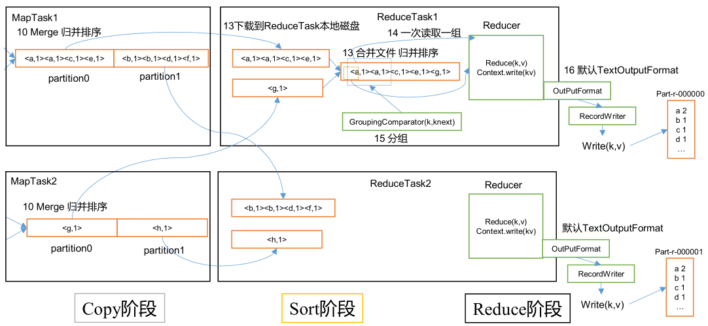

1. `Copy`阶段：`ReduceTask`从各个`MapTask`上远程拷贝一片数据，并针对某一片数据，如果其大小超过一定阈值，则写到磁盘上，否则直接放到内存中。
2. `Sort`阶段：在远程拷贝数据的同时，`ReduceTask`启动了两个后台线程对内存和磁盘上的文件进行合并，以防止内存使用过多或磁盘上文件过多。按照`MapReduce`语义，用户编写`reduce()`函数输入数据是按key进行聚集的一组数据。为了将`key`相同的数据聚在一起，`Hadoop`采用了基于排序的策略。由于各个`MapTask`已经实现对自己的处理结果进行了局部排序，因此，`ReduceTask`只需对所有数据进行一次归并排序即可。
3. `Reduce`阶段：`reduce()`函数将计算结果写到`HDFS`上。

### YARN

#### YARN工作机制

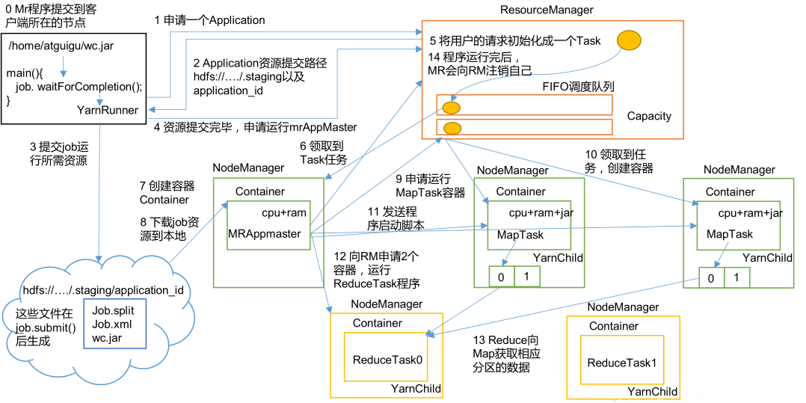

1. MR程序提交到客户端所在的节点。
2. `YarnRunner`向`ResourceManager`申请一个`Application`。
3. `RM`将该应用程序的资源路径返回给`YarnRunner`。
4. 该程序将运行所需资源提交到`HDFS`上。
5. 程序资源提交完毕后，申请运行`MRAppMaster`。
6. `RM`将用户的请求初始化成一个`Task`。
7. 其中一个`NodeManager`领取到`Task`任务。
8. 该`NodeManager`创建容器`Container`，并产生`MRAppmaster`。
9. `Container`从`HDFS`上拷贝资源到本地。
10. `MRAppmaster`向RM申请运行`MapTask`资源。
11. `RM`将运行`MapTask`任务分配给另外两个`NodeManager`，另两个`NodeManager`分别领取任务并创建容器。
12. `MR`向两个接收到任务的`NodeManager`发送程序启动脚本，这两个`NodeManager`分别启动`MapTask`，`MapTask`对数据分区排序。
13. `MRAppMaster`等待所有`MapTask`运行完毕后，向`RM`申请容器，运行`ReduceTask`。
14. `ReduceTask`向`MapTask`获取相应分区的数据。
15. 程序运行完毕后，`MR`会向`RM`申请注销自己。

#### 作业提交过程

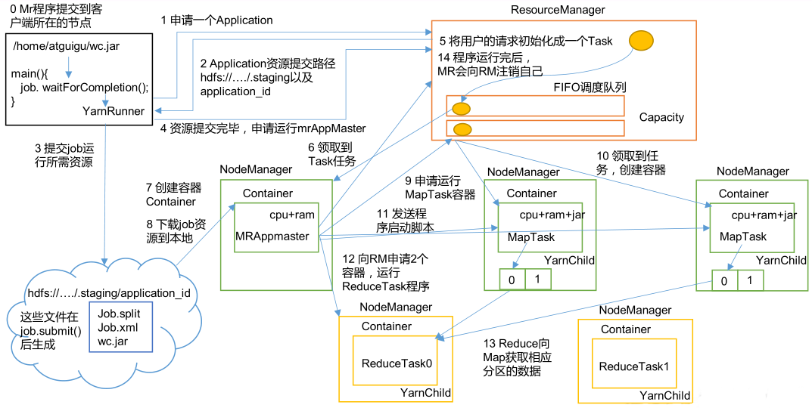

#### 作业提交过程之HDFS & MapReduce

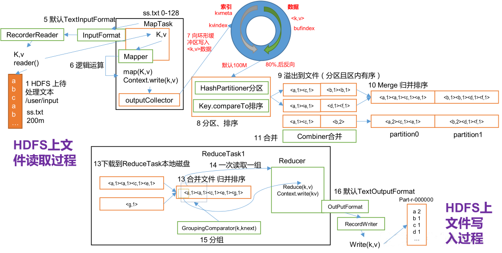

**作业提交全过程详解**
（1）作业提交
第 1 步：`Client `调用 `job.waitForCompletion `方法，向整个集群提交 `MapReduce` 作业。
第 2 步：`Client `向 `RM `申请一个作业 `id`。
第 3 步：`RM `给 `Client `返回该 `job `资源的提交路径和作业 `id`。
第 4 步：`Client `提交 `jar `包、切片信息和配置文件到指定的资源提交路径。
第 5 步：`Client `提交完资源后，向 `RM `申请运行 `MrAppMaster`。
（2）作业初始化
第 6 步：当 `RM `收到 `Client `的请求后，将该 `job `添加到容量调度器中。
第 7 步：某一个空闲的 `NM `领取到该 `Job`。
第 8 步：该 `NM `创建 `Container`，并产生 `MRAppmaster`。
第 9 步：下载 `Client `提交的资源到本地。
（3）任务分配
第 10 步：`MrAppMaster `向 `RM `申请运行多个 `MapTask `任务资源。
第 11 步：`RM `将运行 `MapTask `任务分配给另外两个 `NodeManager`，另两个 `NodeManager`
分别领取任务并创建容器。
（4）任务运行
第 12 步：`MR `向两个接收到任务的 `NodeManager `发送程序启动脚本，这两个`NodeManager `分别启动 `MapTask`，`MapTask `对数据分区排序。
第13步：`MrAppMaster`等待所有MapTask运行完毕后，向`RM`申请容器，运行`ReduceTask`。
第 14 步：`ReduceTask `向 `MapTask `获取相应分区的数据。
第 15 步：程序运行完毕后，MR 会向 `RM `申请注销自己。
（5）进度和状态更新
`YARN `中的任务将其进度和状态(包括 `counter`)返回给应用管理器, 客户端每秒(通过`mapreduce.client.progressmonitor.pollinterval` 设置)向应用管理器请求进度更新, 展示给用户。
（6）作业完成
除了向应用管理器请求作业进度外, 客户端每 5 秒都会通过调用 `waitForCompletion()`来检查作业是否完成。时间间隔可以通过` mapreduce.client.completion.pollinterval` 来设置。作业完成之后, 应用管理器和 `Container `会清理工作状态。作业的信息会被作业历史服务器存储以备之后用户核查。

## HIVE

### 1.Hive架构

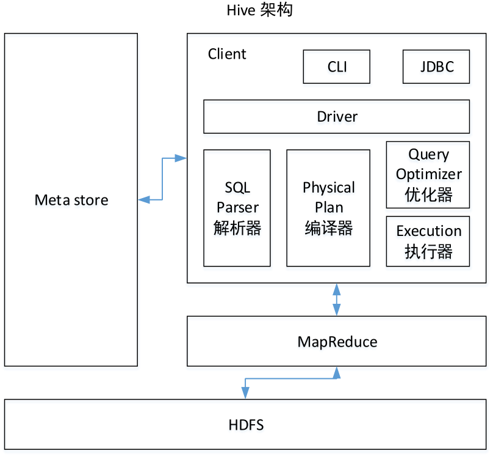

1. 用户接口：`Client ` `CLI（command-line interface）`、`JDBC/ODBC`(`jdbc`访问`hive`)、`WEBUI`（浏览器访问`hive`）
2. 元数据：`Metastore`元数据包括：表名、表所属的数据库（默认是`default`）、表的拥有者、列/分区字段、表的类型（是否是外部表）、表的数据所在目录等；默认存储在自带的`derby`数据库中，推荐使用`MySQL`存储`Metastore`
3. `Hadoop `使用 `HDFS `进行存储，使用 `MapReduce `进行计算
4. 驱动器：`Driver`
5. 解析器（`SQL Parser`） 将`SQL`字符串转换成抽象语法树`AST`，这一步一般都用第三方工具库完成，比如`antlr`；对`AST`进行语法分析，比如表是否存在、字段是否存在、`SQL`语义是否有误。
6. 编译器（`Physical Plan`） 将 `AST `编译生成逻辑执行计划。
7. 优化器（`Query Optimizer`） 对逻辑执行计划进行优化。
8. 执行器（`Execution`） 把逻辑执行计划转换成可以运行的物理计划。对于 `Hive `来说，就是 `MR/Spark`。

### 2.运行机制

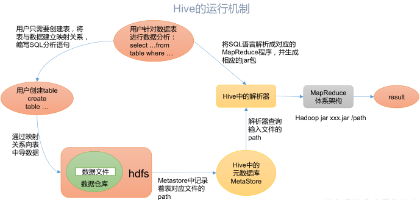

`Hive`通过给用户提供的一系列交互接口，接收到用户的指令(`SQL`)，使用自己的`Driver`，结合元数据(`MetaStore`)，将这些指令翻译成`MapReduce`，提交到`Hadoop`中执行，最后，将执行返回的结果输出到用户交互接口。

### 3.Hive工作原理

**流程步骤：**

1. 用户提交查询等任务给`Driver`。
2. 编译器获得该用户的任务`Plan`。
3. 编译器`Compiler`根据用户任务去`MetaStore`中获取需要的`Hive`的元数据信息。
4. 编译器`Compiler`得到元数据信息，对任务进行编译，先将`HiveQL`转换为抽象语法树，然后将抽象语法树转换成查询块，将查询块转化为逻辑的查询计划，重写逻辑查询计划，将逻辑计划转化为物理的计划（`MapReduce`）, 最后选择最佳的策略。
5. 将最终的计划提交给`Driver`。
6. `Driver`将计划`Plan`转交给`ExecutionEngine`去执行，获取元数据信息，提交给`JobTracker`或者`SourceManager`执行该任务，任务会直接读取`HDFS`中文件进行相应的操作。
7. 获取执行的结果。
8. 取得并返回执行结果。

## HBASE

### 1.HBASE架构

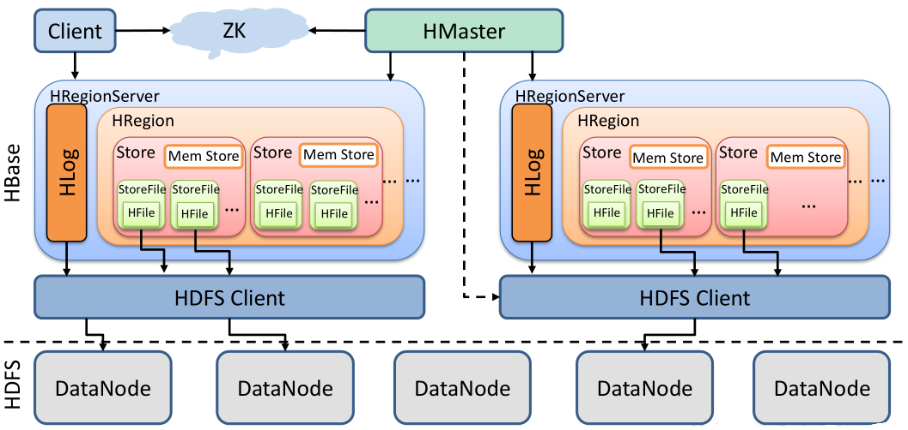

1. **RegionServer** 为`Region`的管理者，其实现类为`HRegionServer`，主要作用如下:
   - 对于数据的操作：`get`、`put`、`delete`；
   - 对于`Region`的操作：`splitRegion`、`compactRegion`。

2. **Master**是所有 `RegionServer`的管理者，其实现类为`HMaster`，主要作用如下：
   - 对于表的操作：`create`、 `delete`、 `alter`
   - 对于 `RegionServer`的操作：分配`regions `到每个`RegionServer`，监控每个`RegionServer`的状态，负载均衡和故障转移。

3. **Zookeeper** `HBase`通过`Zookeeper`来做`Master`的高可用、`RegionServer`的监控、元数据的入口以及集群配置的维护等工作。

4. **HDFS** 为 `HBase`提供最终的底层数据存储服务，同时为 `HBase `提供高可用的支持

1. **StoreFile** 保存实际数据的物理文件，`StoreFile`以`HFile `的形式存储在`HDFS`上。每个`Store`会有一个或多个`StoreFile（HFile）`，数据在每个`StoreFile `中都是有序的。
2. **MemStore**写缓存，由于`HFile`中的数据要求是有序的，所以数据是先存储在`MemStore`中，排好序后，等到达刷写时机才会刷写到`HFile`，每次刷写都会形成一个新的`HFile`。
3. **WAL**由于数据要经 `MemStore`排序后才能刷写到`HFile`，但把数据保存在内存中会有很高的概率导致数据丢失，为了解决这个问题，数据会先写在一个叫做`Write-Ahead logfile`的文件中，然后再写入`MemStore`中。所以在系统出现故障的时候，数据可以通过这个日志文件重建。

### 2.写流程

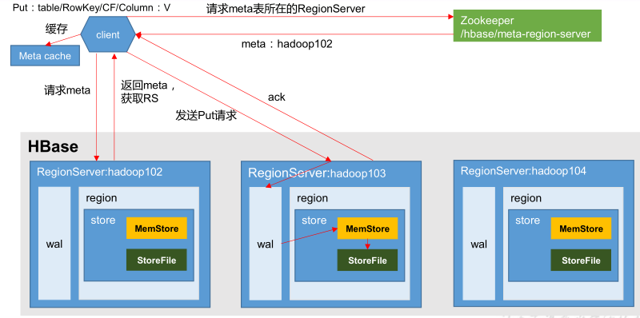

1. `Client`先访问`zookeeper`，获取`hbase:meta`表位于哪个`RegionServer`。
2. 访问对应的`RegionServer`，获取`hbase:meta`表，根据读请求的`namespace:table/rowkey`，查询出目标数据位于哪个`RegionServer`中的哪个`Region`中。并将该`table`的`region`信息以及`meta`表的位置信息缓存在客户端的`metacache`，方便下次访问。
3. 与目标`RegionServer`进行通讯；
4. 将数据顺序写入（追加）到`WAL`；
5. 将数据写入对应的`MemStore`，数据会在`MemStore`进行排序；
6. 向客户端发送`ack`；
7. 等达到`MemStore`的刷写时机后，将数据刷写到`HFile`。

### 3.读流程

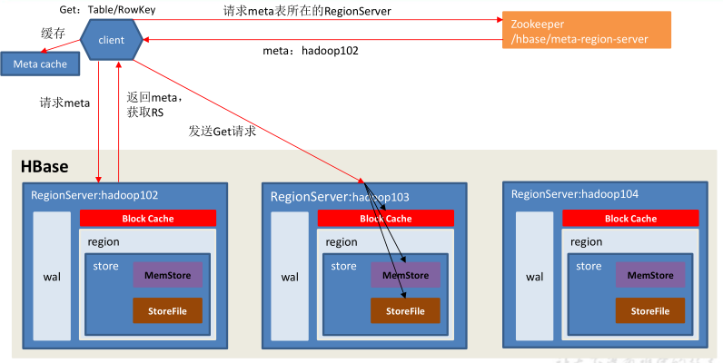

1. Client先访问zookeeper，获取hbase:meta表位于哪个RegionServer。
2. 访问对应的RegionServer，获取hbase:meta表，根据读请求的namespace:table/rowkey，查询出目标数据位于哪个RegionServer中的哪个Region中。并将该table的region信息以及meta表的位置信息缓存在客户端的metacache，方便下次访问。
3. 与目标RegionServer进行通讯；
4. 分别在BlockCache（读缓存），MemStore和StoreFile（HFile）中查询目标数据，并将查到的所有数据进行合并。此处所有数据是指同一条数据的不同版本（timestamp）或者不同的类型（Put/Delete）。
5. 将从文件中查询到的数据块（Block，HFile数据存储单元，默认大小为64KB）缓存到BlockCache。
6. 将合并后的最终结果返回给客户端

## SPARK

### 1.Spark的架构

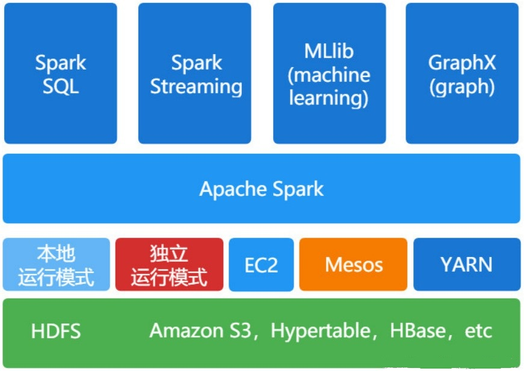

1. `Spark Core`：包含`Spark`的基本功能；尤其是定义`RDD`的`API`、操作以及这两者上的动作。其他`Spark`的库都是构建在`RDD`和`Spark Core`之上的
2. `Spark SQL`：提供通过`Apache Hive`的`SQL`变体`Hive`查询语言（`HiveQL`）与`Spark`进行交互的`API`。每个数据库表被当做一个`RDD`，`Spark SQL`查询被转换为`Spark`操作。
3. `Spark Streaming`：对实时数据流进行处理和控制。`Spark Streaming`允许程序能够像普通`RDD`一样处理实时数据
4. `MLlib`：一个常用机器学习算法库，算法被实现为对`RDD`的`Spark`操作。这个库包含可扩展的学习算法，比如分类、回归等需要对大量数据集进行迭代的操作。
5. `GraphX`：控制图、并行图操作和计算的一组算法和工具的集合。`GraphX`扩展了`RDD API`，包含控制图、创建子图、访问路径上所有顶点的操作

### 2.Spark架构的组成图

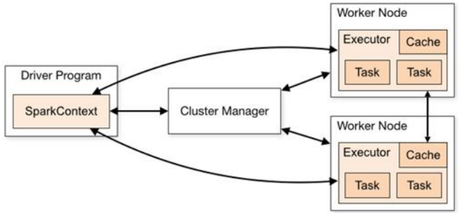

1. `Cluster Manager`：在`standalone`模式中即为`Master`主节点，控制整个集群，监控`worker`。在`YARN`模式中为资源管理器
2. `Worker`节点：从节点，负责控制计算节点，启动`Executor`或者`Driver`。
3. `Driver`： 运行`Application `的`main()`函数
4. `Executor`：执行器，是为某个`Application`运行在`worker node`上的一个进程

### 3.部署模式

#### 3.1 Standalone模式

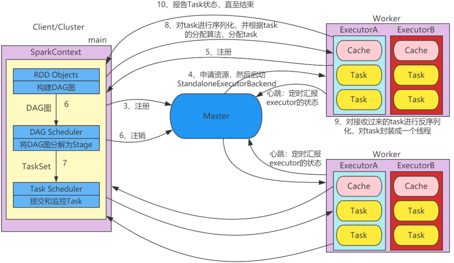

运行流程如下：

1. 提交一个任务，任务就叫`Application`；
2. 初始化程序的入口`SparkContext`；
   - 初始化`DAG Scheduler`
   - 初始化`Task Scheduler`
3. `Task Scheduler`向`master`去进行注册并申请资源（`CPU Core`和`Memory`）；
4. `Master`根据`SparkContext`的资源申请要求和`Worker`心跳周期内报告的信息决定在哪个`Worker`上分配资源，然后在该`Worker`上获取资源，然后启动`StandaloneExecutorBackend`；顺便初始化好了一个线程池；
5. `StandaloneExecutorBackend`向`Driver(SparkContext)`注册，这样`Driver`就知道哪些`Executor`为他进行服务了。到这个时候其实我们的初始化过程基本完成了，我们开始执行`transformation`的代码，但是代码并不会真正的运行，直到我们遇到一个`action`操作。生产一个`job`任务，进行`stage`的划分；
6. `SparkContext`将`Applicaiton`代码发送给`StandaloneExecutorBackend`；并且`SparkContext`解析`Applicaiton`代码，构建`DAG`图，并提交给`DAG Scheduler`分解成`Stage`（当碰到`Action`操作时，就会催生`Job`；每个`Job`中含有`1`个或多个`Stage`，`Stage`一般在获取外部数据和`shuffle`之前产生）；
7. 将`Stage`（或者称为`TaskSet`）提交给`Task Scheduler`。`Task Scheduler`负责将`Task`分配到相应的`Worker`，最后提交给`StandaloneExecutorBackend`执行；
8. 对task进行序列化，并根据`task`的分配算法，分配`task`；
9. `executor`对接收过来的`task`进行反序列化，把`task`封装成一个线程；
10. 开始执行`Task`，并向`SparkContext`报告，直至`Task`完成；
11. 资源注销

#### 3.2 Yarn Client模式

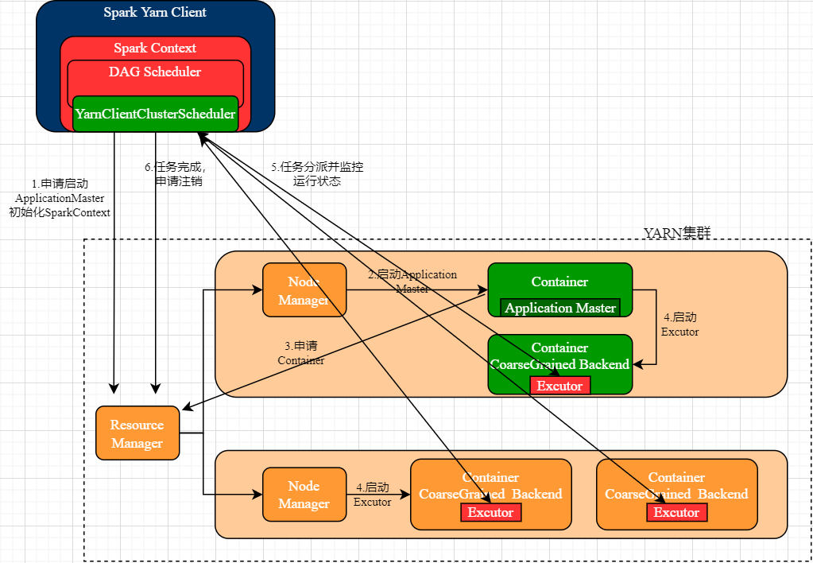

`Client`模式将用于监控和调度的`Driver`模块在客户端执行，而不是在`Yarn`中，一般用于测试

1. `Driver`在任务提交的本地上运行
2. `Driver`启动后会和`ResourceManager`通讯申请启动`ApplicationMaster`
3. `ResourceManager`分配`container`，在合适的`NodeManager`上启动`ApplicationMaster`负责向`ResourceManager`申请`Executor`内存
4. `ResourceManager`接到`Application`的资源申请后会分配`container`，然后`ApplicationMaster`在资源分配指定的`NodeManager`上启动`Executor`进程
5. `Executor`进程启动后会向`Driver`反向注册，`Executor`全部注册完成后`Driver`开始执行`main`函数
6. 之后执行到`Action`算子时，出发一个`Job`，并根据宽依赖开始划分`stage`，每个stage生成对应的`TaskSet`，之后将task分发到各个`Executor`上执行

#### 3.3 Yarn Cluster模式

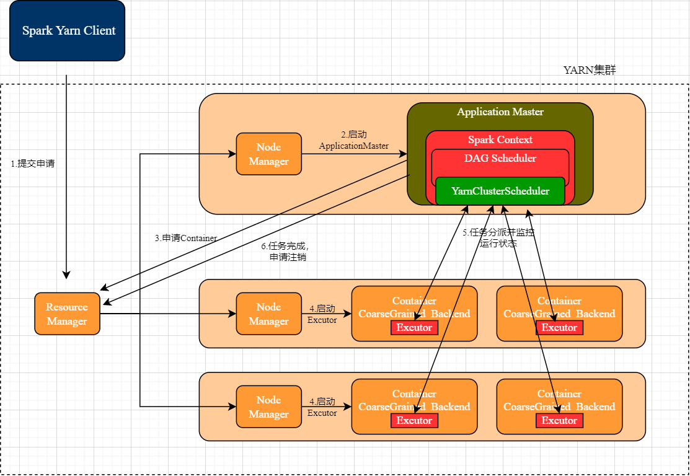

`Cluster`模式将用于监控和调度的`Driver`模块启动在`Yarn`集群资源中执行，一般应用于实际生产环境。

1. 在`Yarn Cluster`模式下，任务提交后会和`ResourceManager`通讯申请启动`ApplicationMaster`
2. 随后`ResourceManager`分配`container`，在合适的`NodeManager`上启动`ApplicationMaster`，此时的`ApplicationMaster`就是`Driver`
3. `Driver`启动后向`ResourceManager`申请`Executor`内存，`ResourceManager`接到`ApplicationMaster`的申请后会分配`container`，然后在合适的`NodeManager`上启动`Executor`进程
4. `Executor`进程启动后会向`Driver`反向注册，`Executor`全部注册完成后`Driver`开始执行`main`函数
5. 之后执行到`Action`算子时，触发一个`Job`，并根据宽依赖开始划分`stage`，每个stage生成对应的`TaskSet`，之后将task分发到各个`Executor`上执行

**Yarn-Client&Yarn-Cluster区别:**

1. 理解`YARN-Client`和`YARN-Cluster`深层次的区别之前先清楚一个概念：`Application Master`。在`YARN`中，每个`Application`实例都有一个`ApplicationMaster`进程，它是`Application`启动的第一个容器。它负责和`ResourceManager`打交道并请求资源，获取资源之后告诉`NodeManager`为其启动`Container`。从深层次的含义讲`YARN-Cluster`和`YARN-Client`模式的区别其实就是`ApplicationMaster`进程的区别。
2. `YARN-Cluster`模式下，`Driver`运行在`Application Master`中，它负责向`YARN`申请资源，并监督作业的运行状况。当用户提交了作业之后，就可以关掉`Client`，作业会继续在`YARN`上运行，因而`YARN-Cluster`模式不适合运行交互类型的作业；
3. `YARN-Client`模式下，`Application Master`仅仅向`YARN`请求`Executor`，`Client`会和请求的`Container`通信来调度他们工作，也就是说`Client`不能离开。

## FLINK

### 1.运行时的组件

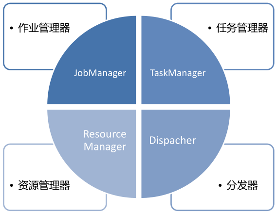

**JobManager**

1. 控制一个应用程序执行的主进程，也就是说，每个应用程序都会被一个不同的`JobManager`所控制执行。
2. `JobManager`会先接收到要执行的应用程序，这个应用程序会包括：作业图（`JobGraph`）、逻辑数据流图（`logical dataflow graph`）和打包了所有的类、库和其它资源的JAR包。
3. `JobManager `会把`JobGraph`转换成一个物理层面的数据流图，这个图被叫做“执行图”（`ExecutionGraph`），包含了所有可以并发执行的任务。
4. `JobManager`会向资源管理器（`ResourceManager`）请求执行任务必要的资源，也就是任务管理器（`TaskManager`）上的插槽（`slot`）。一旦它获取到了足够的资源，就会将执行图分发到真正运行它们的`TaskManager`上。而在运行过程中，`JobManager`会负责所有需要中央协调的操作，比如说检查点（`checkpoints`）的协调。

**TaskManager**

1. `Flink`中的工作进程。通常在Flink中会有多个`TaskManager`运行，每一个`TaskManager`都包含了一定数量的插槽（`slots`）。插槽的数量限制了`TaskManager`能够执行的任务数量。
2. 启动之后，`TaskManager`会向资源管理器注册它的插槽；收到资源管理器的指令后，`TaskManager`就会将一个或者多个插槽提供给`JobManager`调用。`JobManager`就可以向插槽分配任务（`tasks`）来执行了。
3. 在执行过程中，一个`TaskManager`可以跟其它运行同一应用程序的`TaskManager`交换数据。

**ResourceManager**

1. 主要负责管理任务管理器（`TaskManager`）的插槽（`slot`），`TaskManger `插槽是Flink中定义的处理资源单元。
2. `Flink`为不同的环境和资源管理工具提供了不同资源管理器，比如`YARN`、`Mesos`、`K8s`，以及`standalone`部署。
3. 当`JobManager`申请插槽资源时，`ResourceManager`会将有空闲插槽的`TaskManager`分配给`JobManager`。如果`ResourceManager`没有足够的插槽来满足`JobManager`的请求，它还可以向资源提供平台发起会话，以提供启动`TaskManager`进程的容器

**Dispatcher**

1. 可以跨作业运行，它为应用提交提供了`REST`接口。
2. 当一个应用被提交执行时，分发器就会启动并将应用移交给一个`JobManager`。
3. `Dispatcher`也会启动一个`Web UI`，用来方便地展示和监控作业执行的信息。
4. `Dispatcher`在架构中可能并不是必需的，这取决于应用提交运行的方式。

### 2.提交流程

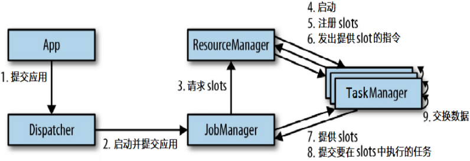

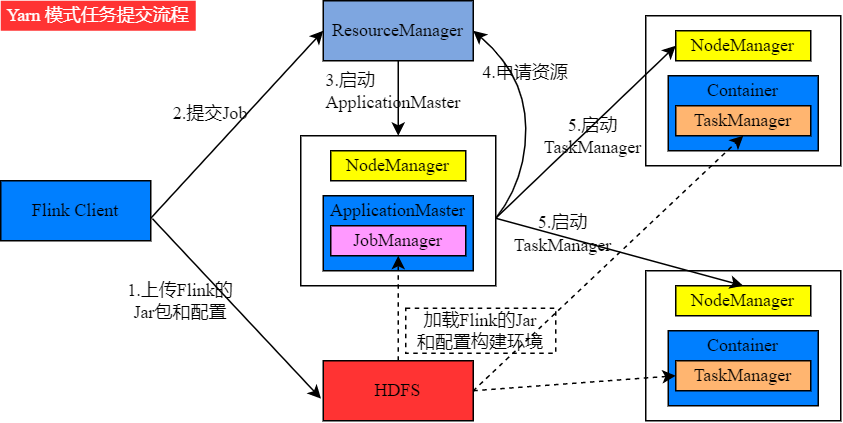

`Flink`任务提交后，`Client`向`HDFS`上传`Flink`的`Jar`包和配置，之后向`Yarn ResourceManager`提交任务，`ResourceManager`分配`Container`资源并通知对应的`NodeManager`启动`ApplicationMaster`，`ApplicationMaster`启动后加载`Flink`的`Jar`包和配置构建环境，然后启动`JobManager`，之后`ApplicationMaster`向`ResourceManager`申请资源启动`TaskManager`，`ResourceManager`分配`Container`资源后，由`ApplicationMaster`通知资源所在节点的`NodeManager`启动`TaskManager`，`NodeManager`加载`Flink`的`Jar`包和配置构建环境并启动`TaskManager`，`TaskManager`启动后向`JobManager`发送心跳包，并等待`JobManager`向其分配任务。

### 3.任务调度

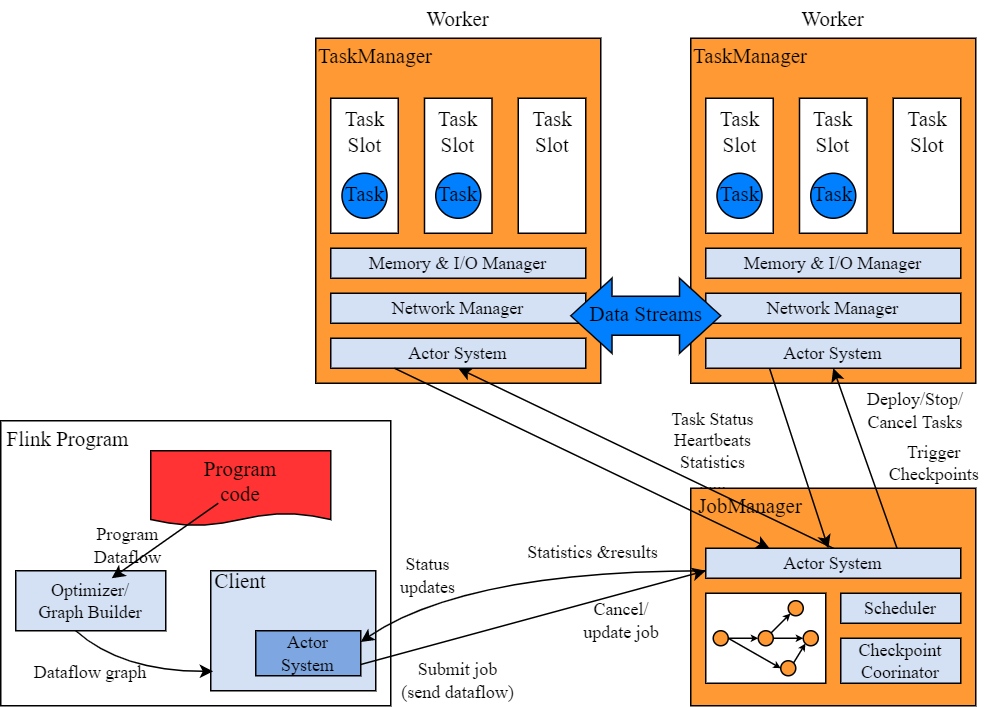

1. 客户端不是运行时和程序执行的一部分，但它用于准备并发送`dataflow(JobGraph)`给`Master(JobManager)`，然后，客户端断开连接或者维持连接以等待接收计算结果。
2. 当`Flink`集群启动后，首先会启动一个`JobManger`和一个或多个的`TaskManager`。由`Client`提交任务给`JobManager`，`JobManager`再调度任务到各个`TaskManager`去执行，然后`TaskManager`将心跳和统计信息汇报给`JobManager`。`TaskManager`之间以流的形式进行数据的传输。上述三者均为独立的`JVM`进程。
3. `Client`为提交`Job`的客户端，可以是运行在任何机器上（与`JobManager`环境连通即可）。提交`Job`后，`Client`可以结束进程（`Streaming`的任务），也可以不结束并等待结果返回。
4. `JobManager`主要负责调度`Job`并协调`Task`做`checkpoint`。从`Client`处接收到Job和JAR包等资源后，会生成优化后的执行计划，并以`Task`的单元调度到各个`TaskManager`去执行。
5. `TaskManager`在启动的时候就设置好了槽位数（`Slot`），每个`slot`能启动一个`Task`，`Task`为线程。从`JobManager`处接收需要部署的`Task`，部署启动后，与自己的上游建立`Netty`连接，接收数据并处理。

## KAFKA

### kafka架构

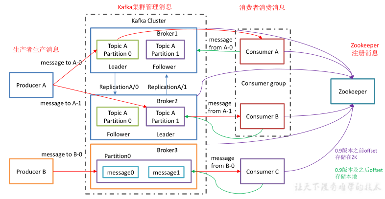

1. `Producer`：消息生产者，就是向`kafkabroker`发消息的客户端；
2. `Producer`：消息生产者，就是向`kafka broker`发消息的客户端；
3. `Consumer`：消息消费者，向`kafka broker`取消息的客户端；
4. `ConsumerGroup`（CG）：消费者组，由多个`consumer`组成。消费者组内每个消费者负责消费不同分区的数据，一个分区只能由一个组内消费者消费；消费者组之间互不影响。所有的消费者都属于某个消费者组，即消费者组是逻辑上的一个订阅者。
5. `Broker`：一台`kafka`服务器就是一个`broker`。一个集群由多个`broker`组成。一个`broker`可以容纳多个`topic`。
6. `Topic`：可以理解为一个队列，生产者和消费者面向的都是一个`topic`；
7. `Partition`：为了实现扩展性，一个非常大的`topic`可以分布到多个`broker`（即服务器）上，一个`topic`可以分为多个`partition`，每个`partition`是一个有序的队列；
8. `Replica`：副本，为保证集群中的某个节点发生故障时，该节点上的`partition`数据不丢失，且`kafka`仍然能够继续工作，`kafka`提供了副本机制，一个`topic`的每个分区都有若干个副本，一个`leader`和若干个`follower`。
9. `leader`：每个分区多个副本的“主”，生产者发送数据的对象，以及消费者消费数据的对象都是`leader`。
10. `follower`：每个分区多个副本中的“从”，实时从`leader`中同步数据，保持和`leader`数据的同步。`leader`发生故障时，某个`follower`会成为新的`follower`。