### **一**数据仓库概述

首先，我们先来看下数据库、数据集市、数据仓库以及数据湖的概念。

#### **01**什么是数据库？

数据库(`Database`)是按照一定格式和数据结构在计算机保存数据的软件，属于物理层。

最早期是广义上的数据库，这个阶段的数据库结构主要以层次或网状的为主，这是数据库的数据和程序间具备非常强的依赖性，应用有一定局限性。

我们现在所说的数据库一般指的是关系型数据库。关系数据库是指采用了关系模型来组织数据的数据库，其以行和列的形式存储数据，具有结构化程度高，独立性强，冗余度低等优点。

关系型数据库主要用于联机事务处理`OLTP(On-Line Transaction Processing)`，主要用于进行基本的、日常的事务处理，例如银行交易等场景。

#### **02**什么是数据集市？

数据集市是一种微型的数据仓库，它通常是有更少的数据，更少的主题区域，以及更少的历史数据，如果数据仓库是企业级的，那数据集市就是部门级的，一般数据集市只能为某个局部范围内的管理人员服务。

#### **03**什么是数据仓库？

数据仓库`(Data Warehouse)`，可简写为`DW`或`DWH`。它是为企业所有级别的决策制定过程，提供所有类型数据支持的战略集合。它是单个数据存储，出于分析性报告和决策支持目的而创建。为需要业务智能的企业，提供指导业务流程改进、监视时间、成本、质量以及控制。

数据仓库之父比尔·恩门于1990年提出数据仓库`(Data Warehouse)`，数仓主要是为解决企业的数据集成与分析问题。数据仓库主要功能是将`OLTP`经年累月所累积的大量数据，通过数据仓库特有的数据储存架构进行`OLAP`，最终帮助决策者能快速有效地从大量数据中，分析出有价值的信息，提供决策支持。自从数据仓库出现之后，信息产业就开始从以关系型数据库为基础的运营式系统慢慢向决策支持系统发展。

一句话总结：**数据仓库存在的意义在于对企业的所有数据进行汇总，为企业各个部门提供统一的， 规范的数据出口。**

**数据仓库相比数据库**，主要有以下**两个特点**：

- **数据仓库是面向主题集成的**。数据仓库是为了支撑各种业务而建立的，数据来自于分散的操作型数据。因此需要将所需数据从多个异构的数据源中抽取出来，进行加工与集成，按照主题进行重组，最终进入数据仓库。
- **数据仓库主要用于支撑企业决策分析，所涉及的数据操作主要是数据查询**。因此数据仓库通过表结构优化、存储方式优化等方式提高查询速度、降低开销。

数据仓库与数据库的对比

| 维度         | 数据仓库           | 数据库                  |
| :----------- | :----------------- | :---------------------- |
| 应用场景     | OLAP               | OLTP                    |
| 数据来源     | 多数据源           | 单数据源                |
| 数据标准化   | 非标准化Schema     | 高度标准化的静态 Schema |
| 数据读取优势 | 针对读操作进行优化 | 针对写操作进行优化      |

#### **04**什么是数据湖？

在现在这个时代，数据对于企业而言，已经是一种重要资产。随着企业的不断发展，数据不断堆积，企业希望把生产经营中的所有相关数据都完整保存下来，进行有效管理与集中治理，挖掘和探索数据价值。而数据湖就应运而生。

数据湖是一个集中存储各类结构化和非结构化数据的大型数据仓库，它可以存储来自多个数据源、多种数据类型的原始数据，数据无需经过结构化处理，就可以进行存取、处理、分析和传输。数据湖能帮助企业快速完成异构数据源的联邦分析、挖掘和探索数据价值。

**数据湖的本质**，是由“**数据存储架构+数据处理工具**”组成的解决方案。

- **数据存储架构**：要有足够的扩展性和可靠性，可以存储海量的任意类型的数据，包括结构化、半结构化和非结构化数据。

- **数据处理工具**，则分为两大类：

  - 第一类工具，**聚焦如何把数据“搬到”湖里**。包括定义数据源、制定数据同步策略、移动数据、编制数据目录等。

  - 第二类工具，**关注如何对湖中的数据进行分析、挖掘、利用**。数据湖需要具备完善的数据管理能力、多样化的数据分析能力、全面的数据生命周期管理能力、安全的数据获取和数据发布能力。如果没有这些数据治理工具，元数据缺失，湖里的数据质量就没法保障，最终会由数据湖变质为数据沼泽。

数据仓库和数据湖的不同类比于仓库和湖泊：仓库存储着来自特定来源的货物；而湖泊的水来自河流、溪流和其他来源，并且是原始数据。

数据湖与数据仓库的对比

| 维度     | 数据湖                                                       | 数据仓库                         |
| -------- | ------------------------------------------------------------ | -------------------------------- |
| 应用场景 | 可以探索性分析所有类型的数据，包括机器学习、数据发现、特征分析、预测等 | 通过历史的结构化数据进行数据分析 |
| 使用成本 | 起步成本低，后期成本较高                                     | 起步成本高，后期成本较低         |
| 数据质量 | 包含大量原始数据，使用前需要清洗和标准化处理                 | 质量高，可作为事实依据           |
| 适用对象 | 数据科学家、数据开发人员为主                                 | 业务分析师为主                   |

#### **05**数据仓库特点

**5.1 数据仓库是面向主题的**

数据仓库中的数据是按照一定的主题域进行组织的，每一个主题对应一个宏观的分析领域。数据仓库排除对于决策无用的数据，提供特定主题的简明视图。

举个例子：

比如说一个公司会有很多的部门，不同的部门都会去数据仓库拿数据，做自己要做的报表，我们把这一个部门或是某一个业务，也就是独立从我们数据仓库中获取数据的单元，把它称作为主题，也可以理解为一个主题就是一个部门。这个部门作为一个主题会从数据仓库总去获取数据，用于完成需要的报表。

**5.2 数据仓库是集成的**

数据仓库中的数据不是一开始就是在里面的，而是从各个分散的数据库中抽取出来的。但是有一个问题，就是这些来自不同数据库的数据会有重复和不一样的地方，如字段的同名异议、异名同义、单位不统一，字长不统一等。所以在集成的过程中，还要对数据进行清洗、规划、去敏等操作。

一句话就是，**数据仓库是对企业内不同业务部门数据完整集合，而且还是处理过的数据。**

**5.3 数据仓库的数据是稳定的**

数据仓库中的数据主要是为了给企业做决策时分析使用，涉及的主要是对数据的查询，一般情况下不会对数据进行修改，如果数据仓库中的历史数据超过存储期限，则会直接删除。

因为数据仓库涉及的操作主要是查询，所以它的系统要比数据库简单很多，但是数据仓库涉及到查询的数据量一般都很大，所以在数据查询就有更高的要求。

**一句话记忆，数仓里不存在数据的更新和删除（不是指数据到期的删除）操作。**

**5.4 数据仓库中的数据是随时间变化而变化的**

数据仓库中的数据不可更新是针对应用来说的，也就是说，数据仓库的用户进行分析处理是不进行数据更新操作的。但并不是说，在从数据集成输入数据仓库开始到最后被删除的整个生存周期中，所有的数据仓库数据都是永远不变的。

数据仓库的数据是随着时间变化而变化的主要表现如下：

1）数据仓库随着时间变化不断增加新的数据内容。数据仓库系统必须不断捕捉OLTP数据库中变化的数据，追加到数据仓库当中去，也就是要不断的生成`OLTP`数据库的快照，经统一集成增加到数据仓库中去；但对于确实不在变化的数据库快照，如果捕捉到新的变化数据，则只生成一个新的数据库快照增加进去，而不会对原有的数据库快照进行修改。

2）数据库随着时间变化不断删去旧的数据内容 。数据仓库内的数据也有存储期限，一旦过了这一期限，过期数据就要被删除。

3）数据仓库中包含有大量的综合数据，这些综合数据中很多跟时间有关，如数据经常按照时间段进行综合，或隔一定的时间片进行抽样等等。这些数据要随着时间的变化不断地进行从新综合。因此数据仓库的数据特征都包含时间项，以标明数据的历史时期。

**一句话理解，数仓里会完整的记录某个对象在一段时期内的变化情况。**

### **二**数据仓库分层

我们先来看下数据仓库为什么要分层，也就是分层的优势。

**1）把复杂问题简单化**

将复杂的问题分解成多层来完成，每一次只处理简单的任务，方便定位问题。

**2）减少重复开发**

规范数据分层，通过的中间层数据，能够减少极大的重复计算，增加一次计算结果的复用性。

**3）隔离原始数据**

不论是数据的异常还是数据敏感度，使真实数据与统计数据解耦开。

数据仓库基础分层主要是分为四层，如下图所示

如上图所示，一个公司可能有多个业务系统，而数据仓库就是将所有的业务系统按照某种组织架构整合起来，形成一个仓储平台，也就是数仓。

#### 01四层分层

第一层：

**ODS——原始数据层**：存放原始数据

`ODS`层即操作数据存储，是最接近数据源中数据的一层，数据源中的数据，经过抽取、洗净、传输，也就说传说中的`ETL`之后，装入本层；一般来说`ODS`层的数据和源系统的数据是同构的，主要目的是简化后续数据加工处理的工作。从数据粒度上来说ODS层的数据粒度是最细的。`ODS`层的表通常包括两类，一个用于存储当前需要加载的数据，一个用于存储处理完后的历史数据。历史数据一般保存`3-6`个月后需要清除，以节省空间。但不同的项目要区别对待，如果源系统的数据量不大，可以保留更长的时间，甚至全量保存；数据在装入本层前需要做以下工作：去噪、去重、提脏、业务提取、单位统一、砍字段、业务判别。

第二层：

**DWD——数据明细层**：对`ODS`层数据进行清洗、维度退化、脱敏等。

该层一般保持和`ODS`层一样的数据粒度，并且提供一定的数据质量保证，在`ODS`的基础上对数据进行加工处理，提供更干净的数据。同时，为了提高数据明细层的易用性，该层会采用一些维度退化手法，当一个维度没有数据仓库需要的任何数据时，就可以退化维度，将维度退化至事实表中，减少事实表和维表的关联。例如：订单`id`,这种量级很大的维度，没必要用一张维度表来进行存储，而我们一般在进行数据分析时订单id又非常重要，所以我们将订单`id`冗余在事实表中，这种维度就是退化维度。

第三层：

**DWS——数据汇总层**：对`DWD`层数据进行一个轻度的汇总。

`DWS`层为公共汇总层，会进行轻度汇总，粒度比明细数据稍粗，会针对度量值进行汇总，目的是避免重复计算。该层数据表会相对比较少，大多都是宽表(一张表会涵盖比较多的业务内容，表中的字段较多)。按照主题划分，如订单、用户等，生成字段比较多的宽表，用于提供后续的业务查询，`OLAP`分析，数据分发等。

第四层：

**DM——数据集市层**：为各种统计报表提供数据。

存放的是轻度聚合的数据，也可以称为数据应用层，基于`DWD`、`DWS`上的基础数据，整合汇总成分析某一个主题域的报表数据。主要是提供给数据产品和数据分析使用的数据，通常根据业务需求，划分成流量、订单、用户等，生成字段比较多的宽表，用于提供后续的业务查询，`OLAP`分析，数据分发等。从数据粒度来说，这层的数据是汇总级的数据，也包括部分明细数据。从数据的时间跨度来说，通常是DW层的一部分，主要的目的是为了满足用户分析的需求，而从分析的角度来说，用户通常只需要分析近几年的即可。从数据的广度来说，仍然覆盖了所有业务数据。

**注意：面试问到数仓分层，可以回答是四层，但是也一定要说是会根据企业实际情况来决定的。**

**下面再介绍下三层和五层（来自于阿里大数据之路）的情况**

#### **02**三层分层

三层分层如下：

第一层：

**ODS——原始数据层**：存放原始数据

第二层：

**DW——数据仓库层**：数据清洗，初步汇总

本层将从`ODS `层中获得的数据按照主题建立各种数据模型，每一个主题对应一个宏观的分析领域，数据仓库层排除对决策无用的数据，提供特定主题的简明视图。在`DW`层会保存`BI`系统中所有的历史数据，例如保存10年的数据。

第三层：

**DM——数据集市层**：为各种统计报表提供数据。

#### **03**五层分层

五层分层如下：

第一层：

**ODS——原始数据层**：存放原始数据

第二层：

**DWD——数据明细层**：对`ODS`层数据进行清洗、维度退化、脱敏等。

第三层：

**DWS——数据汇总层**：对`DWD`层数据进行一个轻度的汇总。

第四层：

**ADS——数据应用层**：为各种统计报表提供数据

该层是基于`DW`层的数据，整合汇总成主题域的服务数据，用于提供后续的业务查询等。

第五层：

**DIM——维表层**：基于维度建模理念思想，建立整个企业的一致性维度。

维表层主要包含两部分数据：

**高基数维度数据**：一般是用户资料表、商品资料表类似的资料表。数据量可能是千万级或者上亿级别。

**低基数维度数据**：一般是配置表，比如枚举值对应的中文含义，或者日期维表。数据量可能是个位数或者几千几万。

### **三**数据仓库核心理论

#### **01**数据仓库建模

**1.1 为什么需要数据建模**

在大数据时代，数据爆发式增长，如何将这些数据进行有序、有结构的分类组织和存储是大多数公司面临的一个挑战。

如果我们把数据当成书，我们也希望看到按类别整整齐齐排列好放置；如果把数据当做我们学习所做的笔记、总结，我们肯定是想把知识点按主题放在各个文件夹，每个知识点再排版整理好。

数据模型就是数据组织和存储方法，它强调从业务、数据存取和使用角度合理存储数据。

**数据仓库建模的目标是通过建模的方法更好的组织、存储数据，以便在性能、成本、效率和数据质量之间找到最佳平衡点。**

当有了**适合业务和基础数据存储环境的模型（良好的数据模型）**，那么大数据就能获得以下好处：

- 性能：快速的查询我们所需要的数据，减少数据的`I/O`吞吐。
- 成本：极大的减少不必要的数据冗余，实现计算结果复用，降低数据的存储和计算成本。
- 效率：极大的改善用户使用数据的体验，提高使用数据的效率。
- 质量：改善数据统计口径的不一致性，减少数据计算错误的可能性。

**1.2 常见的四种数据仓库建模模型**

现在数据处理大致可以分为两大类：

**操作型处理**，叫**联机事务处理 OLTP(On-Line Transaction Processing)**，也可以称面向交易的处理系统，它是针对具体业务在数据库联机的日常操作，通常对少数记录进行查询、修改。用户较为关心操作的响应时间、数据的安全性、完整性和并发支持的用户数等问题。传统的数据库系统作为数据管理的主要手段，主要用于操作型处理。

**分析型处理**，叫**联机分析处理 OLAP(On-Line Analytical Processing)**一般针对某些主题的历史数据进行分析，支持管理决策。

**1.2.1 ER模型（范式模型）**

这是数据仓库之父`Bill Inmon`提出的建模方法，即实体关系`(Entity Relationship，ER)`模型。这是从全企业的高度设计一个3NF模型，用实体关系模型来描述企业业务，在范式理论上符合3NF。

**关系模型主要应用于OLTP系统中，为了保证数据的一致性以及避免冗余，所以大部分业务系统的表都是遵循第三范式的。**

**特点**：设计思路自上而下，适合上游基础数据存储，同一份数据只存储一份，没有数据冗余，方便解耦，易维护，缺点是开发周期一般比较长，维护成本高。

**范式理论**：

范式可以理解为设计一张数据表的表结构，符合的标准级别，也就是规范和要求。

优点：关系型数据库设计时，遵照一定的规范要求，目的在于降低数据的冗余性。

缺点：范式的缺点是获取数据时，需要通过Join拼接出最后的数据。

分类：目前业界范式有**第一范式(1NF)、第二范式(2NF)、第三范式(3NF)**、巴斯-科德范式(BCNF)、第四范式(4NF)、第五范式(5NF)（这里只概述1NF、2NF和3NF）。

**1.2.2 维度模型**

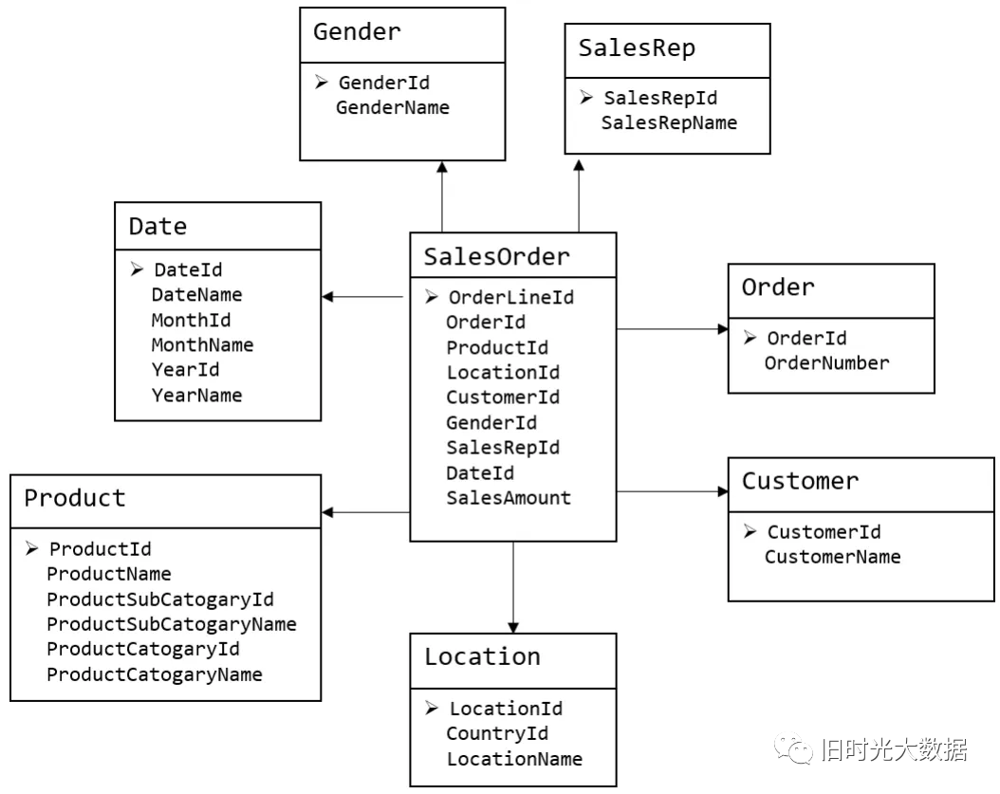

维度模型如图所示，主要应用于`OLAP`系统中，通常以某一个事实表为中心进行表的组织，主要面向业务，特征是可能存在数据的冗余，但是能方便的得到数据。

**关系模型虽然冗余少，但是在大规模数据，跨表分析统计查询过程中，会造成多表关联，这会大大降低执行效率。所以一般都会采用维度模型建模，把相关各种表整理成两种：事实表和维度表两种。**

在维度建模的基础上又可分为三种模型：**星型模型、雪花模型、星座模型**。

维度建模是从分析决策的需求出发构建模型，为分析需求服务，因此它重点关注用户如何更快速的完成需求分析，同事具有较好的大规模复杂查询的相应能力。其典型的代表是星型模型，以及在一些特殊场景下使用的雪花模型。

维度建模设计分为以下步骤：

- 选择需要进行分析决策的业务过程
- 定义粒度
- 识别维度
- 确认事实

**1）星型模型**

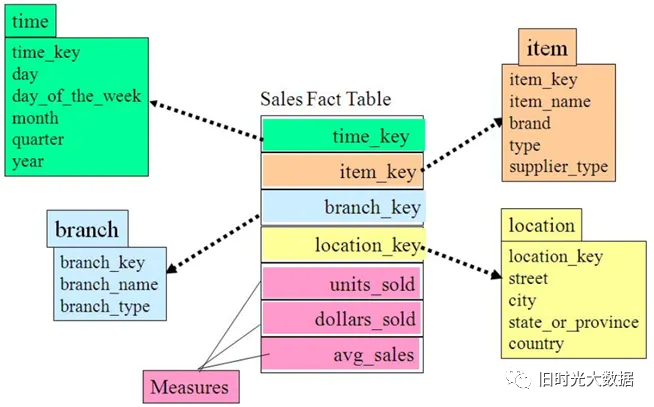

星型模式是维度模型中最简单的形式，也是数据仓库以及数据集市开发中使用最广泛的形式。星型模式由事实表和维度表组成，一个星型模式中可以有一个或多个事实表，每个事实表引用任意数量的维度表。

星型模型与雪花模型的区别主要在于维度的层级，标准的星型模型维度只有一层，而雪花模型可能会涉及多层。

**2）雪花模型**

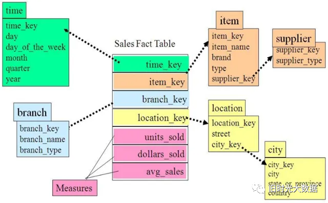

雪花模式是一种多维模型中表的逻辑布局，与星型模式相同，雪花模式也是由事实表和维度表所组成。所谓的“雪花化”就是将星型模型中的维度表进行规范化处理。当所有的维度表完成规范化后，就形成了以事实表为中心的雪花型结构，即雪花模式。

**3）星座模型**

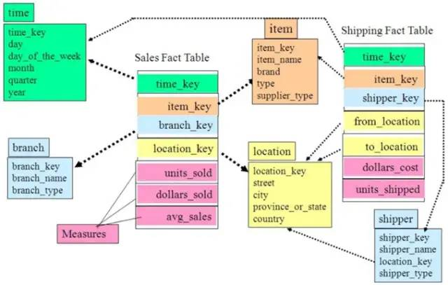

数据仓库由多个主题构成，包含多个事实表，而维表是公共的，可以共享（例如两张事实表共用一些维度表时，就叫做星型模型），这种模式可以看做星型模式的汇集，因而称作星系模式或者事实星座模式。

**1.2.3 Data Vault模型**

`DataVault`由`Hub`（关键核心业务实体）、`Link`（关系）、`Satellite`（实体属性） 三部分组成 ，是`Dan Linstedt`发起创建的一种模型方法论，它是在ER关系模型上的衍生，同时设计的出发点也是为了实现数据的整合，并非为数据决策分析直接使用。

**1.2.4 Anchor模型**

`Anchor`模型是对`Data Vault`模型做了进一步规范化处理，它是一个高度可扩展的模型，所有的扩展只是添加而不是修改，因此它将模型规范到`6NF`，基本变成了`K-V`结构模型。企业很少使用。

**1.3 模型选择**

在数据仓库建模时，会涉及到模式的选择，我们要根据不同模式的特点选择适合具体业务的模式。

星型还是雪花，取决于性能优先，还是灵活更优先。

在实际开发中，不会绝对选择一种，根据情况灵活组合，甚至并存（一层维度和多层维度都保存）。

在传统企业数仓中，业务相对稳定，以范式建模为主。如电信、金融行业等。

在互联网公司，业务变化快，需求来来回回的改，计算和存储也不是问题，我们更关心快速便捷的满足业务需求，所以以维度建模为主。

**1.4 数仓建模流程**

数仓建模就是业务模型->概念模型->逻辑模型->物理模型的这样一个流程，下面我们详细解释一下各个模型阶段都要做什么。

1）**业务建模**：需求沟通

- 划分整个单位的业务，一般按照业务部门的划分，进行各个部分之间业务工作的界定，理清各业务部门之间的关系。
- 深入了解各个业务部门的内具体业务流程并将其程序化。
- 提出修改和改进业务部门工作流程的方法并程序化。
- 数据建模的范围界定，整个数据仓库项目的目标和阶段划分。

业务建模阶段其实是一次和业务人员梳理业务的过程，在这个过程中，不仅能帮助我们技术人员更好的理解业务，另一方面，也能够发现业务流程中的一些不合理的环节，加以改善和改进。

2）**领域（概念）建模**：画图想好怎么做

- 抽取关键业务概念，并将之抽象化。
- 将业务概念分组，按照业务主线聚合类似的分组概念。
- 细化分组概念，理清分组概念内的业务流程并抽象化。
- 理清分组概念之间的关联，形成完整的领域概念模型。

概念模型具体要求如下：

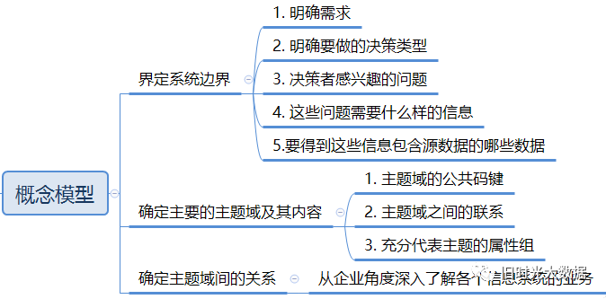

领域概念建模就是运用了实体建模法，从纷繁的业务表象背后通过实体建模法，抽象出实体，事件，说明等抽象的实体，从而找出业务表象后抽象实体间的相互的关联性，保证了我们数据仓库数据按照数据模型所能达到的一致性和关联性。

3）**逻辑建模**：表设计

业务概念实体化，并考虑其具体的属性。

事件实体化，也就是所谓的事实，并考虑其属性内容。

说明实体化，也就是所谓的维度，并考虑其属性内容。

逻辑模型具体要求如下：

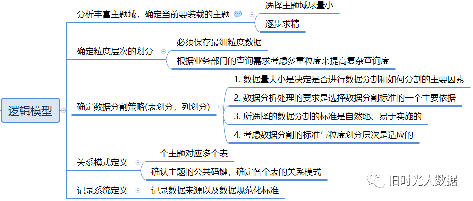

总体来说就是建表，前面已经画出了关系图，这里只要将表里头有哪些字段考虑出来就可以，如果是事实表就考虑事实字段和业务主键，如果是维度表就考虑维度属性，`SCD`策略等等。在这里需要确定数据粒度，如果多个指标都用到一个字段，则取粒度最小的指标。如果不确定指标的量度，则取毫秒级作为粒度。

4）**物理建模**：建表

- 针对特定物理化平台，做出相应的技术调整。
- 针对模型的性能考虑，对特定平台作出相应的调整。
- 针对管理的需要，结合特定的平台，做出相应的调整。
- 生成最后的执行脚本，并完善。

物理模型具体要求如下：

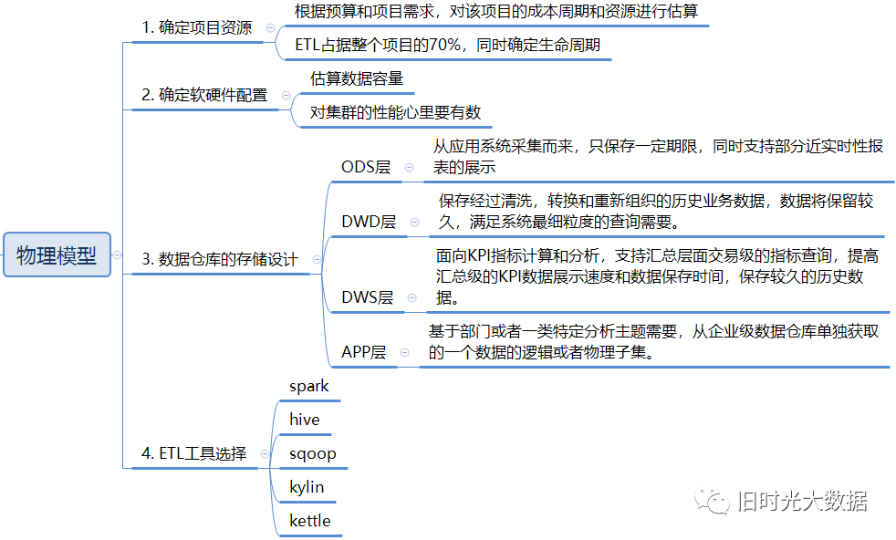

综合现实的大数据平台、采集工具、`etl`工具、数仓组件、性能要求、管理要求等多方面因素，设计出具体的项目代码，完成数仓的搭建。

总结来说，上面的模型设计流程大部分应用于`DWD`层，也就是事实维度层。通过建模，捋清逻辑，把业务落实到一张张表，并梳理表于表之间的关系。

**1.5 数仓建模过程**

假设现在在构建一张订单表

从多个维度进行统计组合，形成多维度数据集，来从多个角度观察业务过程的好坏

1）**选择业务过程**

- 确认哪些业务处理流程是数据仓库应该覆盖的，是维度方法的基础。因此，建模的第一个步骤是描述需要建模的业务流程。例如，需要了解和分析一个零售店的销售情况，那么与该零售店销售相关的所有业务流程都是需要关注的。为了描述业务流程，可以简单地使用纯文本将相关内容记录下来，或者使用“业务流程建模标注”（`BPMN`）方法，也可以使用统一建模语言（`UML`）或其他类似的方法。
- 业务过程就是需要那种业务场景下产生的订单表(划分到那个业务线和数据域)
- 业务过程就是用户下单的订单记录表

2）**选择数据域**

（1）申明粒度

- 粒度就是确认一条记录代表的含义或者是细化到何种程度(一条记录代表一个订单还是多个订单，如拼团的时候团长的单)
- 在选择维度和事实前必须声明粒度，因为每个候选维度或事实必须与定义的粒度保持一致。在一个事实所对应的所有维度设计中强制实行粒度一致性是保证数据仓库应用性能和易用性的关键。
- 从给定的业务流程获取数据时，原始粒度是最低级别的粒度。建议从原始粒度数据开始设计，因为原始记录能够满足无法预期的用户查询。汇总后的数据粒度对优化查询性能很重要，但这样的粒度往往不能满足对细节数据的查询需求。
- 不同的事实可以有不同的粒度，但同一事实中不要混用多种不同的粒度。维度模型建立完成之后，还有可能因为获取了新的信息，而回到这步修改粒度级别。

（2）确认维度

- 维度的粒度必须和第二步所声明的粒度一致。
- 维度表是事实表的基础，也说明了事实表的数据是从哪里采集来的。
- 典型的维度都是名词，如日期、商店、库存等。维度表存储了某一维度的所有相关数据，例如，日期维度应该包括年、季度、月、周、日等数据。

（3）确认事实

- 这一步识别数字化的度量，构成事实表的记录。它是和系统的业务用户密切相关的，因为用户正是通过对事实表的访问获取数据仓库存储的数据。大部分事实表的度量都是数字类型的，可累加，可计算，如成本、数量、金额等。

**1.6 模型设计的思路**

业务需求驱动，数据驱动，构造数据仓库有两种方式：一是自上而下，一是自下而上。

1）自上而下

`Bill Inmon`先生推崇“自上而下”的方式，即一个企业建立唯一的数据中心，就像一个数据的仓库，其中数据是经过整合、经过清洗、去掉脏数据的、标准的，能够提供统一的视图。要建立这样的数据仓库，并不从它需要支持哪些应用入手，而是要从整个企业的环境入手，分析其中的概念，应该有什么样的数据，达成整体概念。

2）自下而上

`Ralph Kimball`先生推崇“自下而上”的方式，他认为建设数据仓库应该按照实际的应用需求，加载需要的数据，不需要的数据不要加载到数据仓库中。这种方式建设周期较短，客户能够很快看到结果。（针对客户的需求，需求要什么就做什么）

**1.7 模型落地实现**

1）按照命名规范创建表

2）开发生成维表和事实表的代码

3）进行代码逻辑测试，验证数据加工逻辑的正确性

4）代码发布，加入调度并配置相应的质量监控和报警机制

#### **02**事实表设计

事实表作为数据仓库维度建模的核心，紧紧围绕着业务过程来设计，通过获取描述业务过程的度量来表达业务过程，包含了引用的维度和与业务过程有关的度量。

事实表有三种类型 : **事务事实表、周期快照事实表和累积快照事实表**。

**2.1 事实表设计原则**

**原则一：尽可能包含所有与业务过程相关的事实**

- 分析哪些事实与业务过程有关是设计中非常重要的关注点。
- 在事实表中应尽量包含所有与业务过程相关的事实，即使存在冗余，不过事实通常为数字型，存储开销不会太大。

**原则二：只选择与业务过程相关的事实**

- 选择事实时，应只选择与业务过程有关的事实。比如在订单的下单这个业务过程中，事实表中不应该存在支付金额这个表示支付业务过程的事实。

**原则三：分解不可加性事实为可加的事实**

- 比如订单的优惠率，应分解为订单原价金额与订单优化金额两个事实存储在事实表中。

**原则四：在选择维度和事实之前必须先声明粒度**

- 粒度用于确定事实表中一行所表示业务的细节层次，决定了维度的扩展性。
- 每个维度和事实必须与所定义的粒度保持一致。
- 事实表设计过程中，粒度定义得越细越好，建议从最低级别的原子粒度开始。
- 原子粒度提供了最大限度的灵活性，可以支持无法预期的各种细节层次的用户需求。

**原则五：在同一个事实表中不能有多种不同粒度的事实**

下图为机票支付成功事务事实表：

- 对于上图事务事实表，粒度为“票一级”（实际业务中，一个订单可以同时支付多张票）
- 票支付金额和票折扣金额两个事实的粒度与表定义的粒度一致，都为“票级”，支持按表的任意维度汇总。
- 订单支付金额和订单票数粒度为“订单级”，与事实表粒度不一致，且不能进行汇总。
- 若在汇总计算时对总订单金额和总票数两个度量进行汇总计算，则会造成重复计算的问题。

**原则六：事实的单位要保持一致**

- 比如原订单金额、订单优惠金额、订单运费金额这三个事实，应采用一致的计量单位，统一为元或分，以方便使用。

**原则七：对事实的null值要处理**

- 在数据库中，`null`值对常用数字型字段的`SQL`过滤条件都不生效，比如大于、小于、等于、大于或等于、小于或等于，建议用`0`代替`null`。

**原则八：使用退化维度提高事实表的易用性**

- 在`Kimball`的维度建模中，通常按照星型模型的方式来设计，通过事实表的外键关联专门的维表的方式来获取维度，谨慎使用退化维度，这一点，与大数据领域的事实表设计不一样。

- 在大数据领域的事实表设计中，大量采用退化维度的方式，在事实表中存储各种类型的常用维度信息。这样做的设计目的如下：

- - 减少下游用户使用时关联多个表的操作，直接通过退化维度实现对事实表的过滤查询、控制聚合层次、排序数据以及定义主从关系等。
  - 通过增加冗余存储的方式减少计算开销，提高使用效率。

**2.2 事实表设计方法**

`Kimball`的维度模型设计方法有以下四个步骤：选择业务过程、声明粒度、确定维度、确定事实。

在当前互联网大数据环境下，业务场景越来越复杂，所以一般会在`Kimball`的四步维度建模方法上进一步做出改进，以便适合公司业务场景（所以这里共有五步）。

**第一步：选择业务过程及确定事实表类型**

明确业务需求后，就需要对我们的需求进行详细分析，对业务的整个生命周期进行分析，明确关键的业务步骤，从而选择与需求有关的业务过程。

以淘宝的一个交易订单为例：

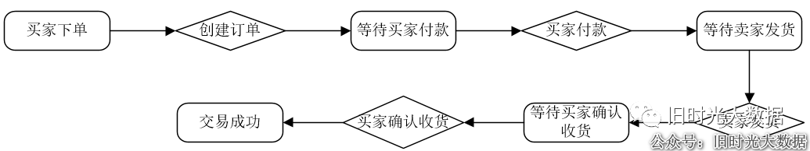

1）分析业务的生命周期

如上图，业务过程通常使用行为动词表示业务执行的活动。

2）明确关键的业务步骤

上图中淘宝订单的业务过程有四个：创建订单、买家付款、卖家发货、买家确认收货。

3）根据具体的业务需求，选择与维度建模有关的业务过程

比如是选择 “买家付款” 这个业务过程，还是选择 “创建订单” 和 “买家付款” 这两个业务过程，具体根据业务情况来定。

4）根据选择的业务过程来确定事实表类型

如果选择买家付款这个业务过程，那么事实表应该为只包含买家付款这一个业务过程的单事务事实表；如果选择的是所有四个业务过程，并且需要分析各个业务过程之间的时间间隔，那么所建立的事实表应该为包含了所有四个业务过程的累计快照事实表。

**第二步：声明粒度**

1）粒度的作用

粒度的声明，意味着精确定义事实表的每一行所表示的业务含义。

明确的粒度能够确保对实表中行的意思的理解不会产生混淆，保证所有的事实按照同样的细节层次记录。

2）粒度的选择

应尽量选择最细级别的原子粒度，以确保事实表的应用具有最大的灵活性。

灵活性：支持无法预期的各种细节层次的用户需求。

对于订单级别，粒度可以定义为最细的订单级别（如，父子订单，事实表的粒度可以定 “子订单级别” ）。

**第三步：确定维度**

完成粒度声明后，就意味着确定了主键，对应的维度组合以及相关的维度字段就可以确定了。

维度选择的原则：应该选择能够描述清楚业务过程所处的环境的维度信息。

- 比如淘宝订单 “付款事务事实表” 中，粒度为 “子订单”，相关的维度有买家、卖家、商品、收货人信息、业务类型、订单时间等。

**第四步：确定事实**

确定原则：选择与业务过程有关的所有事实，且事实的粒度要与所声明的事实表的粒度一致。

思路：可以通过回答 “过程的度量是什么” 来确定。

注意：将不可加性事实分解为可加的组件（分解的原则：可以通过分解后的可加的属性值，计算得到不可加性事实）。

**第五步：冗余维度**

冗余常用维度字段（比如商品类目），方便下游用户使用（过滤查询、控制聚合）

**2.3 三种事实表**

1）事务事实表

也可称为原子事实表，描述业务过程，跟踪控件或时间上某点的度量时间，保存的是最原子的数据。

类似于`mysql binlog`日志，每一次相关的 `change `都记录下来，生成一行新的数据。

2）周期快照事实表

以一个周期为时间间隔，来记录事实，一般周期可以是每天、每周、每月、每年等。

只看某个业务过程，比如订单收货，数据按订单收货时间来切分，周期可以为每天、每月等。

3）累积快照事实表

用来描述过程开始和结束之间的关键步骤事件，覆盖过程的整个生命周期，通常具有多个日期字段来记录关键时间点；当过程随着生命周期不断变化时，记录也会随着过程的变化而被修改。

要看整个生命周期的多个业务过程，比如：创建订单 → 买家付款 → 卖家发货 → 买家确认收货。粒度是一个订单一行数据，创建订单时间，付款时间，发货时间，收货时间，分别作为一个字段，便于计算不同业务过程的时间间隔。

4）事务表对比

|            | 事务事实表             | 周期快照事实表               | 累计快照事实表                       |
| ---------- | ---------------------- | ---------------------------- | ------------------------------------ |
| 时期/时间  | 离散事务时间点         | 以有规律的、可预测的         | 用于时间跨度不确定的不断变化的工作流 |
| 日期维度   | 事务日期               | 快照日期                     | 相关业务过程涉及的多个日期           |
| 粒度       | 每行代表实体的一个事务 | 每行代表某时间周期的一个实体 | 每行代表一个实体的生命周期           |
| 事实       | 事务事实               | 累积事实                     | 相关业务过程事实和时间间隔事实       |
| 事实表加载 | 插入                   | 插入                         | 插入与更新                           |
| 事实表更新 | 不更新                 | 不更新                       | 业务过程变更时更新                   |

#### **03**多维体系结构

在`Kimball`的维度建模的数据仓库中，关于多维体系结构(`MD`)有三个关键性概念：**总线架构**`(Bus Architecture)`，**一致性维度**(`Conformed Dimension`)和**一致性事实**（`Conformed Fact`）。

**3.1 总线架构**

在多维体系结构(`MD`)（也就是总线架构）的数据仓库架构中，主导思想是分步建立数据仓库，由数据集市组合成企业的数据仓库。但是，在建立第一个数据集市前，架构师首先要做的就是设计出在整个企业内具有统一解释的标准化的维度和事实，即一致性维度和一致性事实。而开发团队必须严格的按照这个体系结构来进行数据集市的迭代开发。

一致性维度就好比企业范围内的一组总线，不同数据集市的事实的就好比插在这组总线上的元件。这也是称之为总线架构的原因。

实际设计过程中，我们通常把总线架构列表成矩阵的形式，其中列为一致性维度，行为不同的业务处理过程，即事实，在交叉点上打上标记表示该业务处理过程与该维度相关。这个矩阵也称为总线矩阵(Bus Matrix`)。

总线架构和一致性维度、一致性事实共同组成了Kimball的多维体系结构的基础，也建立了一套可以逐步建立数据仓库的方法论。由于总线架构是多维体系结构的核心，所以我们有时就把多维体系结构直接称为总线架构。

**3.2 价值链的意义**

每家机构都有一个关键业务过程组成的潜在价值链，这个价值链确定机构主体活动的自然逻辑流程。数据仓库建设就是围绕着价值链建立一致化的维度和事实。

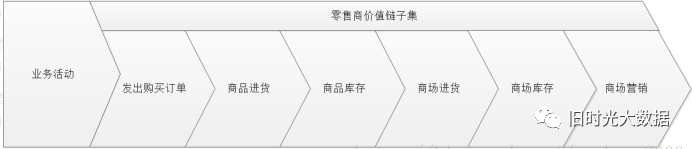

**3.3 数据总矩阵**

矩阵的每一行对应都对应机构中的一个业务过程，每一列都和一个业务维度相对应，用叉号填充显示的是和每一行相关的列。业务过程应该先从单个数据源系统开始，然后再进行多数据源的合并。

企业数据仓库总线矩阵是`DW/BI`系统的一个总体数据架构，提供了一种可用于分解企业数据仓库规划任务的合理方法，开发团队可以独立的，异步的完成矩阵的各个业务过程，迭代地去建立一个集成的企业数据仓库。

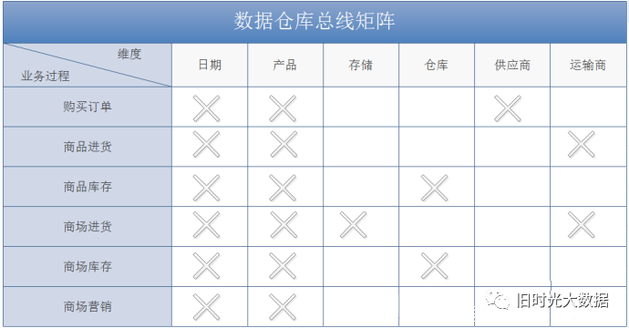

**3.4 一致性维度**

在多维体系结构中，没有物理上的数据仓库，由物理上的数据集市组合成逻辑上的数据仓库。而且数据集市的建立是可以逐步完成的，最终组合在一起，成为一个数据仓库。如果分步建立数据集市的过程出现了问题，数据集市就会变成孤立的集市，不能组合成数据仓库，而一致性维度的提出正式为了解决这个问题。

一致性维度的范围是总线架构中的维度，即可能会在多个数据集市中都存在的维度，这个范围的选取需要架构师来决定。一致性维度的内容和普通维度并没有本质上区别，都是经过数据清洗和整合后的结果。一致性维度建立的地点是多维体系结构的后台(`Back Room`)，即数据准备区。

在多维体系结构的数据仓库项目组内需要有专门的维度设计师，他的职责就是建立维度和维护维度的一致性。在后台建立好的维度同步复制到各个数据集市。这样所有数据集市的这部分维度都是完全相同的。建立新的数据集市时，需要在后台进行一致性维度处理，根据情况来决定是否新增和修改一致性维度，然后同步复制到各个数据集市。这是不同数据集市维度保持一致的要点。

**在同一个集市内，一致性维度的意思是两个维度如果有关系，要么就是完全一样的，要么就是一个维度在数学意义上是另一个维度的子集。**

例如，如果建立月维度话，月维度的各种描述必须与日期维度中的完全一致，最常用的做法就是在日期维度上建立视图生成月维度。这样月维度就可以是日期维度的子集，在后续钻取等操作时可以保持一致。如果维度表中的数据量较大，出于效率的考虑，应该建立物化视图或者实际的物理表。这样，维度保持一致后，事实就可以保存在各个数据集市中。虽然在物理上是独立的，但在逻辑上由一致性维度使所有的数据集市是联系在一起，随时可以进行交叉探察等操作，也就组成了数据仓库。

**3.5 一致性事实**

在建立多个数据集市时，完成一致性维度的工作就已经完成了一致性的`80%－90%`的工作量。余下的工作就是建立一致性事实。一致性事实和一致性维度有些不同，一致性维度是由专人维护在后台(`Back Room`)，发生修改时同步复制到每个数据集市，而事实表一般不会在多个数据集市间复制。需要查询多个数据集市中的事实时，一般通过交叉探查（drill across)来实现。

**为了能在多个数据集市间进行交叉探查，一致性事实主要需要保证两点：第一个是KPI的定义及计算方法要一致，第二个是事实的单位要一致性。如果业务要求或事实上就不能保持一致的话，建议不同单位的事实分开建立字段保存。**

这样，一致性维度将多个数据集市结合在一起，一致性事实保证不同数据集市间的事实数据可以交叉探查，一个分布式的数据仓库就建成了。

**3.6 小结**

**总线矩阵**：业务过程和维度的交点。

**一致性维度**：同一集市的维度表，内容相同或包含。一致性维度要么是统一的，要么是维度表的一个子集。

**一致性事实**：不同集市的同一事实，需保证口径一致，单位统一。指每个度量在整个数据仓库中都是唯一的统计口径，为了避免歧义，一个度量只有唯一的业务术语。

### **四**维度设计

#### **01**维度基本概念

维度是维度建模的基础和灵魂。在维度建模中，将度量称为“事实”，将环境描述为“维度”，维度是用于分析事实所需要的的多样环境。

例如，在分析交易过程时，可以通过买家、卖家、商品和时间等维度描述交易发生的环境。

**维度所包含的表示维度的列，称为维度属性**。维度属性是查询约束条件、分组和报表标签生成的基本来源，是数据易用性的关键。

维度属性的作用一般是查询约束、分类汇总以及排序等。

#### **02**如何获取维度或维度属性

维度或维度属性的获取，可以从以下两方面获取：

1）从报表中获取；

2）可以在和业务人员的交谈中发现维度或维度属性。

#### **03**维度设计原则

**维度属性的作用一般是查询约束、分类汇总以及排序**等，在确定维度属性时，应当提前考虑以下内容：

1）维度属性尽量丰富，为数据使用打下基础

比如淘宝商品维度有近百个维度属性，为下游的数据统计、分析、探查提供了良好的基础。

2）给出详实的、富有意义的文字描述

属性不应该是编码，而应该是真正的文字。在间里巴巴维度建模中，一般是编码和文字同时存在，比如商品维度中的商品ID和商品标题、类目ID和类目名称等。ID一般用于不同表之间的关联，而名称一般用于报表标签。

3）区分数值型属性和事实

数值型宇段是作为事实还是维度属性，可以参考字段的一般用途。如果通常用于查询约束条件或分组统计，则是作为维度属性；如果通常用于参与度量的计算，则是作为事实。比如商品价格，可以用于查询约束条件或统计价格区间的商品数量，此时是作为维度属性使用的也可以用于统计某类目下商品的平均价格，此时是作为事实使用的。另外，如果数值型字段是离散值，则作为维度属性存在的可能性较大；如果数值型宇段是连续值，则作为度量存在的可能性较大，但并不绝对，需要同时参考宇段的具体用途。

4）沉淀出通用的维度属性，为建立一致性维度做好铺垫

有些维度属性获取需要进行比较复杂的逻辑处理，有些需要通过多表关联得到，或者通过单表的不同宇段混合处理得到，或者通过对单表的某个字段进行解析得到。此时，需要将尽可能多的通用的维度属性进行沉淀。一方面，可以提高下游使用的方便性，减少复杂度；另一方面，可以避免下游使用解析时由于各自逻辑不同而导致口径不一致。

#### **04**维度的基本设计方法

**第一步：选择维度或新建维度**

作为维度建模的核心，在企业级数据仓库中必须保证维度的唯一性。以淘宝商品维度为例，有且只允许有一个维度定义。

**第二步：确定主维表**

此处的主维表一般是`ODS`表，直接与业务系系统同步。以淘宝商品维度为例，`sauctionauctions`是与前台商品中心系统同步的商品表，此表即是主维表。

**第三步：确定相关维表**

数据仓库是业务源系统的数据整合，不同业务系统或者同一业务系统中的表之间存在关联性。根据对业务的梳理，确定哪些表和主维表存在关联关系，并选择其中的某些表用于生成维度属性。以淘宝商品维度为例，根据对业务逻辑的梳理，可以得到商品与类目、`SPU`、卖家、店铺等维度存在关联关系。

**第四步：确定维度属性**

本步骤主要包括两个阶段，其中第一个阶段是从主维表中选择维度属性或生成新的维度属性；第二个阶段是从相关维表中选择维度属性或生成新的维度属性。

以淘宝商品维度为例，从主维表(`s_auction_auctions`)和类目、 `SPU`、卖家、店铺等相关维表中选择维度属性或生成新的维度属性。

### **五**六范式与反范式

#### **01**六范式

**1.1 一范式（1NF）**

一范式（`1NF`）：域应该是原子性的，即数据库表的每一列都是不可分割的原子数据项。

域：域就是列的取值范围，比如性别的域就是（男，女）

不符合一范式的表格设计如下：

| ID   | 商品    | 商家ID    | 用户ID |
| ---- | ------- | --------- | ------ |
| 001  | 5台电脑 | XXX旗舰店 | 00001  |

很明显上表所示的表格设计是不符合第一范式的，商品列中的数据不是原子数据项，是可以进行分割的，因此对表格进行修改，让表格符合第一范式的要求，修改结果如下表所示：

| ID   | 商品 | 数量 | 商家ID    | 用户ID |
| ---- | ---- | ---- | --------- | ------ |
| 001  | 电脑 | 5    | XXX旗舰店 | 00001  |

实际上，1NF 是所有关系型数据库的最基本要求，你在关系型数据库管理系统（`RDBMS`），例如` SQL Server`，`Oracle`，`MySQL `中创建数据表的时候，如果数据表的设计不符合这个最基本的要求，那么操作一定是不能成功的。也就是说，只要在 `RDBMS `中已经存在的数据表，一定是符合 1NF 的。

**1.2 二范式**

二范式（`2NF`）：在 `1NF `的基础上，实体的属性完全函数依赖于主关键字（混合主键）， 不能存在部分函数依赖于主关键字（混合主键）。

如果存在某些属性只依赖混合主键中的部分属性，那么不符合二范式。

不符合二范式的表格设计如下：

| 学生ID      | 姓名   | 所属系   | 系主任 | 所修课程 | 分数 |
| ----------- | ------ | -------- | ------ | -------- | ---- |
| 20170901176 | 王小强 | 计算机系 | 马小腾 | 000001   | 95   |
| 20170901176 | 王小强 | 计算机系 | 马小腾 | 000002   | 99   |

上述表格中是混合主键（学生 ID + 所修课程），但是所属系和系主任这两个属性只依赖于混合主键中的学生 ID 这一个属性，因此，不符合第二范式。

如果有一天学生的所属系要调整，那么所属系和系主任这两列都需要修改，如果这个学生修了多门课程，那么表中的多行数据都要修改，这是非常麻烦的，不符合第二范式。

为了消除这种部分依赖，只有一个办法，就是将大数据表拆分成两个或者更多个更小的数据表。

符合二范式的表格设计如下：

| 学生ID      | 所修课程 | 分数 |
| ----------- | -------- | ---- |
| 20170901176 | 000001   | 95   |
| 20170901176 | 000002   | 99   |

| 学生ID      | 所属系   | 主任   |
| ----------- | -------- | ------ |
| 20170901176 | 计算机系 | 马小腾 |
| 20170901176 | 计算机系 | 马小腾 |

| 学生ID      | 姓名   |
| ----------- | ------ |
| 20170901176 | 王小强 |

通过上述的修改，当一个学生的所属系需要调整时，不管学生修了多少门课程，都只需要改变上表中的一行数据即可。

**1.3 三范式**

三范式：`3NF` 在 `2NF `的基础之上，消除了非主属性对于主键（复合主键）的传递依赖。

不符合三范式的表格设计如下：

| 订单ID | 商品ID | 商品颜色 | 商品尺寸   | 商家ID    | 用户ID |
| ------ | ------ | -------- | ---------- | --------- | ------ |
| 001    | 0001   | 深空灰   | 300x270x40 | XXX旗舰店 | 00001  |

很明显，上表中，商品颜色依赖于商品 `ID`，商品 `ID `依赖于订单 `ID`，那么非主属性商品颜色就传递依赖于订单 ID，因此不符合三范式，解决方案是将大数据表拆分成两个或者更多个更小的数据表。

符合三范式的表格设计如下：

| 订单ID | 商品ID | 商家ID    | 用户ID |
| ------ | ------ | --------- | ------ |
| 001    | 0001   | XXX旗舰店 | 00001  |

| 商品ID | 商家颜色 | 商家尺寸   |
| ------ | -------- | ---------- |
| 0001   | 深灰色   | 300x270x40 |

**1.4 BC范式（BGFN）**

定义：关系模式`R`中，若每一个决定因素都包含码，则R属于`BCFN`。

理解：根据定义我们可以得到结论，一个满足BC范式的关系模式有：

- 所有非主属性对每一个码都是完全函数依赖；
- 所有主属性对每一个不包含它的码也是完全函数依赖；
- 没有任何属性完全函数依赖于非码的任何一组属性。

例如有关系模式`C(Cno, Cname, Pcno)`，`Cno`，`Cname`，`Pcno`依次表示课程号、课程名、先修课。可知关系`C`只有一个码`Cno`，且没有任何属性对`Cno`部分函数依赖或传递函数依赖，所以关系C属于第三范式，同时`Cno`是C中的唯一决定因素，所以`C`也属于`BC`范式。

**1.5 第四范式（4NF）**

定义：限制关系模式的属性之间不允许有非平凡且非函数依赖的多值依赖。

理解：显然一个关系模式是4NF，则必为`BCNF`。也就是说，当一个表中的非主属性互相独立时(`3NF`)，这些非主属性不应该有多值，若有多值就违反了4NF。

**1.6 第五范式（5NF）**

第五范式，又称为完美范式， 越往下，冗余度越低。

第五范式有以下要求：

- 必须满足第四范式；
- 表必须可以分解为较小的表，除非那些表在逻辑上拥有与原始表相同的主键。

第五范式是在第四范式的基础上做的进一步规范化。第四范式处理的是相互独立的多值情况，而第五范式则处理相互依赖的多值情况。

#### **02**反范式

一般来说，数据库只需要满足第三范式(`3NF`)即可。

反范式化设计数据库，是为了提高查询效率，采用空间换时间的实现思路。

应用场景：当冗余的信息有价值或者能大幅度提高查询效率的时候，我们才会采取反范式的优化。

一些情况下，比如存在频繁查询时，可以容忍适当的冗余设计，目的是减少多表关联查询，提高效率。

例如：订单表中冗余了商品信息和用户相关信息，避免查询订单时关联用户表和商品表去查询相关信息，提高效率。

优点：增加数据表中的冗余字段来提高数据库的读性能

缺点：

- 存储空间变大了
- 一个表中字段做了修改，另一个表中冗余字段也需要做同步修改，否则数据不一致
- 若采用存储过程来支持数据的更新、删除等额外操作，如果更新频繁会非常消耗系统资源
- 在数据量小的情况下，反范式不能体现性能的优势，可能还会让数据库的设计更加复杂

#### **03**范式化设计与反范式设计的优缺点

**3.1 范式化设计（时间换空间）**

优点：范式化的表减少了数据冗余，数据表更新操作快、占用存储空间小。

缺点：

- 查询时需要对多个表进行关联，查询性能降低
- 索引优化会更难进行

#### 3.2 反范式化设计（空间换时间）

反范式化的过程就是通过增加数据表中的冗余字段来提高数据库的读（查询）性能，但冗余数据会牺牲数据一致性。

优点：

- 可以减少表关联
- 可能更好的进行索引优化

缺点：

- 存在大量冗余数据
- 数据维护成本更高（删除异常，插入异常，更新异常）

### **六**元数据

元数据(Metadata`)最基本的定义就是“关于数据的数据”。

元数据打通了源数据、数据仓库、数据应用，记录了数据从产生到消费的全过程。元数据主要记录数据仓库中模型的定义、各层级间的映射关系、监控数据仓库的数据状态及 `ETL `的任务运行状态。在数据仓库系统中，元数据可以帮助数据仓库管理员和开发人员非常方便地找到他们所心的数据，用于指导其进行数据管理和开发工作，提高工作效率。

正是有了元数据，才使得数据仓库的最终用户可以随心所欲地使用数据仓库，利用数据仓库进行各种管理决策模式的探讨。元数据是数据仓库的应用灵魂，可以说没有元数据就没有数据仓库。 

#### **01**元数据的类型

根据用途的不同，可将元数据分为两类：**技术元数据**(`Technical Metadata`)和**业务元数据**(`Business Metadata` )。

**1.1 技术元数据**

技术元数据是**存储关于数据仓库系统技术细节的数据**，是用于开发、管理和维护数据仓库使用的数据。

它主要包含以下信息：

- **数据仓库结构的描述**，包括仓库模式、视图、维、层次结构和导出数据的定义，以及数据集市的位置和内容； 
- **业务系统、数据仓库和数据集市的体系结构和模式**； 
- **汇总用的算法**，包括度量和维定义算法，数据粒度、主题领域、聚合、汇总和预定义的查询与报告； 
- **由操作环境到数据仓库环境的映射**，包括源数据和它们的内容、数据分割、数据提取、清理、转换规则和数据刷新规则及安全（用户授权和存取控制）。

**1.2 业务元数据**

业务元数据**从业务角度描述了数据仓库中的数据**，它提供了介于使用者和实际系统之间的语义层，使得不懂计算机技术的业务人员也能够“读懂”数据仓库中的数据。

业务元数据主要包括以下信息：

- 使用者的业务术语所表达的数据模型、对象名和属性名；
- 访问数据的原则和数据的来源；
- 系统所提供的分析方法及公式和报表的信息。 

**在信息打包过程中，需要用包图表示维度和类别还有它们之间的传递和映射关系，实际上这个操作就是在原业务系统的基础上创建了元数据**。其中的维度、类别还有 层次关系是属于典型的技术型元数据，而业务系统中与之对应的术语则属于业务元数据。比如日期、区域、产品、客户年龄和客户状况等维 度，实际销售、计划销售、预测销售、计划偏差和预测偏差等指标皆属于元数据。这些数据在以后的分析中起到了极为重要的作用。

#### **02**元数据的作用

元数据是数据管理、数据内容、数据应用的基础，在数据管理方面为集团数据提供在计算、存储、成本、质量、安全、 模型等治理领域上的数据支持。

从元数据的类型和作用来看，元数据实际上是要解决何人在何时、何地为了什么原因及怎样使用数据仓库的问题。再具体化一点，元数据在数据仓库管理员的眼中是数据仓库中的包含了所有内容和过程的完整知识库和文档，而在最终用户（即数据分析人员）眼中，元数据则是数据仓库的信息地图。 

数据分析员为了能有效地使用数据仓库环境，往往需要元数据的帮助。尤其是在数据分析员进行信息分析处理时，他们首先需要去查看元数据。元数据还涉及到数据从操作型环境到数据仓库环境中的映射。当数据从操作型环境进入数据仓库环境时，数据要经历一系列重大的转变，包含了数据的转化、过滤、汇总和结构改变等过程。数据仓库的元数据要能够及时跟踪这些转变，当数据分析员需要就数据的变化从数据仓库环境追溯到操作型环境中时，就要利用元数据来追踪这种转变。另外， 由于数据仓库中的数据会存在很长一段时间，其间数据仓库往往可能会改变数据的结构。随着时间的流逝来跟踪数据结构的变化，是元数据另一个常见的使用功能。 

元数据描述了数据的结构、内容、链和索引等项内容。在传统的数据库中，元数据是对数据库中各个对象的描述，数据库中的数据字典就是一种元数据。在关系数据库中，这种描述就是对数据库、表、列、观点和其他对象的定义；但在数据仓库中，元数据定义了数据仓库中的许多对象——表、列、查询、商业规则及数据仓库内 部的数据转移。元数据是数据仓库的重要构件，是数据仓库的指示图。元数据在数据源抽取、数据仓库开发、商务分析、数据仓库服务和数据求精与重构工程等过程都有重要的作用，在下图中可以看到元数据在整个数据仓库开发和应用过程中的巨大影响。因此，设计一个描述能力强并且内容完善的元数据，对数据仓库进行有效地开发和管理具有决定性意义。

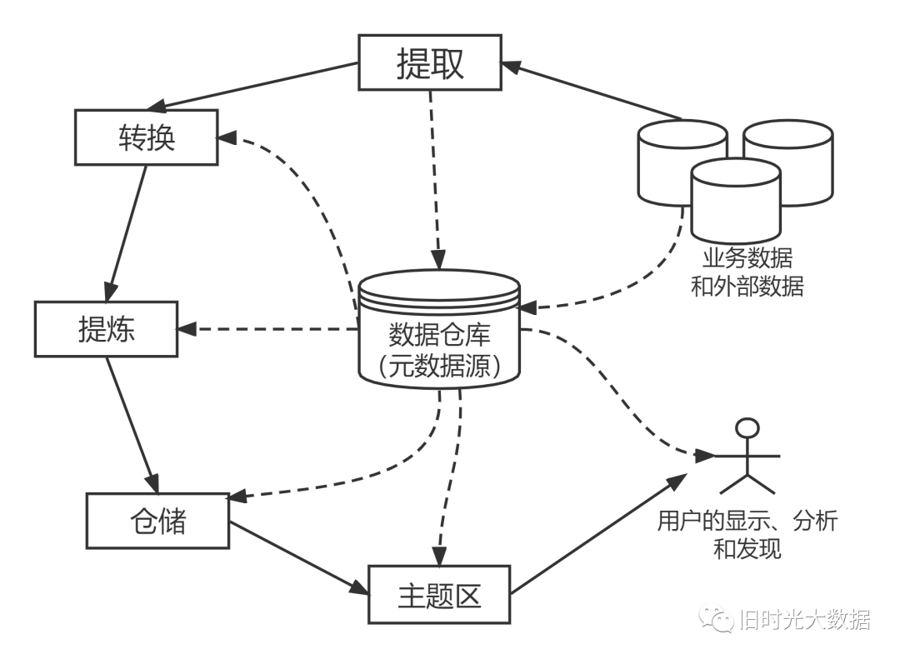

### **七**数据治理

#### **01**数据治理概念

数据治理是指将数据作为组织资产而展开的一系列的具体化工作，是对数据的全生命周期管理。

数据治理体系是指从组织架构、管理制度、操作规范、IT应用技术、绩效考核支持等多个维度对组织的数据模型、数据架构、数据质量、数据安全、数据生命周期等各方面进行全面的梳理、建设以及持续改进的体系。

#### **02**数据治理目标

数据治理的目标是提高数据的质量准确性和完整性，保证数据的安全性（保密性、完整性及可用性），实现数据资源在各组织机构部门的共享；推进信息资源的整合、对接和共享，从而提升集团公司或政务单位信息化水平，充分发挥信息化作用。

#### **03**数据治理体系

如下图所示，数据治理体系包含两个方面：一是数据质量核心领域，二是数据质量保障机制。

两者内容及相互关系如下图：

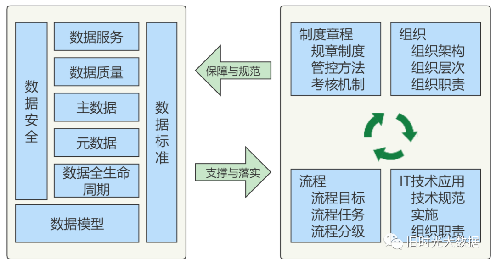

#### **04**数据治理核心领域

为了有效管理信息资源，必须构集团级数据治理体系。数据治理体系包含数据治理组织、数据构架管理、主数据管理、数据质量管理、数据服务管理及数据安全管理内容，这些内容既有机结合，又相互支撑。

#### **05**数据治理方法

**1）数据资源梳理**

数据治理的第一个步骤是从业务的视角厘清组织的数据资源环境和数据资源清单，包含组织机构、业务事项、信息系统，以及以数据库、网页、文件和 API 接口形式存在的数据项资源，本步骤的输出物为分门别类的数据资源清单。

**2）数据采集清洗**

通过可视化的`ETL`工具（例如阿里的 `DataX`，`Pentaho Data Integration`）将数据从来源端经过抽取 (`extract`)、转换 (`transform`)、加载 (`load`) 至目的端的过程，目的是将散落和零乱的数据集中存储起来。

**3）基础库主题库建设**

一般情况下，可以将数据分为基础数据、业务主题数据和分析数据。基础数据一般指的是核心实体数据，或称主数据，例如智慧城市中的人口、法人、地理信息、信用、电子证照等数据。主题数据一般指的是某个业务主题数据，例如市场监督管理局的食品监管、质量监督检查、企业综合监管等数据。而分析数据指的是基于业务主题数据综合分析而得的分析结果数据，例如市场监督管理局的企业综合评价、产业区域分布、高危企业分布等。那么基础库和主题库的建设就是在对业务理解的基础上，基于易存储、易管理、易使用的原则抽像数据存储结构，说白了，就是基于一定的原则设计数据库表结构，然后再根据数据资源清单设计数据采集清洗流程，将整洁干净的数据存储到数据库或数据仓库中。

**4）元数据管理**

元数据管理是对基础库和主题库中的数据项属性的管理，同时，将数据项的业务含义与数据项进行了关联，便于业务人员也能够理解数据库中的数据字段含义，并且，元数据是后面提到的自动化数据共享、数据交换和商业智能（BI）的基础。需要注意的是，元数据管理一般是对基础库和主题库中（即核心数据资产）的数据项属性的管理，而数据资源清单是对各类数据来源的数据项的管理。

**5）血缘追踪**

数据被业务场景使用时，发现数据错误，数据治理团队需要快速定位数据来源，修复数据错误。那么数据治理团队需要知道业务团队的数据来自于哪个核心库，核心库的数据又来自于哪个数据源头。我们的实践是在元数据和数据资源清单之间建立关联关系，且业务团队使用的数据项由元数据组合配置而来，这样，就建立了数据使用场景与数据源头之间的血缘关系。数据资源目录：数据资源目录一般应用于数据共享的场景，例如政府部门之间的数据共享，数据资源目录是基于业务场景和行业规范而创建，同时依托于元数据和基础库主题而实现自动化的数据申请和使用。

**6）质量管理**

数据价值的成功发掘必须依托于高质量的数据，唯有准确、完整、一致的数据才有使用价值。因此，需要从多维度来分析数据的质量，例如：偏移量、非空检查、值域检查、规范性检查、重复性检查、关联关系检查、离群值检查、波动检查等等。需要注意的是，优秀的数据质量模型的设计必须依赖于对业务的深刻理解，在技术上也推荐使用大数据相关技术来保障检测性能和降低对业务系统的性能影响，例如 `Hadoop`，`MapReduce`，`HBase `等。

**7）商业智能（BI）**

数据治理的目的是使用，对于一个大型的数据仓库来说，数据使用的场景和需求是多变的，那么可以使用 BI 类的产品快速获取需要的数据，并分析形成报表，比较知名的产品有 `Microsoft Power BI`，`QlikView`，`Tableau`，`Smartbi`等。

**8）数据共享交换**

数据共享包括组织内部和组织之间的数据共享，共享方式也分为库表、文件和 API 接口三种共享方式，库表共享比较直接粗暴，文件共享方式通过 ETL 工具做一个反向的数据交换也就可以实现。我们比较推荐的是 API 接口共享方式，在这种方式下，能够让中心数据仓库保留数据所有权，把数据使用权通过 API 接口的形式进行了转移。API 接口共享可以使用 API 网关实现，常见的功能是自动化的接口生成、申请审核、限流、限并发、多用户隔离、调用统计、调用审计、黑白名单、调用监控、质量监控等等。

#### **06**数据质量衡量标准

**1）数据的准确性**

数据准确性(`Accuracy`)是**指数据采集值或者观测值和真实值之间的接近程度，也叫做误差值，误差越大，准确度越低**。

**指数据中记录的信息和数据是否准确，数据记录的信息是否存在异常或错误**。准确性关注的是数据记录中存在的错误，如字符型数据的乱码现象就存在着准确性的问题，还有就是异常的数值：异常大或者异常小的数值、不符合有效性要求的数值等。

**2）数据的精确性**

数据的精确性(`Precision`)是**指对同一对象的观测数据在重复测量时所得到不同数据间的接近程度**。精确性，也可以叫精准性。精确性与我们数据采集的精度有关系。精度高，要求数据采集的粒度越细，误差的容忍程度越低。

比如测量人的身高，我们可以精确到厘米，多次测量差异只会在厘米级别；测量北京到上海的距离，我们精确到公里，多次测量结果间的差异会在公里级别:采用游标卡尺测量一个零件的厚度，可以精确到`1/50`毫米，多次测量的结果间的误差也只会在`1/50`毫米间。采用的测量方法和手段直接影响着数据的精确性。

**3）数据的真实性**

数据的真实性，也叫数据的正确性(`Rightness`)。**数据的正确性取决于数据采集过程的可控程度**，可控程度高，可追溯情况好，数据的真实性容易得到保障，而可控程度低或者无法追溯，数据造假后无法追溯，则真实性难以保证。为了提高数据的真实性，采用无人进行过程干涉的智能终端直接采集数据，能够更好地保证所采集数据的真实性，减少人为干预，减少数据造假，从而让数据更加正确地反应客观事物。

**4）数据的及时性**

数据的及时性（`In-time`）就是指**数据能否在需要的时候得到保证**。

比如月初会对上个月的经营和管理数据进行统计汇总，这些数据能否及时处理完成，财务能否在月度关账后及时核算。**数据的及时性是我们数据分析和挖掘及时性的保障**。如果公司的财务核算复杂，核算速度缓慢，上个月的数据在月中才能统计汇总完成，等需要调整财务策略的时候，已经到了月底了，一个月已经快过完了。特别是公司做大了之后，业务覆盖多个市场，多个国家，数据不能及时汇总，会影响到高层决策的及时程度，数据的及时性与企业数据处理的速度和效率有直接的关系，为了提高数据的及时性，越来越多的公司采用管理信息系统，并在管理信息系统中附加各种自动数据外理功能，能够在数据上传系统之后自动完成绝大部分报表，从而保证数据外理的效率。计算机自动外理中间层数据是提高企业数据处理效率的有效手段。

除了保证数据采集的及时性和数据外理的效率问题外，还需要从制度和流程上保证数据传输的及时性，数据报表完成了，要及时或者在要求的时间范围内发送到指定的部门，或者上传到指定的存储空间。

**5）数据的即时性**

指**数据采集时间节点和数据传输的时间节点**，一个数据在数据源头采集后立即存储，并立即加工呈现，就是即时数据，而经过一段时间之后再传输到信息系统中，则数据即时性就稍差。

比如微博的数据采集，当用户发布了微博，数据立即能够被抓取和加工，会生成即时微博数据报告，并随着时间推移，数据不断变化，我们可以称作是即时采集和处理的。一个生产设备的仪表即时反应着设备的温度、电压、电流、气压等数据，这些数据生成数据流，随时监控设备的运行状况，这个数据可以看作是即时数据。而当设备的即时运行数据存储下来，用来分析设备运行状况与设备寿命的关系，这些数据就成为历史数据。

**6）数据的完整性**

数据的完整性是**从数据采集到的程度来衡量的，是应采集和实际采集到数据之间的比例**。

比如一条信息采集12个数据点，如我们采集员工信息数据的时候，要求填写姓名，出生日期，性别，民族、籍贯，身高、血型、婚姻状况，最高学历，最高学历专业、最高学历毕业院校、最高学历毕业时间等`12`项信息，而某一员工仅仅填写了部分信息，如只填写了其中的`5`项，则该员工所填写数据的完整性只有一半。

一个公司数据的完整性体现着这个公司对数据的重视程度。要求采集数据而实际上并未完整采集，只采集了一部分，这就是不完整的，往往是公司对数据采集质量要求不到位导致的。公司要求每个人都填写完整的个人信息表，而有部分员工拒绝填写，公司`2000`员工，只有`1200`人填写了完整的个人信息表，则这个数据集就是不完整的。

另外，对干动态数据，还要从时间轴上去衡量数据采集的完整性。比如，我们要求每小时采集一次数据，每天会形成`24`个数据点，记录为`24`条数据，但是员工渎职，只记录了`20`次，那么这个数据集也是不完整的。

**7）数据的全面性**

数据的全面性和完整性不同，完整性衡量的是应采集和实际采集的差异。而**全面性指的是数据采集点的遗漏情况**。

比如说，我们要采集员工行为数据，我们只采集了员工上班打卡和下班打卡的数据，上班时间的员工行为数据并未采集，或者没有找到合适的方法来采集。那么，这个数据集就是不全面的。

比如描述一个产品的包装，仅仅描述了产品包装的正面和背面，没有记录产品包装的侧面，则就是不全面的。我们记录一个客户的交易数据，我们只采集了客户订单中的产品、订单中产品的价格和数量，而没有采集客户送货地址，采购时间，这个数据采集就是不全面的。

比如腾讯OO和微信的用户数据记录了客户交流沟通的数据；阿里和京东的用户数据记录了用户的购买交易数据；百度地图记录了用户出行的数据；大众点评和美团记录了客户餐饮娱乐的数据。对于全面描述一个人的生活的衣食住行各方面，这些公司的数据都是不全面的，而如果把他们的数据整合起来，则会形成更加全面的数据。所以说，数据的全面性是一个相对的概念。过度追求数据的全面性是不现实的。

**8）数据的关联性**

数据的关联性是**指各个数据集之间的关联关系**。

比如员工工资数据和工绩效考核数据是通过员工这个资源关联在一起来的，而且绩效数据直接关系到工资的多少。采购订单数据与生产订单数据之间通过物料的追溯机制进行关联，而生产订单又是由员工完成的，即通过员工作业数据与员工信息数据关联起来。

#### **07**数据质量的保证方法

1）**从技术层面来说**，需要构建一套高效、健壮的`ETL`程序，以此保证数据清洗、转换后数据的正确性和一致性。

2）**从流程上来说**，整个`ETL`是多个任务，按步骤顺序执行的一个过程，后置任务依赖前置任务，定期执行，整个流程需要自动化，并且哪个环节出现了问题，给予预警，通知相关维护人员及时处理。

3）**从管理层面上来说**，数据仓库是构建在公司各个业务系统之上，它是一面镜子，很多时候它能反映出业务系统的问题，所以需要管理层的支持和约束，比如通过第一条说的事后自动检验机制反映出业务系统的维护错误，需要相应的业务系统维护人员及时处理。

#### **08**数据治理流程

如下图，基本流程如下：**发现数据质量问题 > 定义数据质量规则 > 质量控制 > 质量评估 > 质量优化**。

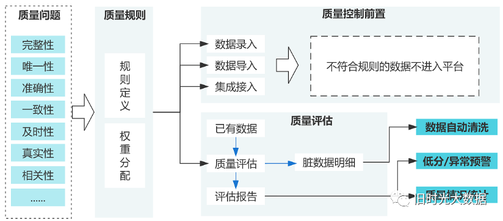