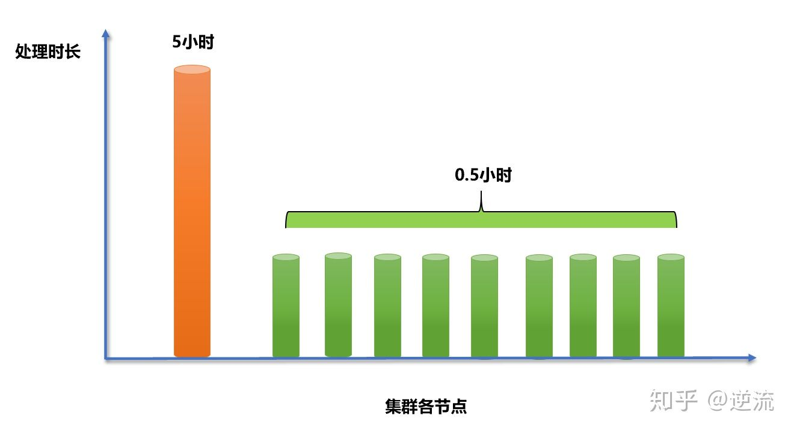
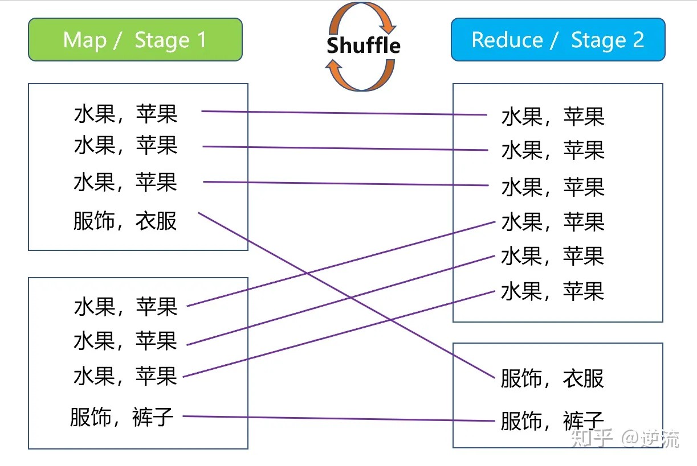
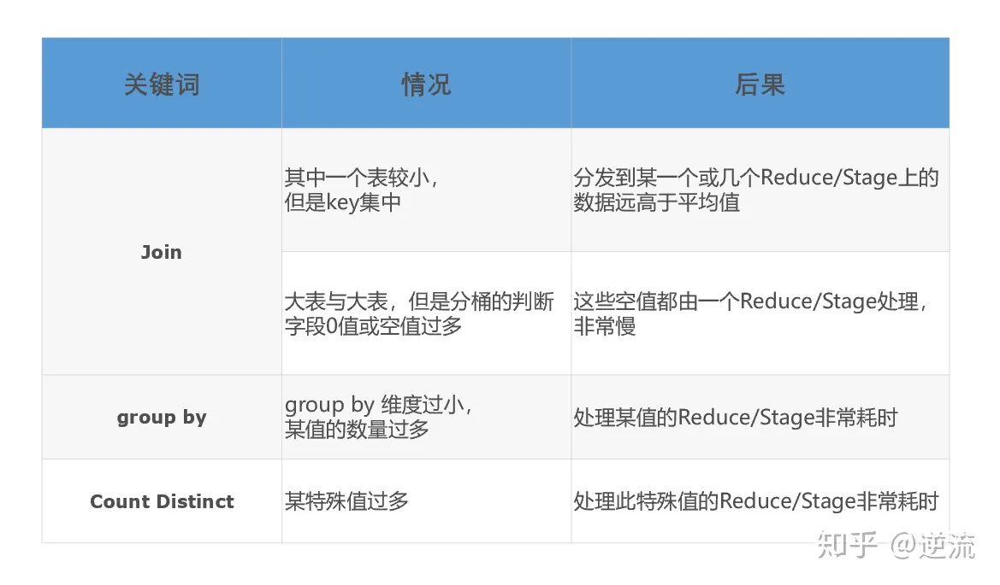
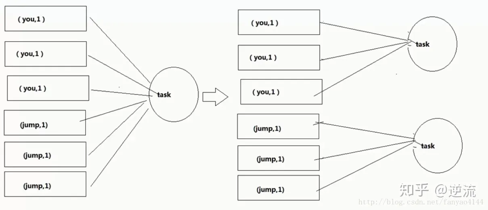
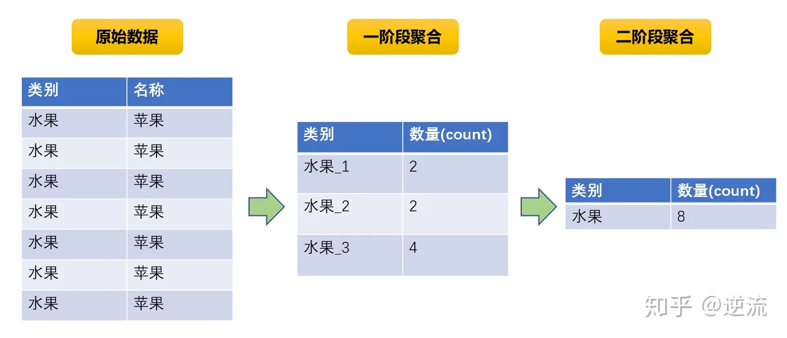
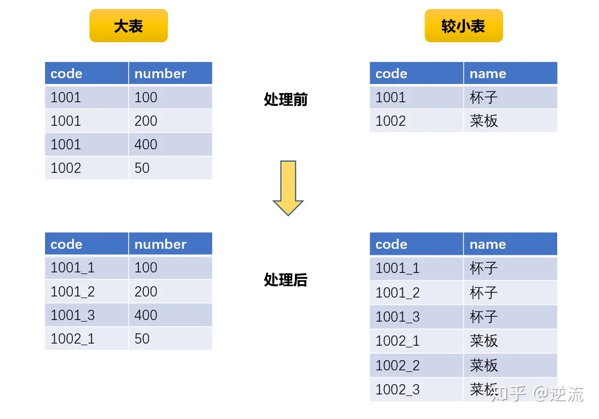

### 一、什么是数据倾斜？

Hadoop能够进行对海量数据进行批处理的核心，在于它的分布式思想，也就是多台服务器（节点）组成集群，进行分布式的数据处理。

举个例子，假如要处理一个10亿数据的表格，我的集群由10个节点组成，一台服务器处理这10亿数据需要10个小时，现在我将10亿条数据平均的分配到不同的节点上，每台节点负责处理1亿条数据，那么原本需要10个小时完成的工作，现在只需要1个小时即可。

而以上只是理想情况，实际上分配到每台节点的数据量并不是均匀的，当大量的数据分配到某一个节点时（假设5亿条），那么原本只需要1小时完成的工作，变成了其中9个节点不到1小时就完成了工作，而分配到了5亿数据的节点，花了5个小时才完成。

从最终结果来看，就是这个处理10亿数据的任务，集群花了5个小时才最终得出结果。大量的数据集中到了一台或者几台机器上计算，这些数据的计算速度远远低于平均计算速度，导致整个计算过程过慢，**这种情况就是发生了数据倾斜**。



### 二、发生数据倾斜的表现


**MapReduce任务**：

主要表现在ruduce阶段卡在99.99%，一直99.99%不能结束。 

- 有一个多几个reduce卡住
- 各种container报错OOM
- 读写的数据量极大，至少远远超过其它正常的reduce 
  伴随着数据倾斜，会出现任务被kill等各种诡异的表现。

**Spark任务**：

- 绝大多数task执行得都非常快，但个别task执行的极慢。
- 单个Executor执行时间特别久，整体任务卡在某个stage不能结束
- Executor lost，OOM，Shuffle过程出错。
- 正常运行的任务突然失败
- 用SparkStreaming做实时算法时候，一直会有executor出现OOM的错误，但是其余的executor内存使用率却很低。

### 三、发生数据倾斜的原因

正常的数据分布理论上都是倾斜的，就是我们所说的20-80原理：80%的财富集中在20%的人手中, 80%的用户只使用20%的功能 , 20%的用户贡献了80%的访问量 , 不同的数据字段可能的数据倾斜一般有两种情况:

- 唯一值非常少，极少数值有非常多的记录值(唯一值少于几千)
- 唯一值比较多，这个字段的某些值有远远多于其他值的记录数，但是它的占比也小于百分之一或千分之一

可以理解为：

- 数据频率倾斜——某一个区域的数据量要远远大于其他区域。
- 数据大小倾斜——部分记录的大小远远大于平均值。

无论是MR还是Spark任务进行计算的时候，都会触发**Shuffle**动作，一旦触发，**所有相同key的值就会拉到一个或几个节点上，就容易发生单个节点处理数据量爆增的情况。**

**Shuffle**的中文含义是“洗牌”，其原理在这里不展开说，但通过下面这张图，你能了解到它的对数据进行了什么样的处理。



导致数据倾斜发生，往往是以下几种情况

- **key分布不均匀**

1、某些key的数量过于集中，存在大量相同值的数据

2、存在大量异常值或空值。

- **业务数据本身的特性**

例如某个分公司或某个城市订单量大幅提升几十倍甚至几百倍，对该城市的订单统计聚合时，容易发生数据倾斜。

- **某些SQL语句本身就有数据倾斜**

两个表中关联字段存在大量空值，或是关联字段的数据不统一，例如在A表中值是大写，B表中值是小写等情况。


### 四、触发数据倾斜的SQL操作



### 五、数据倾斜的解决方案

首先排除过滤倾斜key，ETL预处理这种治标不治本的方法，然后详细来讲解各种不同的处理方式

**参数调整**


【1】**通用优化：提高shuffle并行度**

Spark的shuffle并行度默认值是200，建议根据服务器的情况进行调整。一般是集群cpu总和的2-3倍。当发生数据倾斜的时候，适当增大并行度，可以将原本被分配到同一个Task的不同Key分配到不同Task。

> set spark.sql.shuffle.partitions= [num_tasks] 

原理如图



缺陷：它没有从根本上改变数据倾斜的本质和问题，只是说尽可能地去缓解和减轻

shuffle reduce task的数据压力，以及数据倾斜的问题。

------

【2】**map端聚合，启动负载均衡**

适用范围：**group by 造成的数据倾斜**

> set hive.map.aggr=true; --在map中会做部分聚集操作，效率更高但需要更多的内存
> set hive.groupby.skewindata=true; --默认false，数据倾斜时负载均衡

数据倾斜时负载均衡，当选项设定为true，它使计算变成了两个mapreduce，先在第一个中在 shuffle 过程 partition 时随机给 key 打标记，使每个key 随机均匀分布到各个 reduce 上计算，但是这样只能完成部分计算，因为相同key没有分配到相同reduce上，所以需要第二次的mapreduce,这次就回归正常 shuffle,但是数据分布不均匀的问题在第一次mapreduce已经有了很大的改善。

------

【3】**Reduce join 改为Map join**

适用范围：**小表 join 大表**

> **set hive.auto.convert.join = true;** -- hive是否自动根据文件量大小，选择将common join转成map join 。
> **set hive.mapjoin.smalltable.filesize =25000000; --**大表小表判断的阈值，如果表的大小小于该值25Mb，则会被判定为小表。则会被加载到内存中运行，将commonjoin转化成mapjoin。一般这个值也就最多几百兆的样子。

原理：mapjoin优化就是在Map阶段完成join工作，而不是像通常的common join在Reduce阶段按照join的列值进行分发数据到每个Reduce上进行join工作。这样避免了**Shuffle**阶段，从而避免了数据倾斜。

注意：这个操作会将所有的小表全量复制到每个map任务节点，然后再将小表缓存在每个map节点的内存里与大表进行join工作。小表的大小的不能太大，一般也就几百兆，否则会出现OOM报错。

------

【4】**开启Skewed Join**

hadoop 中默认是使用hive.exec.reducers.bytes.per.reducer = 1000000000

也就是每个节点的reduce 默认是处理1G大小的数据，如果你的join 操作也产生了数据倾斜，那么你可以在hive 中设定

> set hive.optimize.skewjoin = true;
> set hive.skewjoin.key = skew_key_threshold （default = 100000）

建议每次运行比较复杂的sql 之前都可以设一下这个参数. 如果你不知道设置多少，可以就按官方默认的1个reduce 只处理1G 的算法，那么 skew_key_threshold = 1G/平均行长. 或者默认直接设成250000000 (差不多算平均行长4个字节) 

当我们开启Skew Join之后，在运行时，会对数据进行扫描并检测哪个key会出现倾斜，对于会倾斜的key，用map join做处理，不倾斜的key正常处理。

------

**SQL优化**


【1】count（distinct）优化

先用group去重，再count子查询

```sql
--优化前
select count(distinct a) from test ;

--优化后
select count x.a 
from 
(select a from test group by a ) x 
```

------

【2】聚合类操作，发生数据倾斜

解决方法：阶段拆分-两阶段聚合

在需要聚合的key前加一个随机数的前后缀，这样就能得到非常均匀的key，然后按这个加工之后的key进行第一次聚合之后，再对聚合的结果，按照原始key进行二次聚合，这样基本就不可能出现数据倾斜了

原理如下图



sql例子：

```sql
--水果字段名为category
select count (substr(x.category,1,2)) 
from
(select concat(category,'_',cast(round(10*rand())+1 as string))
from table1
group by concat(category,'_',cast(round(10*rand())+1 as string))
) x --1阶段聚合
group by substr(x.category,1,2);   --2阶段聚合
```

------


【3】大表join大表发生数据倾斜

- 大表拆分，倾斜部分单独处理
- 中间表分桶排序后join

举例：

假设有有两张表

table_a表是一张近3个月买家交易明细表，字段如下，数据量较大

| buyer_id（买家id） | seller_id（卖家id） | order_num(订单数) |
| ------------------ | ------------------- | ----------------- |
| 1113839839         | 1001                | 5                 |


table_b表是一张所有卖家信息表，数据量也很大，不满足mapjoin的条件。

| seller_id（卖家id） | seller_level（卖家评级） |
| ------------------- | ------------------------ |
| 1001                | A                        |


现在我们想要获取买家所有订单中，来源于不同等级卖家的数量。sql逻辑其实是比较简单的

```sql
SELECT 
	 t1.buyer_id 
	,sum(case when t2.seller_level = 'A' then order_num end) as a_num
	,sum(case when t2.seller_level = 'B' then order_num end) as b_num
	,sum(case when t2.seller_level = 'C' then order_num end) as c_num
FROM table_a  t1  --买家交易明细表
INNER JOIN table_b t2 --卖家信息表
ON t1.seller_id = t2.seller_id
GROUP BY t1.buyer_id;
```

但因为二八法则，某些卖家会拥有成千上万的买家，而大部分卖家的买家数量是较少的，两个表关联会发生数据倾斜。


**优化方案1：转为map join 避免shuffle** 

tableb由于数据量较大，无法直接map join ，所以考虑通过过滤3个月内没有发生交易的卖家，来减少table_b的数据量，使其达到满足map join 的情况。

```sql
SELECT 
	 t1.buyer_id 
	,sum(case when t4.seller_level = 'A' then order_num end) as a_num
	,sum(case when t4.seller_level = 'B' then order_num end) as b_num
	,sum(case when t4.seller_level = 'C' then order_num end) as c_num
FROM table_a  t1
INNER JOIN 
	(
	SELECT
		 t2.seller_id
		,t2.seller_level
	FROM
		table_b t2
	INNER JOIN 
		(
		SELECT
			seller_id
		FROM table_a
		GROUP BY seller_id	
		) t3
	ON t2.seller_id = t3.seller_id
	) t4  --过滤掉table_b中没有出现在table_a中的seller_id
ON t1.seller_id = t4.seller_id
GROUP BY t1.buyer_id;
```

此方案在有些时候能够起作用，但大部分情况并不能解决问题，比如table_b经过过滤后，数量依然很大，还是不满足map join的条件。

------

**优化方案2：拆表一分为二，倾斜部分单独处理**

首先创建一个临时表temp_b，存放大卖家（买家超过1万个）的名单，然后tablea分别join temp_b和table_b，结果union all 起来即可。此方案的适用情况最多，且最有效。

```sql
--临时表存放90天内买家超过10000的大卖家
INSERT OVERWRITE TABLE temp_b
SELECT
	 t1.seller_id
	,t2.seller_level
FROM
(
SELECT
	 seller_id
	,count(buyer_id) as buy_num
FROM table_a
GROUP BY seller_id
) t1
LEFT JOIN 
(
SELECT
	 seller_id
	,seller_level
FROM table_b
) t2
ON t1.seller_id = t2.seller_id
AND t1.buy_num > 10000;


--获取最终结果
SELECT 
	 t7.buyer_id 
	,sum(case when t7.seller_level = 'A' then t7.order_num end) as a_num
	,sum(case when t7.seller_level = 'B' then t7.order_num end) as b_num
	,sum(case when t7.seller_level = 'C' then t7.order_num end) as c_num
FROM
(
SELECT
	  /*+mapjoin(t2)*/
	 t1.buyer_id
	,t1.seller_id
	,t1.order_num
	,t2.seller_level
FROM table_a t1
LEFT JOIN temp_b t2
ON t1.seller_id = t2.seller_id
UNION ALL  --针对大卖家map join 其他卖家正常join
SELECT
	 t3.buyer_id
	,t3.seller_id
	,t3.order_num
	,t6.seller_level
FROM 
	table_a t3
LEFT JOIN 
	(
	SELECT
		 seller_id
		,seller_level
	FROM table_b t4
	LEFT JOIN temp_b t5
	ON t4.seller_id = t5.seller_id
	WHERE t5.seller_id is null
	) t6
ON t3.seller_id = t6.seller_id
) t7
GROUP BY t7.buyer_id;
```


------

【4】join发生数据倾斜通用方法

解决方法：随机前缀和RDD扩容

sql实现方法：

1、将大表的倾斜key筛选出来，随机打上前后缀，假如为1-10的数字。

2、将较小表cross join(笛卡尔积) 1-10数字共10行，再通过拼接，形成与大表对应的前后缀。（假如较小表数据量为10万，此时扩容至100万）

3、此时将筛选过的大表与扩容的较小表关联，关联成功后，通过字段加工复原。

4、将大表其他无倾斜数据与较小表关联，union all 前3步处理后得到的数据。

原理如下图



------

【5】空值产生的数据倾斜

解决方法：给空值进行随机赋值

场景：如日志中，常会有信息丢失的问题，比如日志中的 user_id，如果取其中的 user_id 和 用户表中的user_id 关联，会碰到数据倾斜的问题。

```sql
select *
from
log a
left join
users b
on  coalesce(a.user_id,concat(‘rand’,rand()))= b.user_id;
```

**其他方法**

1. 增加reduce 的jvm内存

2. 增加reduce 个数

> set mapred.reduce.tasks = [num] 

3.自定义partitioner

根据现在处理的这份数据，单独写一个适合的partitioner。比如现在是按省份进行汇总数据，如果只是简单的按省份去分（这并没有错），那么数据肯定会倾斜，因为各省的数据天然不一样。我们可以通过历史数据、抽样数据或者一些常识，对数据进行人工分区，让数据按照我们自定义的分区规则比较均匀的分配到不同的task中。

常见的分区方式：

- 随机分区：每个区域的数据基本均衡，简单易用，偶尔出现倾斜，但是特征同样也会随机打散。
- 轮询分区：绝对不会倾斜，但是需要提前预知分成若干份，进行轮询。
- hash散列：可以针对某个特征进行hash散列，保证相同特征的数据在一个区，但是极容易出现数据倾斜。
- 范围分区：需要排序，临近的数据会被分在同一个区，可以控制分区数据均匀。